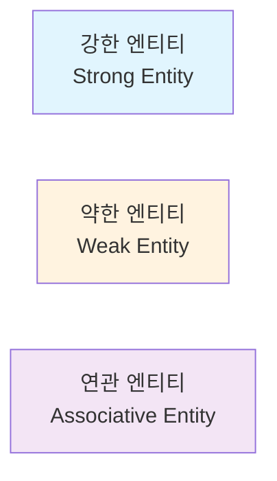
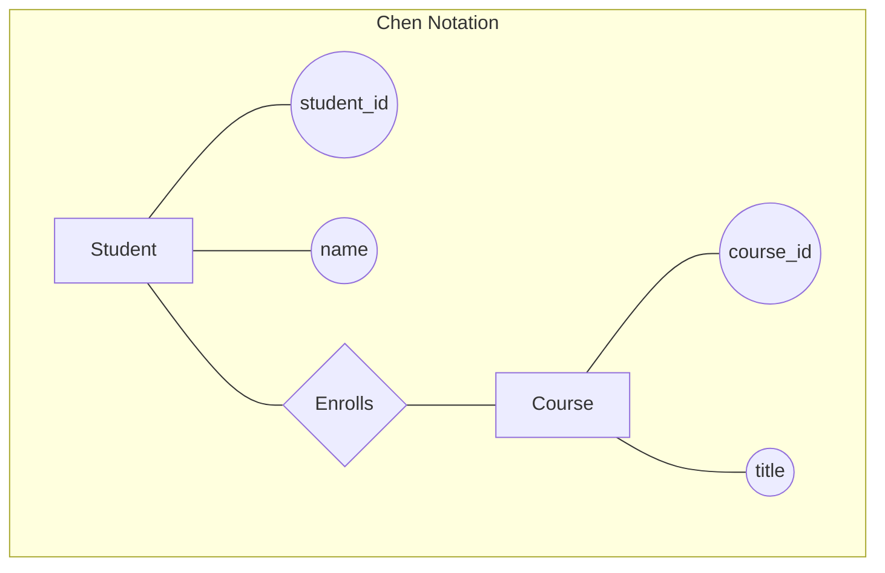

---
tags:
  - database
  - erd
  - entity-relationship
  - database-design
  - modeling
created: 2025-01-08
updated: 2025-01-08
---

# 관계(Relationships)와 ERD

> [!info] 개요
> Entity-Relationship Diagram(ERD)은 데이터베이스 설계의 핵심 도구입니다. 엔티티 간의 관계를 시각적으로 표현하여 데이터베이스 구조를 이해하고 설계하는 데 사용됩니다.

## 📑 목차

- [[#🎯 ERD 기본 개념]]
- [[#🔗 관계의 종류]]
- [[#📊 카디널리티]]
- [[#🎨 ERD 표기법]]
- [[#💡 설계 과정]]
- [[#📝 실전 예제]]
- [[#⚠️ 주의사항]]
- [[#📚 참고자료]]

---

## 🎯 ERD 기본 개념

### ERD 구성 요소

> [!note] 3가지 핵심 요소
> ERD는 엔티티(Entity), 속성(Attribute), 관계(Relationship)로 구성됩니다.

| 구성 요소 | 설명 | 표기법 |
|-----------|------|---------|
| **Entity** | 독립적으로 존재하는 객체 | 사각형 □ |
| **Attribute** | 엔티티의 특성 | 타원 ○ |
| **Relationship** | 엔티티 간의 연관성 | 마름모 ◇ |
| **Primary Key** | 엔티티를 고유하게 식별 | 밑줄 |

### 엔티티 타입



---

## 🔗 관계의 종류

### 1:1 관계 (One-to-One)

> [!example] 1:1 관계 예제
> 한 사람은 하나의 여권을 가지고, 하나의 여권은 한 사람에게 속합니다.

```sql
-- 1:1 관계 구현
CREATE TABLE persons (
    person_id INT PRIMARY KEY,
    name VARCHAR(100),
    birth_date DATE
);

CREATE TABLE passports (
    passport_id INT PRIMARY KEY,
    passport_number VARCHAR(20) UNIQUE,
    person_id INT UNIQUE,  -- UNIQUE로 1:1 보장
    issue_date DATE,
    FOREIGN KEY (person_id) REFERENCES persons(person_id)
);
```

### 1:N 관계 (One-to-Many)

> [!example] 1:N 관계 예제
> 한 부서에는 여러 직원이 속하지만, 한 직원은 하나의 부서에만 속합니다.

```sql
-- 1:N 관계 구현
CREATE TABLE departments (
    dept_id INT PRIMARY KEY,
    dept_name VARCHAR(50)
);

CREATE TABLE employees (
    emp_id INT PRIMARY KEY,
    emp_name VARCHAR(100),
    dept_id INT,  -- 다(Many) 쪽에 외래키
    FOREIGN KEY (dept_id) REFERENCES departments(dept_id)
);
```

### N:M 관계 (Many-to-Many)

> [!example] N:M 관계 예제
> 한 학생은 여러 과목을 수강하고, 한 과목은 여러 학생이 수강합니다.

```sql
-- N:M 관계 구현 (연결 테이블 사용)
CREATE TABLE students (
    student_id INT PRIMARY KEY,
    student_name VARCHAR(100)
);

CREATE TABLE courses (
    course_id INT PRIMARY KEY,
    course_name VARCHAR(100)
);

-- 연결 테이블 (Junction Table)
CREATE TABLE enrollments (
    student_id INT,
    course_id INT,
    enrollment_date DATE,
    grade VARCHAR(2),
    PRIMARY KEY (student_id, course_id),
    FOREIGN KEY (student_id) REFERENCES students(student_id),
    FOREIGN KEY (course_id) REFERENCES courses(course_id)
);
```

---

## 📊 카디널리티

### 카디널리티 표기법

> [!tip] 카디널리티와 옵셔널리티
> - **카디널리티**: 관계에 참여하는 인스턴스 수
> - **옵셔널리티**: 관계 참여의 필수/선택 여부

| 표기 | 의미 | 설명 |
|------|------|------|
| `|―|` | 정확히 1개 | 필수적 1개 |
| `|―O` | 0 또는 1개 | 선택적 1개 |
| `|―<` | 1개 이상 | 필수적 다수 |
| `O―<` | 0개 이상 | 선택적 다수 |

### Crow's Foot 표기법

```
고객 |―――O< 주문    (한 고객은 0개 이상의 주문)
주문 >―――| 고객    (한 주문은 정확히 1명의 고객)

부서 |―――< 직원    (한 부서는 1명 이상의 직원)
직원 >―――| 부서    (한 직원은 정확히 1개 부서)
```

---

## 🎨 ERD 표기법

### Chen 표기법



### IE 표기법 (Information Engineering)

```
┌─────────────┐        ┌─────────────┐
│   CUSTOMER  │|―――O<  │    ORDER    │
├─────────────┤        ├─────────────┤
│ customer_id │        │ order_id    │
│ name        │        │ customer_id │
│ email       │        │ order_date  │
└─────────────┘        └─────────────┘
```

---

## 💡 설계 과정

### ERD 설계 단계

> [!note] 체계적인 설계 프로세스
> 1. 요구사항 분석
> 2. 엔티티 식별
> 3. 속성 정의
> 4. 관계 설정
> 5. 카디널리티 결정
> 6. 정규화 검토

### 실무 설계 예제: 온라인 쇼핑몰

```sql
-- 1. 엔티티 식별
-- Customers, Products, Orders, Categories, Reviews

-- 2. 관계 정의
-- Customer (1) ――< (N) Order
-- Order (N) >――< (N) Product (through OrderDetails)
-- Category (1) ――< (N) Product
-- Customer (1) ――< (N) Review
-- Product (1) ――< (N) Review

-- 3. ERD를 SQL로 변환
CREATE TABLE categories (
    category_id INT AUTO_INCREMENT PRIMARY KEY,
    category_name VARCHAR(50) NOT NULL,
    description TEXT
);

CREATE TABLE products (
    product_id INT AUTO_INCREMENT PRIMARY KEY,
    product_name VARCHAR(100) NOT NULL,
    category_id INT,
    price DECIMAL(10, 2),
    stock_quantity INT DEFAULT 0,
    FOREIGN KEY (category_id) REFERENCES categories(category_id)
);

CREATE TABLE customers (
    customer_id INT AUTO_INCREMENT PRIMARY KEY,
    email VARCHAR(100) UNIQUE NOT NULL,
    first_name VARCHAR(50),
    last_name VARCHAR(50),
    registration_date TIMESTAMP DEFAULT CURRENT_TIMESTAMP
);

CREATE TABLE orders (
    order_id INT AUTO_INCREMENT PRIMARY KEY,
    customer_id INT NOT NULL,
    order_date TIMESTAMP DEFAULT CURRENT_TIMESTAMP,
    total_amount DECIMAL(10, 2),
    status VARCHAR(20) DEFAULT 'pending',
    FOREIGN KEY (customer_id) REFERENCES customers(customer_id)
);

-- N:M 관계 해결을 위한 연결 테이블
CREATE TABLE order_details (
    order_id INT,
    product_id INT,
    quantity INT NOT NULL,
    unit_price DECIMAL(10, 2) NOT NULL,
    PRIMARY KEY (order_id, product_id),
    FOREIGN KEY (order_id) REFERENCES orders(order_id),
    FOREIGN KEY (product_id) REFERENCES products(product_id)
);

CREATE TABLE reviews (
    review_id INT AUTO_INCREMENT PRIMARY KEY,
    product_id INT NOT NULL,
    customer_id INT NOT NULL,
    rating INT CHECK (rating >= 1 AND rating <= 5),
    comment TEXT,
    review_date TIMESTAMP DEFAULT CURRENT_TIMESTAMP,
    FOREIGN KEY (product_id) REFERENCES products(product_id),
    FOREIGN KEY (customer_id) REFERENCES customers(customer_id),
    UNIQUE KEY unique_review (product_id, customer_id)
);
```

---

## 📝 실전 예제

### 병원 관리 시스템 ERD

> [!example] 복잡한 관계 모델링

```sql
-- 의사와 환자는 N:M 관계 (진료를 통해)
CREATE TABLE doctors (
    doctor_id INT AUTO_INCREMENT PRIMARY KEY,
    name VARCHAR(100) NOT NULL,
    specialization VARCHAR(50),
    license_number VARCHAR(20) UNIQUE
);

CREATE TABLE patients (
    patient_id INT AUTO_INCREMENT PRIMARY KEY,
    name VARCHAR(100) NOT NULL,
    birth_date DATE,
    phone VARCHAR(20),
    blood_type VARCHAR(3)
);

-- 진료 예약 (연결 엔티티)
CREATE TABLE appointments (
    appointment_id INT AUTO_INCREMENT PRIMARY KEY,
    doctor_id INT NOT NULL,
    patient_id INT NOT NULL,
    appointment_date DATETIME NOT NULL,
    status ENUM('scheduled', 'completed', 'cancelled') DEFAULT 'scheduled',
    FOREIGN KEY (doctor_id) REFERENCES doctors(doctor_id),
    FOREIGN KEY (patient_id) REFERENCES patients(patient_id),
    UNIQUE KEY unique_appointment (doctor_id, appointment_date)
);

-- 진료 기록
CREATE TABLE medical_records (
    record_id INT AUTO_INCREMENT PRIMARY KEY,
    appointment_id INT NOT NULL,
    diagnosis TEXT,
    prescription TEXT,
    notes TEXT,
    created_at TIMESTAMP DEFAULT CURRENT_TIMESTAMP,
    FOREIGN KEY (appointment_id) REFERENCES appointments(appointment_id)
);

-- 약한 엔티티 예제: 환자의 보호자
CREATE TABLE guardians (
    patient_id INT,
    guardian_name VARCHAR(100),
    relationship VARCHAR(50),
    phone VARCHAR(20),
    PRIMARY KEY (patient_id, guardian_name),
    FOREIGN KEY (patient_id) REFERENCES patients(patient_id) 
        ON DELETE CASCADE
);
```

---

## ⚠️ 주의사항

> [!danger] ERD 설계 시 흔한 실수
> - 순환 참조 관계 생성
> - N:M 관계를 직접 구현 시도
> - 약한 엔티티 무시
> - 카디널리티 잘못 설정
> - 불필요한 관계 추가

### 안티패턴과 해결책

```sql
-- ❌ 잘못된 예: 순환 참조
CREATE TABLE employees_bad (
    emp_id INT PRIMARY KEY,
    manager_id INT,
    FOREIGN KEY (manager_id) REFERENCES employees_bad(emp_id)
    -- 최상위 관리자의 manager_id가 NULL이 되어야 함
);

-- ✅ 올바른 예: NULL 허용으로 순환 참조 해결
CREATE TABLE employees_good (
    emp_id INT PRIMARY KEY,
    manager_id INT NULL,  -- NULL 허용
    FOREIGN KEY (manager_id) REFERENCES employees_good(emp_id)
);

-- ❌ 잘못된 예: N:M 직접 구현 시도
-- 불가능: 한 컬럼에 여러 값을 저장할 수 없음

-- ✅ 올바른 예: 연결 테이블 사용
-- (위의 enrollments 테이블 예제 참조)
```

---

## 📚 참고자료

### 내부 문서
- [[02_rdbms-basics|RDBMS 기본 개념]]
- [[04_keys-and-constraints|키와 제약조건]]
- [[08_normalization|정규화]]

### 외부 리소스
- [ERD Tutorial](https://www.lucidchart.com/pages/er-diagrams)
- [Database Design Guide](https://www.vertabelo.com/blog/database-design-tutorial/)
- [Chen vs Crow's Foot Notation](https://vertabelo.com/blog/chen-erd-notation/)

### ERD 도구
- MySQL Workbench
- ERDPlus
- Lucidchart
- draw.io
- dbdiagram.io

---

> [!quote]
> "좋은 ERD는 천 줄의 문서보다 데이터베이스를 명확하게 설명합니다. 시간을 들여 정확한 ERD를 그리는 것이 나중의 많은 문제를 예방합니다."