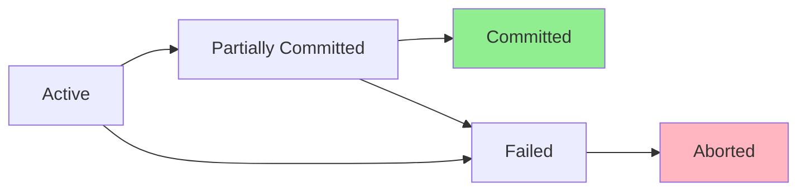

---
tags:
  - database
  - transaction
  - acid
  - concurrency
  - isolation
created: 2025-01-08
updated: 2025-01-08
---

# 트랜잭션과 ACID

> [!info] 개요
> 트랜잭션은 데이터베이스의 상태를 변경하는 작업의 논리적 단위입니다. ACID 속성은 트랜잭션이 데이터베이스의 무결성과 일관성을 보장하는 핵심 원칙입니다.

## 📑 목차

- [[#🎯 트랜잭션 개념]]
- [[#⚡ ACID 속성]]
- [[#🔒 동시성 제어]]
- [[#📊 격리 수준]]
- [[#💡 트랜잭션 관리]]
- [[#⚠️ 교착상태]]
- [[#📝 실전 예제]]
- [[#📚 참고자료]]

---

## 🎯 트랜잭션 개념

### 트랜잭션이란?

> [!note] 트랜잭션 정의
> 트랜잭션은 하나의 논리적 작업 단위로, 모두 성공하거나 모두 실패해야 하는 연산들의 집합입니다.

### 트랜잭션의 특징

| 특징 | 설명 |
|------|------|
| **논리적 단위** | 여러 연산을 하나의 작업으로 처리 |
| **All or Nothing** | 부분적 실행 불가 |
| **상태 변경** | 데이터베이스를 한 일관된 상태에서 다른 일관된 상태로 변경 |
| **독립성** | 다른 트랜잭션과 격리되어 실행 |

### 트랜잭션 상태



---

## ⚡ ACID 속성

### Atomicity (원자성)

> [!tip] 원자성 보장
> 트랜잭션의 모든 연산이 완전히 수행되거나 전혀 수행되지 않아야 합니다.

```sql
-- 계좌 이체 예제: 원자성 보장
START TRANSACTION;

UPDATE accounts 
SET balance = balance - 1000 
WHERE account_id = 'A001';

UPDATE accounts 
SET balance = balance + 1000 
WHERE account_id = 'B001';

-- 모두 성공하면 커밋
COMMIT;
-- 하나라도 실패하면 롤백
-- ROLLBACK;
```

### Consistency (일관성)

> [!note] 일관성 유지
> 트랜잭션 실행 전후에 데이터베이스는 일관된 상태를 유지해야 합니다.

```sql
-- 일관성 제약조건 예제
CREATE TABLE accounts (
    account_id VARCHAR(10) PRIMARY KEY,
    balance DECIMAL(10, 2) CHECK (balance >= 0),  -- 잔액은 음수 불가
    account_type VARCHAR(20)
);

-- 트랜잭션이 이 제약조건을 위반하면 자동 롤백
START TRANSACTION;
UPDATE accounts 
SET balance = balance - 2000 
WHERE account_id = 'A001';  -- 잔액 부족시 실패
COMMIT;
```

### Isolation (격리성)

> [!warning] 격리성 레벨
> 동시에 실행되는 트랜잭션들이 서로 영향을 주지 않아야 합니다.

```sql
-- 격리 수준 설정
SET TRANSACTION ISOLATION LEVEL READ COMMITTED;

START TRANSACTION;
-- 다른 트랜잭션의 커밋된 데이터만 읽음
SELECT * FROM products WHERE product_id = 1;
-- 작업 수행
UPDATE products SET stock = stock - 1 WHERE product_id = 1;
COMMIT;
```

### Durability (지속성)

> [!success] 지속성 보장
> 트랜잭션이 성공적으로 완료되면 그 결과는 영구적으로 보존되어야 합니다.

```sql
-- 트랜잭션 커밋 후 시스템 장애가 발생해도 데이터 보존
START TRANSACTION;
INSERT INTO orders (customer_id, total_amount) 
VALUES (1001, 50000);
COMMIT;  -- 이 시점에서 데이터는 영구 저장됨

-- WAL (Write-Ahead Logging) 사용
-- Redo Log를 통한 복구 보장
```

---

## 🔒 동시성 제어

### 동시성 문제

| 문제 | 설명 | 해결 방법 |
|------|------|-----------|
| **Dirty Read** | 커밋되지 않은 데이터 읽기 | READ COMMITTED 이상 |
| **Non-Repeatable Read** | 같은 데이터 다시 읽을 때 값 변경 | REPEATABLE READ 이상 |
| **Phantom Read** | 같은 쿼리 실행 시 레코드 수 변경 | SERIALIZABLE |
| **Lost Update** | 동시 업데이트로 인한 손실 | 락 사용 |

### 락(Lock) 메커니즘

```sql
-- 공유 락 (Shared Lock, S-Lock)
-- 읽기만 가능, 여러 트랜잭션이 동시 획득 가능
SELECT * FROM products WHERE product_id = 1 LOCK IN SHARE MODE;

-- 배타 락 (Exclusive Lock, X-Lock)
-- 읽기/쓰기 모두 가능, 한 트랜잭션만 획득 가능
SELECT * FROM products WHERE product_id = 1 FOR UPDATE;

-- 테이블 락
LOCK TABLES products WRITE;
-- 작업 수행
UPDATE products SET price = price * 1.1;
UNLOCK TABLES;

-- 행 수준 락 (Row-Level Lock)
START TRANSACTION;
SELECT * FROM orders WHERE order_id = 1001 FOR UPDATE;
-- 해당 행만 락
UPDATE orders SET status = 'shipped' WHERE order_id = 1001;
COMMIT;
```

---

## 📊 격리 수준

### 격리 수준별 특징

> [!example] 4가지 격리 수준

| 격리 수준 | Dirty Read | Non-Repeatable Read | Phantom Read | 성능 |
|-----------|:----------:|:-------------------:|:------------:|:----:|
| **READ UNCOMMITTED** | O | O | O | 최고 |
| **READ COMMITTED** | X | O | O | 높음 |
| **REPEATABLE READ** | X | X | O | 보통 |
| **SERIALIZABLE** | X | X | X | 최저 |

### 격리 수준 설정 및 테스트

```sql
-- MySQL InnoDB 기본값: REPEATABLE READ
-- 현재 격리 수준 확인
SELECT @@tx_isolation;

-- 세션별 격리 수준 설정
SET SESSION TRANSACTION ISOLATION LEVEL READ COMMITTED;

-- 글로벌 격리 수준 설정
SET GLOBAL TRANSACTION ISOLATION LEVEL REPEATABLE READ;

-- 격리 수준별 동작 예제
-- Terminal 1
SET SESSION TRANSACTION ISOLATION LEVEL READ UNCOMMITTED;
START TRANSACTION;
SELECT * FROM accounts WHERE account_id = 'A001';
-- balance: 10000

-- Terminal 2
START TRANSACTION;
UPDATE accounts SET balance = 5000 WHERE account_id = 'A001';
-- 아직 커밋하지 않음

-- Terminal 1
SELECT * FROM accounts WHERE account_id = 'A001';
-- READ UNCOMMITTED: balance = 5000 (Dirty Read 발생)
-- READ COMMITTED 이상: balance = 10000 (원래 값)
```

---

## 💡 트랜잭션 관리

### 트랜잭션 명령어

```sql
-- 트랜잭션 시작
START TRANSACTION;
-- 또는
BEGIN;

-- 저장점 설정
SAVEPOINT sp1;

-- 작업 수행
INSERT INTO orders VALUES (1, 100, '2024-01-01');
SAVEPOINT sp2;

UPDATE inventory SET quantity = quantity - 10;

-- 부분 롤백 (sp2로 롤백)
ROLLBACK TO SAVEPOINT sp2;

-- 전체 커밋
COMMIT;

-- 전체 롤백
-- ROLLBACK;
```

### 자동 커밋 모드

```sql
-- 자동 커밋 확인
SELECT @@autocommit;

-- 자동 커밋 비활성화
SET autocommit = 0;

-- 이제 명시적 COMMIT 필요
UPDATE products SET price = 100;
COMMIT;  -- 명시적 커밋

-- 자동 커밋 활성화
SET autocommit = 1;
```

---

## ⚠️ 교착상태

### 교착상태(Deadlock) 발생

> [!danger] 교착상태 시나리오
> 두 개 이상의 트랜잭션이 서로가 보유한 락을 기다리는 상황

```sql
-- Transaction 1
START TRANSACTION;
UPDATE accounts SET balance = balance - 100 WHERE account_id = 'A001';
-- A001 락 획득
-- B001 락 대기...
UPDATE accounts SET balance = balance + 100 WHERE account_id = 'B001';

-- Transaction 2 (동시 실행)
START TRANSACTION;
UPDATE accounts SET balance = balance - 50 WHERE account_id = 'B001';
-- B001 락 획득
-- A001 락 대기... (교착상태!)
UPDATE accounts SET balance = balance + 50 WHERE account_id = 'A001';
```

### 교착상태 해결

```sql
-- 교착상태 감지 및 해결
-- MySQL은 자동으로 교착상태를 감지하고 하나의 트랜잭션을 롤백

-- 교착상태 정보 확인
SHOW ENGINE INNODB STATUS;

-- 교착상태 예방 방법
-- 1. 일관된 순서로 테이블/행 접근
START TRANSACTION;
-- 항상 작은 ID부터 접근
UPDATE accounts SET balance = balance - 100 
WHERE account_id = 'A001';
UPDATE accounts SET balance = balance + 100 
WHERE account_id = 'B001';
COMMIT;

-- 2. 트랜잭션 시간 최소화
-- 3. 인덱스 사용으로 락 범위 축소
```

---

## 📝 실전 예제

### 은행 시스템 트랜잭션

> [!example] 복잡한 트랜잭션 처리

```sql
DELIMITER //

CREATE PROCEDURE transfer_money(
    IN from_account VARCHAR(10),
    IN to_account VARCHAR(10),
    IN amount DECIMAL(10, 2)
)
BEGIN
    DECLARE exit handler for SQLEXCEPTION
    BEGIN
        -- 에러 발생 시 롤백
        ROLLBACK;
        SIGNAL SQLSTATE '45000' 
        SET MESSAGE_TEXT = 'Transfer failed';
    END;
    
    -- 트랜잭션 시작
    START TRANSACTION;
    
    -- 출금 계좌 잔액 확인 및 차감
    UPDATE accounts 
    SET balance = balance - amount
    WHERE account_id = from_account 
    AND balance >= amount;
    
    IF ROW_COUNT() = 0 THEN
        SIGNAL SQLSTATE '45000' 
        SET MESSAGE_TEXT = 'Insufficient balance';
    END IF;
    
    -- 입금 계좌에 추가
    UPDATE accounts 
    SET balance = balance + amount
    WHERE account_id = to_account;
    
    -- 거래 기록 저장
    INSERT INTO transaction_log 
    (from_account, to_account, amount, transaction_date)
    VALUES 
    (from_account, to_account, amount, NOW());
    
    -- 성공 시 커밋
    COMMIT;
END//

DELIMITER ;

-- 프로시저 실행
CALL transfer_money('A001', 'B001', 1000.00);
```

### 재고 관리 시스템

```sql
-- 동시성이 중요한 재고 차감 처리
DELIMITER //

CREATE PROCEDURE process_order(
    IN p_product_id INT,
    IN p_quantity INT,
    IN p_customer_id INT
)
BEGIN
    DECLARE v_current_stock INT;
    DECLARE v_order_id INT;
    
    -- 격리 수준 설정
    SET TRANSACTION ISOLATION LEVEL REPEATABLE READ;
    
    START TRANSACTION;
    
    -- 재고 확인 및 락 획득
    SELECT stock INTO v_current_stock
    FROM products 
    WHERE product_id = p_product_id
    FOR UPDATE;
    
    IF v_current_stock >= p_quantity THEN
        -- 재고 차감
        UPDATE products 
        SET stock = stock - p_quantity
        WHERE product_id = p_product_id;
        
        -- 주문 생성
        INSERT INTO orders (customer_id, order_date)
        VALUES (p_customer_id, NOW());
        
        SET v_order_id = LAST_INSERT_ID();
        
        -- 주문 상세 추가
        INSERT INTO order_details 
        (order_id, product_id, quantity)
        VALUES 
        (v_order_id, p_product_id, p_quantity);
        
        COMMIT;
        SELECT 'Order processed successfully' AS result;
    ELSE
        ROLLBACK;
        SELECT 'Insufficient stock' AS result;
    END IF;
END//

DELIMITER ;
```

---

## 📚 참고자료

### 내부 문서
- [[01_database-fundamentals|데이터베이스 기초]]
- [[04_keys-and-constraints|키와 제약조건]]
- [[07_database-index|데이터베이스 인덱스]]

### 외부 리소스
- [MySQL Transaction Documentation](https://dev.mysql.com/doc/refman/8.0/en/innodb-transaction-isolation-levels.html)
- [PostgreSQL MVCC](https://www.postgresql.org/docs/current/mvcc.html)
- [Two-Phase Commit Protocol](https://en.wikipedia.org/wiki/Two-phase_commit_protocol)

### 추가 학습 주제
- MVCC (Multi-Version Concurrency Control)
- 2PL (Two-Phase Locking)
- Distributed Transactions
- Saga Pattern

---

> [!quote]
> "트랜잭션은 데이터베이스의 심장입니다. ACID 속성을 이해하고 적절히 활용하는 것이 안정적인 시스템의 기초입니다."