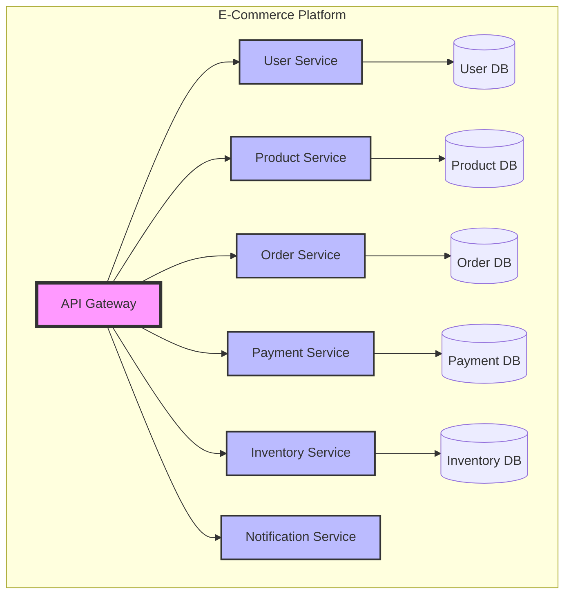

---
tags:
  - msa
  - microservices
  - architecture
  - distributed-systems
  - backend
  - cloud-native
created: 2025-07-15
updated: 2025-07-15
aliases:
  - MSA
  - 마이크로서비스
  - Microservices Architecture
  - 마이크로서비스 아키텍처
description: 마이크로서비스 아키텍처(MSA)의 개념부터 실전 구현까지 다루는 종합 가이드
status: published
category: guide
author: Claude Code
version: 2.0.0
---

# 마이크로서비스 아키텍처(MSA) 완벽 가이드

> [!info] 개요
> 마이크로서비스 아키텍처(MSA)는 애플리케이션을 작고 독립적인 서비스들의 집합으로 구성하는 소프트웨어 개발 방법론입니다. 각 서비스는 특정 비즈니스 기능을 수행하며, 독립적으로 배포되고 확장될 수 있습니다. 이 가이드는 MSA의 핵심 개념부터 실전 구현까지 모든 것을 다룹니다.

## 📑 목차

- [[#⚡ 빠른 시작]]
- [[#🔧 핵심 개념]]
- [[#🏗️ 아키텍처 패턴]]
- [[#💡 설계 원칙]]
- [[#🚀 구현 전략]]
- [[#📊 통신 패턴]]
- [[#🔒 보안 및 인증]]
- [[#📈 모니터링과 관찰성]]
- [[#⚠️ 주의사항 및 안티패턴]]
- [[#📚 참고자료]]

---

## ⚡ 빠른 시작

### MSA vs Monolith 비교

| 특성 | Monolithic | Microservices |
|:------|:-----------|:--------------|
| **배포 단위** | 단일 애플리케이션 | 독립적인 서비스들 |
| **확장성** | 전체 확장 (Scale Up) | 서비스별 확장 (Scale Out) |
| **기술 스택** | 단일 스택 | 다양한 스택 가능 |
| **팀 구조** | 기능별 팀 | 서비스별 팀 |
| **복잡도** | 낮음 | 높음 |
| **장애 격리** | 전체 영향 | 부분 영향 |
| **데이터 관리** | 단일 DB | 서비스별 DB |
| **개발 속도** | 초기 빠름 | 장기적 빠름 |

> [!tip] MSA 도입 시점
> - ✅ 조직이 충분히 크고 여러 팀이 독립적으로 작업
> - ✅ 서비스별로 다른 확장 요구사항 존재
> - ✅ 빠른 배포 주기가 필요
> - ✅ 다양한 기술 스택 활용 필요
> - ✅ 특정 도메인의 복잡도가 높음
> - ❌ 작은 팀이나 간단한 애플리케이션
> - ❌ 운영 복잡도를 감당할 인프라 부재

---

## 🔧 핵심 개념

### 1. 서비스 분해 (Service Decomposition)

> [!note] DDD 기반 서비스 경계
> Domain-Driven Design의 Bounded Context를 활용하여 서비스 경계를 정의합니다. 각 서비스는 하나의 비즈니스 도메인을 담당합니다.



### 2. 서비스 자율성 (Service Autonomy)

> [!info] 독립성의 4가지 원칙
> 1. **데이터베이스 분리**: 서비스별 독립 데이터베이스
> 2. **독립 배포**: 다른 서비스 영향 없이 배포
> 3. **기술 독립성**: 서비스별 최적 기술 선택
> 4. **팀 자율성**: 서비스 담당 팀의 독립적 의사결정

### 3. API Gateway Pattern

> [!example] Express.js 기반 API Gateway 구현

```javascript
// api-gateway.js
const express = require('express');
const httpProxy = require('http-proxy-middleware');
const rateLimit = require('express-rate-limit');
const jwt = require('jsonwebtoken');
const app = express();

// Rate limiting 설정
const limiter = rateLimit({
  windowMs: 15 * 60 * 1000, // 15분
  max: 100, // 최대 100개 요청
  message: 'Too many requests from this IP'
});

// 인증 미들웨어
const authMiddleware = (req, res, next) => {
  const token = req.headers.authorization?.split(' ')[1];
  
  if (!token) {
    return res.status(401).json({ error: 'No token provided' });
  }
  
  try {
    const decoded = jwt.verify(token, process.env.JWT_SECRET);
    req.user = decoded;
    next();
  } catch (error) {
    return res.status(401).json({ error: 'Invalid token' });
  }
};

// 서비스 라우팅 설정
const services = {
  '/api/users': {
    target: 'http://user-service:3001',
    changeOrigin: true,
    pathRewrite: { '^/api/users': '' }
  },
  '/api/products': {
    target: 'http://product-service:3002',
    changeOrigin: true,
    pathRewrite: { '^/api/products': '' }
  },
  '/api/orders': {
    target: 'http://order-service:3003',
    changeOrigin: true,
    pathRewrite: { '^/api/orders': '' },
    onProxyReq: (proxyReq, req) => {
      // 사용자 정보를 헤더에 추가
      proxyReq.setHeader('X-User-Id', req.user.id);
      proxyReq.setHeader('X-User-Roles', JSON.stringify(req.user.roles));
    }
  }
};

// 프록시 설정 적용
Object.keys(services).forEach(path => {
  app.use(path, limiter, authMiddleware, httpProxy(services[path]));
});

// 헬스 체크
app.get('/health', (req, res) => {
  res.json({ 
    status: 'healthy', 
    timestamp: new Date().toISOString(),
    services: Object.keys(services).length
  });
});

// 에러 핸들링
app.use((err, req, res, next) => {
  console.error('Gateway Error:', err);
  res.status(500).json({ 
    error: 'Internal Server Error',
    message: process.env.NODE_ENV === 'development' ? err.message : undefined
  });
});

const PORT = process.env.PORT || 3000;
app.listen(PORT, () => {
  console.log(`API Gateway running on port ${PORT}`);
});
```

---

## 🏗️ 아키텍처 패턴

### 1. Service Mesh Architecture

> [!info] Service Mesh란?
> 서비스 간 통신을 관리하는 전용 인프라 계층으로, 서비스 디스커버리, 로드 밸런싱, 장애 복구, 메트릭 및 모니터링을 제공합니다.

```yaml
# istio-service-mesh.yaml
apiVersion: v1
kind: Service
metadata:
  name: user-service
  labels:
    app: user-service
    version: v1
spec:
  ports:
  - port: 80
    name: http
  selector:
    app: user-service
---
apiVersion: networking.istio.io/v1beta1
kind: VirtualService
metadata:
  name: user-service
spec:
  hosts:
  - user-service
  http:
  - match:
    - headers:
        x-version:
          exact: v2
    route:
    - destination:
        host: user-service
        subset: v2
  - route:
    - destination:
        host: user-service
        subset: v1
      weight: 90
    - destination:
        host: user-service
        subset: v2
      weight: 10  # 10% 카나리 배포
---
apiVersion: networking.istio.io/v1beta1
kind: DestinationRule
metadata:
  name: user-service
spec:
  host: user-service
  trafficPolicy:
    connectionPool:
      tcp:
        maxConnections: 100
      http:
        http1MaxPendingRequests: 10
        http2MaxRequests: 100
    loadBalancer:
      simple: ROUND_ROBIN
    outlierDetection:
      consecutiveErrors: 5
      interval: 30s
      baseEjectionTime: 30s
  subsets:
  - name: v1
    labels:
      version: v1
  - name: v2
    labels:
      version: v2
```

### 2. Event-Driven Architecture

> [!example] Kafka 기반 이벤트 드리븐 구현

```javascript
// event-bus.js
const { Kafka } = require('kafkajs');
const { v4: uuidv4 } = require('uuid');

class EventBus {
  constructor(serviceName) {
    this.serviceName = serviceName;
    this.kafka = new Kafka({
      clientId: serviceName,
      brokers: process.env.KAFKA_BROKERS?.split(',') || ['kafka:9092'],
      retry: {
        initialRetryTime: 100,
        retries: 8
      }
    });
    
    this.producer = this.kafka.producer({
      allowAutoTopicCreation: true,
      transactionTimeout: 30000
    });
    
    this.consumer = this.kafka.consumer({ 
      groupId: `${serviceName}-group`,
      sessionTimeout: 20000,
      heartbeatInterval: 3000
    });
    
    this.eventHandlers = new Map();
  }
  
  async connect() {
    await this.producer.connect();
    await this.consumer.connect();
  }
  
  async publishEvent(topic, event) {
    const enrichedEvent = {
      id: uuidv4(),
      source: this.serviceName,
      type: event.type,
      timestamp: new Date().toISOString(),
      correlationId: event.correlationId || uuidv4(),
      data: event.data,
      metadata: {
        version: event.version || '1.0',
        ...event.metadata
      }
    };
    
    await this.producer.send({
      topic,
      messages: [{
        key: event.aggregateId || enrichedEvent.id,
        value: JSON.stringify(enrichedEvent),
        headers: {
          'content-type': 'application/json',
          'event-type': event.type
        }
      }]
    });
    
    console.log(`Event published: ${event.type} to ${topic}`);
    return enrichedEvent.id;
  }
  
  async subscribeToEvents(topics, options = {}) {
    await this.consumer.subscribe({ 
      topics, 
      fromBeginning: options.fromBeginning || false 
    });
    
    await this.consumer.run({
      autoCommit: options.autoCommit !== false,
      eachMessage: async ({ topic, partition, message }) => {
        const event = JSON.parse(message.value.toString());
        console.log(`Event received: ${event.type} from ${topic}`);
        
        const handlers = this.eventHandlers.get(event.type) || [];
        
        for (const handler of handlers) {
          try {
            await handler(event, { topic, partition });
          } catch (error) {
            console.error(`Error handling event ${event.type}:`, error);
            
            if (options.dlqTopic) {
              await this.publishEvent(options.dlqTopic, {
                type: 'DeadLetterEvent',
                data: {
                  originalEvent: event,
                  error: error.message,
                  topic,
                  partition
                }
              });
            }
          }
        }
      }
    });
  }
  
  on(eventType, handler) {
    if (!this.eventHandlers.has(eventType)) {
      this.eventHandlers.set(eventType, []);
    }
    this.eventHandlers.get(eventType).push(handler);
  }
  
  async disconnect() {
    await this.producer.disconnect();
    await this.consumer.disconnect();
  }
}

// 사용 예제
const eventBus = new EventBus('order-service');

// 이벤트 핸들러 등록
eventBus.on('OrderCreated', async (event) => {
  console.log('Processing order:', event.data);
  // 주문 처리 로직
});

eventBus.on('PaymentProcessed', async (event) => {
  // 결제 완료 후 처리
  await updateOrderStatus(event.data.orderId, 'paid');
});

// 이벤트 구독 시작
await eventBus.connect();
await eventBus.subscribeToEvents(['order-events', 'payment-events'], {
  dlqTopic: 'dead-letter-queue'
});

// 이벤트 발행
await eventBus.publishEvent('order-events', {
  type: 'OrderCreated',
  aggregateId: orderId,
  data: {
    orderId,
    userId,
    items,
    totalAmount
  }
});
```

### 3. CQRS Pattern Implementation

> [!note] CQRS (Command Query Responsibility Segregation)
> 명령(쓰기)과 조회(읽기)를 분리하여 각각 최적화된 모델을 사용하는 패턴입니다.

```typescript
// command-side.ts
interface Command {
  aggregateId: string;
  type: string;
  data: any;
  metadata: {
    userId: string;
    timestamp: Date;
    correlationId: string;
  };
}

class OrderCommandService {
  constructor(
    private eventStore: EventStore,
    private eventBus: EventBus
  ) {}
  
  async createOrder(command: CreateOrderCommand): Promise<string> {
    const orderId = uuid();
    
    // 비즈니스 로직 검증
    await this.validateInventory(command.items);
    await this.validateUserCredit(command.userId);
    
    // 도메인 이벤트 생성
    const events = [
      {
        type: 'OrderCreated',
        aggregateId: orderId,
        data: {
          orderId,
          userId: command.userId,
          items: command.items,
          totalAmount: this.calculateTotal(command.items)
        }
      },
      {
        type: 'InventoryReserved',
        aggregateId: orderId,
        data: {
          orderId,
          items: command.items
        }
      }
    ];
    
    // 이벤트 저장
    await this.eventStore.saveEvents(orderId, events);
    
    // 이벤트 발행
    for (const event of events) {
      await this.eventBus.publishEvent('order-events', event);
    }
    
    return orderId;
  }
  
  async cancelOrder(orderId: string, reason: string): Promise<void> {
    const order = await this.eventStore.getAggregate(orderId);
    
    if (order.status === 'cancelled') {
      throw new Error('Order already cancelled');
    }
    
    const events = [
      {
        type: 'OrderCancelled',
        aggregateId: orderId,
        data: { orderId, reason }
      },
      {
        type: 'InventoryReleased',
        aggregateId: orderId,
        data: { 
          orderId, 
          items: order.items 
        }
      }
    ];
    
    await this.eventStore.saveEvents(orderId, events);
    
    for (const event of events) {
      await this.eventBus.publishEvent('order-events', event);
    }
  }
}

// query-side.ts
class OrderQueryService {
  constructor(private readDb: ReadDatabase) {}
  
  async getOrderById(orderId: string): Promise<OrderView> {
    return this.readDb.orders.findOne({ orderId });
  }
  
  async getOrdersByUser(
    userId: string, 
    options: { page: number; limit: number; status?: string }
  ): Promise<PaginatedResult<OrderView>> {
    const query: any = { userId };
    
    if (options.status) {
      query.status = options.status;
    }
    
    const total = await this.readDb.orders.count(query);
    const orders = await this.readDb.orders
      .find(query)
      .sort({ createdAt: -1 })
      .skip((options.page - 1) * options.limit)
      .limit(options.limit);
    
    return {
      data: orders,
      pagination: {
        page: options.page,
        limit: options.limit,
        total,
        totalPages: Math.ceil(total / options.limit)
      }
    };
  }
  
  async getOrderAnalytics(userId: string): Promise<OrderAnalytics> {
    const pipeline = [
      { $match: { userId } },
      {
        $group: {
          _id: '$status',
          count: { $sum: 1 },
          totalAmount: { $sum: '$totalAmount' }
        }
      }
    ];
    
    const results = await this.readDb.orders.aggregate(pipeline);
    
    return {
      statusBreakdown: results,
      totalOrders: results.reduce((sum, r) => sum + r.count, 0),
      totalSpent: results.reduce((sum, r) => sum + r.totalAmount, 0)
    };
  }
}

// event-projection.ts
class OrderProjection {
  constructor(
    private readDb: ReadDatabase,
    private eventBus: EventBus
  ) {
    this.setupEventHandlers();
  }
  
  private setupEventHandlers() {
    this.eventBus.on('OrderCreated', async (event) => {
      await this.readDb.orders.insert({
        orderId: event.data.orderId,
        userId: event.data.userId,
        items: event.data.items,
        totalAmount: event.data.totalAmount,
        status: 'pending',
        createdAt: new Date(event.timestamp),
        updatedAt: new Date(event.timestamp)
      });
    });
    
    this.eventBus.on('OrderCancelled', async (event) => {
      await this.readDb.orders.update(
        { orderId: event.data.orderId },
        { 
          $set: { 
            status: 'cancelled',
            cancelReason: event.data.reason,
            updatedAt: new Date(event.timestamp)
          }
        }
      );
    });
    
    this.eventBus.on('PaymentProcessed', async (event) => {
      await this.readDb.orders.update(
        { orderId: event.data.orderId },
        { 
          $set: { 
            status: 'paid',
            paymentId: event.data.paymentId,
            paidAt: new Date(event.timestamp),
            updatedAt: new Date(event.timestamp)
          }
        }
      );
    });
  }
}
```

---

## 💡 설계 원칙

### 1. Single Responsibility Principle

> [!tip] 단일 책임 원칙
> 각 마이크로서비스는 하나의 비즈니스 기능에만 집중해야 합니다.
> - ✅ User Service: 사용자 관리만 담당
> - ✅ Order Service: 주문 처리만 담당
> - ❌ UserOrderService: 두 가지 책임을 가짐

### 2. Database per Service

> [!warning] 데이터베이스 분리 원칙

```javascript
// ❌ 안티패턴: 공유 데이터베이스 직접 접근
class OrderService {
  async getOrderWithUser(orderId) {
    const order = await db.query(`
      SELECT o.*, u.name, u.email 
      FROM orders o 
      JOIN users u ON o.user_id = u.id 
      WHERE o.id = ?
    `, [orderId]);
    return order;
  }
}

// ✅ 올바른 패턴: API를 통한 데이터 조합
class OrderService {
  constructor(userServiceClient) {
    this.userServiceClient = userServiceClient;
  }
  
  async getOrderWithUser(orderId) {
    // 1. 자신의 데이터베이스에서 주문 조회
    const order = await this.orderRepository.findById(orderId);
    
    // 2. User Service API 호출
    const user = await this.userServiceClient.getUser(order.userId);
    
    // 3. 데이터 조합
    return {
      ...order,
      user: {
        id: user.id,
        name: user.name,
        email: user.email
      }
    };
  }
}
```

### 3. Asynchronous Communication

> [!info] 비동기 통신 우선
> 서비스 간 결합도를 낮추기 위해 가능한 비동기 통신을 사용합니다.

```javascript
// order-service.js
class OrderService {
  async createOrder(orderData) {
    // 1. 주문 생성
    const order = await this.orderRepository.create(orderData);
    
    // 2. 동기 호출 (필수적인 경우만)
    const paymentResult = await this.paymentService.processPayment({
      orderId: order.id,
      amount: order.totalAmount
    });
    
    if (!paymentResult.success) {
      await this.orderRepository.delete(order.id);
      throw new Error('Payment failed');
    }
    
    // 3. 비동기 이벤트 발행 (느슨한 결합)
    await this.eventBus.publish('order.created', {
      orderId: order.id,
      userId: order.userId,
      items: order.items
    });
    
    // 다른 서비스들이 이벤트를 구독하여 처리
    // - Inventory Service: 재고 차감
    // - Notification Service: 주문 확인 이메일
    // - Analytics Service: 통계 업데이트
    
    return order;
  }
}
```

### 4. Design for Failure

> [!danger] 장애 대응 설계

```javascript
// circuit-breaker.js
class CircuitBreaker {
  constructor(service, options = {}) {
    this.service = service;
    this.failureThreshold = options.failureThreshold || 5;
    this.resetTimeout = options.resetTimeout || 60000;
    this.timeout = options.timeout || 5000;
    
    this.state = 'CLOSED'; // CLOSED, OPEN, HALF_OPEN
    this.failureCount = 0;
    this.lastFailureTime = null;
    this.successCount = 0;
    this.nextAttempt = Date.now();
  }
  
  async call(...args) {
    if (this.state === 'OPEN') {
      if (Date.now() < this.nextAttempt) {
        throw new Error(`Circuit breaker is OPEN. Service: ${this.service.name}`);
      }
      this.state = 'HALF_OPEN';
    }
    
    try {
      const result = await this.executeWithTimeout(...args);
      
      if (this.state === 'HALF_OPEN') {
        this.successCount++;
        if (this.successCount >= 3) {
          this.reset();
        }
      }
      
      return result;
    } catch (error) {
      this.recordFailure();
      throw error;
    }
  }
  
  async executeWithTimeout(...args) {
    return Promise.race([
      this.service(...args),
      new Promise((_, reject) => 
        setTimeout(() => reject(new Error('Request timeout')), this.timeout)
      )
    ]);
  }
  
  recordFailure() {
    this.failureCount++;
    this.lastFailureTime = Date.now();
    
    if (this.state === 'HALF_OPEN') {
      this.open();
    } else if (this.failureCount >= this.failureThreshold) {
      this.open();
    }
  }
  
  open() {
    this.state = 'OPEN';
    this.nextAttempt = Date.now() + this.resetTimeout;
    console.log(`Circuit breaker opened for ${this.service.name}`);
  }
  
  reset() {
    this.state = 'CLOSED';
    this.failureCount = 0;
    this.successCount = 0;
    this.lastFailureTime = null;
    console.log(`Circuit breaker reset for ${this.service.name}`);
  }
}

// 사용 예제
const userServiceBreaker = new CircuitBreaker(
  userService.getUser.bind(userService),
  { 
    failureThreshold: 3, 
    resetTimeout: 30000,
    timeout: 5000 
  }
);

// Retry with exponential backoff
async function callWithRetry(fn, maxRetries = 3) {
  let lastError;
  
  for (let i = 0; i < maxRetries; i++) {
    try {
      return await fn();
    } catch (error) {
      lastError = error;
      
      if (error.message.includes('Circuit breaker is OPEN')) {
        throw error; // Circuit breaker가 열린 경우 재시도하지 않음
      }
      
      const delay = Math.min(1000 * Math.pow(2, i), 10000);
      await new Promise(resolve => setTimeout(resolve, delay));
    }
  }
  
  throw lastError;
}

// 최종 사용
try {
  const user = await callWithRetry(() => 
    userServiceBreaker.call(userId)
  );
} catch (error) {
  // Fallback 처리
  return { 
    id: userId, 
    name: 'Unknown User',
    cached: true 
  };
}
```

---

## 🚀 구현 전략

### 1. Strangler Fig Pattern

> [!example] 단계적 마이그레이션 전략

```nginx
# nginx.conf - 점진적 마이그레이션
upstream legacy_monolith {
    server legacy-app:8080;
}

upstream user_microservice {
    server user-service:3001;
}

upstream product_microservice {
    server product-service:3002;
}

server {
    listen 80;
    
    # Phase 1: 새로운 사용자 서비스로 일부 트래픽 라우팅
    location /api/v2/users {
        proxy_pass http://user_microservice;
        proxy_set_header Host $host;
        proxy_set_header X-Real-IP $remote_addr;
    }
    
    # Phase 2: 제품 서비스 마이그레이션
    location /api/v2/products {
        proxy_pass http://product_microservice;
        proxy_set_header Host $host;
        proxy_set_header X-Real-IP $remote_addr;
    }
    
    # 레거시 사용자 API (점진적 제거)
    location ~ ^/api/users {
        # A/B 테스트: 10% 트래픽을 새 서비스로
        split_clients "${remote_addr}${request_id}" $user_backend {
            10% user_microservice;
            *   legacy_monolith;
        }
        
        proxy_pass http://$user_backend;
    }
    
    # 나머지는 레거시로
    location / {
        proxy_pass http://legacy_monolith;
        proxy_set_header Host $host;
        proxy_set_header X-Real-IP $remote_addr;
    }
}
```

### 2. Service Discovery & Registry

> [!note] Consul을 활용한 서비스 디스커버리

```javascript
// service-registry.js
const consul = require('consul')();

class ServiceRegistry {
  constructor(serviceName, serviceId, port) {
    this.serviceName = serviceName;
    this.serviceId = serviceId;
    this.port = port;
    this.healthCheckInterval = null;
  }
  
  async register() {
    const registration = {
      id: this.serviceId,
      name: this.serviceName,
      address: process.env.SERVICE_HOST || 'localhost',
      port: this.port,
      check: {
        http: `http://localhost:${this.port}/health`,
        interval: '10s',
        timeout: '5s',
        deregistercriticalserviceafter: '30s'
      },
      tags: [
        `version:${process.env.SERVICE_VERSION || '1.0.0'}`,
        `env:${process.env.NODE_ENV || 'development'}`
      ]
    };
    
    await consul.agent.service.register(registration);
    console.log(`Service ${this.serviceName} registered`);
    
    // Graceful shutdown
    process.on('SIGINT', this.deregister.bind(this));
    process.on('SIGTERM', this.deregister.bind(this));
    
    // 주기적 헬스 체크 업데이트
    this.healthCheckInterval = setInterval(async () => {
      try {
        await consul.agent.check.pass(`service:${this.serviceId}`);
      } catch (error) {
        console.error('Health check update failed:', error);
      }
    }, 5000);
  }
  
  async deregister() {
    if (this.healthCheckInterval) {
      clearInterval(this.healthCheckInterval);
    }
    
    try {
      await consul.agent.service.deregister(this.serviceId);
      console.log(`Service ${this.serviceName} deregistered`);
    } catch (error) {
      console.error('Deregistration failed:', error);
    }
    
    process.exit(0);
  }
  
  async discover(serviceName) {
    const services = await consul.health.service(serviceName);
    
    const healthyServices = services
      .filter(s => s.Checks.every(check => check.Status === 'passing'))
      .map(s => ({
        id: s.Service.ID,
        address: s.Service.Address,
        port: s.Service.Port,
        tags: s.Service.Tags,
        version: this.extractVersion(s.Service.Tags)
      }));
    
    if (healthyServices.length === 0) {
      throw new Error(`No healthy instances of ${serviceName} found`);
    }
    
    return healthyServices;
  }
  
  extractVersion(tags) {
    const versionTag = tags.find(tag => tag.startsWith('version:'));
    return versionTag ? versionTag.split(':')[1] : 'unknown';
  }
  
  async watchService(serviceName, callback) {
    const watcher = consul.watch({
      method: consul.health.service,
      options: { service: serviceName }
    });
    
    watcher.on('change', (data) => {
      const healthyServices = data
        .filter(s => s.Checks.every(check => check.Status === 'passing'))
        .map(s => ({
          id: s.Service.ID,
          address: s.Service.Address,
          port: s.Service.Port
        }));
      
      callback(healthyServices);
    });
    
    watcher.on('error', (err) => {
      console.error('Watch error:', err);
    });
    
    return watcher;
  }
}

// 서비스 클라이언트 with 로드 밸런싱
class ServiceClient {
  constructor(serviceName, registry) {
    this.serviceName = serviceName;
    this.registry = registry;
    this.instances = [];
    this.currentIndex = 0;
    
    // 서비스 인스턴스 목록 감시
    this.registry.watchService(serviceName, (instances) => {
      this.instances = instances;
      console.log(`Updated ${serviceName} instances:`, instances.length);
    });
  }
  
  async request(method, path, data = null) {
    if (this.instances.length === 0) {
      this.instances = await this.registry.discover(this.serviceName);
    }
    
    // Round-robin 로드 밸런싱
    const instance = this.instances[this.currentIndex];
    this.currentIndex = (this.currentIndex + 1) % this.instances.length;
    
    const url = `http://${instance.address}:${instance.port}${path}`;
    
    try {
      const response = await fetch(url, {
        method,
        headers: { 'Content-Type': 'application/json' },
        body: data ? JSON.stringify(data) : null
      });
      
      if (!response.ok) {
        throw new Error(`HTTP ${response.status}`);
      }
      
      return response.json();
    } catch (error) {
      // 실패한 인스턴스 제거
      this.instances = this.instances.filter(i => i.id !== instance.id);
      throw error;
    }
  }
}

// 사용 예제
const registry = new ServiceRegistry('order-service', 'order-service-1', 3003);
await registry.register();

const userClient = new ServiceClient('user-service', registry);
const user = await userClient.request('GET', `/users/${userId}`);
```

### 3. Distributed Saga Pattern

> [!example] 분산 트랜잭션 관리

```javascript
// saga-orchestrator.js
class OrderSagaOrchestrator {
  constructor(services) {
    this.services = services;
    this.sagaDefinition = this.defineSaga();
  }
  
  defineSaga() {
    return [
      {
        name: 'CREATE_ORDER',
        service: 'orderService',
        action: 'createOrder',
        compensate: 'cancelOrder'
      },
      {
        name: 'RESERVE_INVENTORY',
        service: 'inventoryService',
        action: 'reserveItems',
        compensate: 'releaseItems'
      },
      {
        name: 'PROCESS_PAYMENT',
        service: 'paymentService',
        action: 'processPayment',
        compensate: 'refundPayment'
      },
      {
        name: 'SEND_NOTIFICATION',
        service: 'notificationService',
        action: 'sendOrderConfirmation',
        compensate: null // 보상 불필요
      }
    ];
  }
  
  async executeSaga(orderData) {
    const sagaId = uuid();
    const executedSteps = [];
    const context = { sagaId, orderData };
    
    console.log(`Starting saga ${sagaId}`);
    
    try {
      // Forward execution
      for (const step of this.sagaDefinition) {
        console.log(`Executing step: ${step.name}`);
        
        const service = this.services[step.service];
        const result = await service[step.action](context);
        
        context[step.name] = result;
        executedSteps.push({ step, result });
        
        // 상태 저장 (장애 복구를 위해)
        await this.saveSagaState(sagaId, {
          status: 'IN_PROGRESS',
          currentStep: step.name,
          context,
          executedSteps
        });
      }
      
      // 성공
      await this.saveSagaState(sagaId, {
        status: 'COMPLETED',
        context,
        completedAt: new Date()
      });
      
      return {
        sagaId,
        status: 'COMPLETED',
        orderId: context.CREATE_ORDER.orderId
      };
      
    } catch (error) {
      console.error(`Saga ${sagaId} failed at step:`, error);
      
      // Compensating transactions
      await this.compensate(executedSteps, context);
      
      await this.saveSagaState(sagaId, {
        status: 'FAILED',
        error: error.message,
        compensatedAt: new Date()
      });
      
      throw new Error(`Order creation failed: ${error.message}`);
    }
  }
  
  async compensate(executedSteps, context) {
    console.log('Starting compensation...');
    
    // 역순으로 보상 트랜잭션 실행
    for (let i = executedSteps.length - 1; i >= 0; i--) {
      const { step, result } = executedSteps[i];
      
      if (step.compensate) {
        try {
          console.log(`Compensating: ${step.name}`);
          const service = this.services[step.service];
          await service[step.compensate](context, result);
        } catch (compensateError) {
          console.error(`Compensation failed for ${step.name}:`, compensateError);
          // 보상 실패는 수동 개입 필요
          await this.alertAdministrator(context.sagaId, step.name, compensateError);
        }
      }
    }
  }
  
  async saveSagaState(sagaId, state) {
    // Redis 또는 데이터베이스에 상태 저장
    await this.stateStore.set(`saga:${sagaId}`, JSON.stringify({
      ...state,
      updatedAt: new Date()
    }));
  }
  
  async recoverSaga(sagaId) {
    const state = await this.stateStore.get(`saga:${sagaId}`);
    if (!state) throw new Error('Saga not found');
    
    const sagaState = JSON.parse(state);
    
    if (sagaState.status === 'IN_PROGRESS') {
      // 중단된 지점부터 재시작 또는 보상
      const lastStepIndex = this.sagaDefinition.findIndex(
        s => s.name === sagaState.currentStep
      );
      
      // 타임아웃 체크
      const timeSinceUpdate = Date.now() - new Date(sagaState.updatedAt).getTime();
      if (timeSinceUpdate > 300000) { // 5분 초과
        await this.compensate(sagaState.executedSteps, sagaState.context);
      }
    }
  }
}

// 서비스 구현 예제
class OrderService {
  async createOrder(context) {
    const order = await this.orderRepository.create({
      userId: context.orderData.userId,
      items: context.orderData.items,
      totalAmount: context.orderData.totalAmount,
      sagaId: context.sagaId,
      status: 'PENDING'
    });
    
    return { orderId: order.id, order };
  }
  
  async cancelOrder(context, result) {
    await this.orderRepository.update(result.orderId, {
      status: 'CANCELLED',
      cancelledAt: new Date(),
      cancelReason: 'Saga compensation'
    });
  }
}

class InventoryService {
  async reserveItems(context) {
    const { items } = context.orderData;
    const reservations = [];
    
    for (const item of items) {
      const reserved = await this.inventoryRepository.reserve({
        productId: item.productId,
        quantity: item.quantity,
        orderId: context.CREATE_ORDER.orderId
      });
      
      if (!reserved) {
        throw new Error(`Insufficient inventory for product ${item.productId}`);
      }
      
      reservations.push(reserved);
    }
    
    return { reservations };
  }
  
  async releaseItems(context, result) {
    for (const reservation of result.reservations) {
      await this.inventoryRepository.release(reservation.id);
    }
  }
}

// 사용
const orchestrator = new OrderSagaOrchestrator({
  orderService: new OrderService(),
  inventoryService: new InventoryService(),
  paymentService: new PaymentService(),
  notificationService: new NotificationService()
});

try {
  const result = await orchestrator.executeSaga({
    userId: 'user123',
    items: [
      { productId: 'prod1', quantity: 2, price: 29.99 },
      { productId: 'prod2', quantity: 1, price: 49.99 }
    ],
    totalAmount: 109.97
  });
  
  console.log('Order created successfully:', result);
} catch (error) {
  console.error('Order creation failed:', error);
}
```

---

## 📊 통신 패턴

### 1. Synchronous Communication

> [!example] REST API Client with Resilience

```javascript
// resilient-http-client.js
class ResilientHttpClient {
  constructor(baseURL, options = {}) {
    this.baseURL = baseURL;
    this.timeout = options.timeout || 5000;
    this.retries = options.retries || 3;
    this.circuitBreaker = new CircuitBreaker(this.makeRequest.bind(this), {
      failureThreshold: options.failureThreshold || 5,
      resetTimeout: options.resetTimeout || 60000
    });
    
    // 요청 인터셉터
    this.requestInterceptors = [];
    this.responseInterceptors = [];
  }
  
  async request(method, path, options = {}) {
    const config = {
      method,
      url: `${this.baseURL}${path}`,
      headers: {
        'Content-Type': 'application/json',
        ...options.headers
      },
      timeout: options.timeout || this.timeout,
      data: options.data
    };
    
    // 요청 인터셉터 실행
    for (const interceptor of this.requestInterceptors) {
      await interceptor(config);
    }
    
    try {
      // Circuit breaker로 감싸진 요청
      const response = await this.circuitBreaker.call(config);
      
      // 응답 인터셉터 실행
      for (const interceptor of this.responseInterceptors) {
        await interceptor(response);
      }
      
      return response.data;
    } catch (error) {
      if (this.shouldRetry(error)) {
        return this.retryWithBackoff(config);
      }
      throw this.enhanceError(error);
    }
  }
  
  async makeRequest(config) {
    const controller = new AbortController();
    const timeoutId = setTimeout(() => controller.abort(), config.timeout);
    
    try {
      const response = await fetch(config.url, {
        method: config.method,
        headers: config.headers,
        body: config.data ? JSON.stringify(config.data) : undefined,
        signal: controller.signal
      });
      
      clearTimeout(timeoutId);
      
      if (!response.ok) {
        throw new HttpError(response.status, response.statusText);
      }
      
      return {
        data: await response.json(),
        status: response.status,
        headers: response.headers
      };
    } catch (error) {
      clearTimeout(timeoutId);
      throw error;
    }
  }
  
  async retryWithBackoff(config, attempt = 0) {
    if (attempt >= this.retries) {
      throw new Error(`Max retries (${this.retries}) exceeded`);
    }
    
    const delay = Math.min(1000 * Math.pow(2, attempt), 10000);
    await new Promise(resolve => setTimeout(resolve, delay));
    
    try {
      return await this.makeRequest(config);
    } catch (error) {
      if (this.shouldRetry(error)) {
        return this.retryWithBackoff(config, attempt + 1);
      }
      throw error;
    }
  }
  
  shouldRetry(error) {
    // 재시도 가능한 에러 판단
    if (error.name === 'AbortError') return true;
    if (error instanceof HttpError) {
      return [408, 429, 502, 503, 504].includes(error.status);
    }
    return false;
  }
  
  enhanceError(error) {
    error.timestamp = new Date().toISOString();
    error.service = this.baseURL;
    return error;
  }
  
  // 인터셉터 등록
  addRequestInterceptor(interceptor) {
    this.requestInterceptors.push(interceptor);
  }
  
  addResponseInterceptor(interceptor) {
    this.responseInterceptors.push(interceptor);
  }
  
  // 편의 메서드
  get(path, options) {
    return this.request('GET', path, options);
  }
  
  post(path, data, options) {
    return this.request('POST', path, { ...options, data });
  }
  
  put(path, data, options) {
    return this.request('PUT', path, { ...options, data });
  }
  
  delete(path, options) {
    return this.request('DELETE', path, options);
  }
}

// 사용 예제
const userClient = new ResilientHttpClient('http://user-service:3001', {
  timeout: 3000,
  retries: 3,
  failureThreshold: 5
});

// 인터셉터 추가
userClient.addRequestInterceptor(async (config) => {
  // 인증 토큰 추가
  const token = await getAuthToken();
  config.headers.Authorization = `Bearer ${token}`;
  
  // 추적 ID 추가
  config.headers['X-Trace-ID'] = generateTraceId();
});

userClient.addResponseInterceptor(async (response) => {
  // 응답 로깅
  console.log(`Response from ${response.config.url}:`, response.status);
});

// API 호출
try {
  const user = await userClient.get(`/users/${userId}`);
  console.log('User:', user);
} catch (error) {
  console.error('Failed to fetch user:', error);
}
```

### 2. Asynchronous Messaging

> [!info] RabbitMQ를 사용한 메시지 큐

```javascript
// rabbitmq-messaging.js
const amqp = require('amqplib');

class MessageBroker {
  constructor() {
    this.connection = null;
    this.channel = null;
    this.exchanges = new Map();
    this.queues = new Map();
  }
  
  async connect(url = process.env.RABBITMQ_URL) {
    try {
      this.connection = await amqp.connect(url);
      this.channel = await this.connection.createChannel();
      
      // 연결 에러 처리
      this.connection.on('error', (err) => {
        console.error('RabbitMQ connection error:', err);
        this.reconnect();
      });
      
      this.connection.on('close', () => {
        console.log('RabbitMQ connection closed');
        this.reconnect();
      });
      
      console.log('Connected to RabbitMQ');
    } catch (error) {
      console.error('Failed to connect to RabbitMQ:', error);
      setTimeout(() => this.reconnect(), 5000);
    }
  }
  
  async reconnect() {
    console.log('Attempting to reconnect to RabbitMQ...');
    this.connection = null;
    this.channel = null;
    await this.connect();
    
    // 재연결 후 exchange와 queue 재생성
    for (const [name, config] of this.exchanges) {
      await this.declareExchange(name, config.type, config.options);
    }
    
    for (const [name, config] of this.queues) {
      await this.declareQueue(name, config.options);
      if (config.bindings) {
        for (const binding of config.bindings) {
          await this.bindQueue(name, binding.exchange, binding.pattern);
        }
      }
    }
  }
  
  async declareExchange(name, type = 'topic', options = {}) {
    await this.channel.assertExchange(name, type, {
      durable: true,
      ...options
    });
    
    this.exchanges.set(name, { type, options });
  }
  
  async declareQueue(name, options = {}) {
    const result = await this.channel.assertQueue(name, {
      durable: true,
      ...options
    });
    
    this.queues.set(name, { options, result });
    return result;
  }
  
  async bindQueue(queue, exchange, pattern = '#') {
    await this.channel.bindQueue(queue, exchange, pattern);
    
    // 바인딩 정보 저장
    const queueConfig = this.queues.get(queue);
    if (!queueConfig.bindings) {
      queueConfig.bindings = [];
    }
    queueConfig.bindings.push({ exchange, pattern });
  }
  
  async publish(exchange, routingKey, message, options = {}) {
    const content = Buffer.from(JSON.stringify(message));
    
    return this.channel.publish(exchange, routingKey, content, {
      persistent: true,
      contentType: 'application/json',
      timestamp: Date.now(),
      ...options
    });
  }
  
  async sendToQueue(queue, message, options = {}) {
    const content = Buffer.from(JSON.stringify(message));
    
    return this.channel.sendToQueue(queue, content, {
      persistent: true,
      contentType: 'application/json',
      timestamp: Date.now(),
      ...options
    });
  }
  
  async consume(queue, handler, options = {}) {
    await this.channel.prefetch(options.prefetch || 1);
    
    return this.channel.consume(queue, async (msg) => {
      if (!msg) return;
      
      try {
        const content = JSON.parse(msg.content.toString());
        const metadata = {
          exchange: msg.fields.exchange,
          routingKey: msg.fields.routingKey,
          deliveryTag: msg.fields.deliveryTag,
          redelivered: msg.fields.redelivered,
          timestamp: msg.properties.timestamp
        };
        
        await handler(content, metadata);
        
        // 메시지 확인
        this.channel.ack(msg);
      } catch (error) {
        console.error('Message processing error:', error);
        
        // 에러 처리 옵션
        if (options.requeueOnError !== false) {
          // 메시지 재큐
          this.channel.nack(msg, false, true);
        } else {
          // Dead Letter Queue로 전송
          if (options.deadLetterExchange) {
            await this.publish(
              options.deadLetterExchange,
              msg.fields.routingKey,
              {
                originalMessage: JSON.parse(msg.content.toString()),
                error: error.message,
                timestamp: new Date().toISOString()
              }
            );
          }
          
          // 메시지 제거
          this.channel.nack(msg, false, false);
        }
      }
    }, {
      noAck: false,
      ...options
    });
  }
  
  async createRPC(procedureName, handler) {
    const queue = await this.declareQueue(`rpc_${procedureName}`);
    
    await this.consume(queue.queue, async (request, metadata) => {
      const response = await handler(request);
      
      // 응답 전송
      await this.sendToQueue(metadata.replyTo, response, {
        correlationId: metadata.correlationId
      });
    });
    
    return queue.queue;
  }
  
  async callRPC(queue, request, timeout = 30000) {
    const correlationId = uuid();
    const replyQueue = await this.declareQueue('', { exclusive: true });
    
    return new Promise((resolve, reject) => {
      const timer = setTimeout(() => {
        reject(new Error('RPC timeout'));
      }, timeout);
      
      this.consume(replyQueue.queue, (response) => {
        clearTimeout(timer);
        resolve(response);
      }, {
        correlationId
      });
      
      this.sendToQueue(queue, request, {
        correlationId,
        replyTo: replyQueue.queue
      });
    });
  }
  
  async close() {
    if (this.channel) await this.channel.close();
    if (this.connection) await this.connection.close();
  }
}

// 이벤트 기반 통신 래퍼
class EventEmitter {
  constructor(broker) {
    this.broker = broker;
    this.handlers = new Map();
  }
  
  async emit(eventType, data) {
    const event = {
      id: uuid(),
      type: eventType,
      timestamp: new Date().toISOString(),
      data
    };
    
    await this.broker.publish('events', eventType, event);
  }
  
  async on(eventType, handler) {
    const queueName = `${process.env.SERVICE_NAME}_${eventType}`;
    
    await this.broker.declareQueue(queueName);
    await this.broker.bindQueue(queueName, 'events', eventType);
    
    await this.broker.consume(queueName, handler, {
      deadLetterExchange: 'events.dlx'
    });
  }
}

// 사용 예제
const broker = new MessageBroker();
await broker.connect();

// Exchange 선언
await broker.declareExchange('events', 'topic');
await broker.declareExchange('events.dlx', 'topic');

// 이벤트 발행자
const emitter = new EventEmitter(broker);
await emitter.emit('order.created', {
  orderId: '12345',
  userId: 'user123',
  totalAmount: 99.99
});

// 이벤트 구독자
await emitter.on('order.created', async (event) => {
  console.log('Order created event received:', event);
  // 이벤트 처리 로직
});

// RPC 서버
await broker.createRPC('calculateShipping', async (request) => {
  const { items, destination } = request;
  // 배송비 계산 로직
  return { shippingCost: 15.99 };
});

// RPC 클라이언트
const shippingCost = await broker.callRPC('rpc_calculateShipping', {
  items: [{ weight: 2.5 }, { weight: 1.2 }],
  destination: 'Seoul'
});
```

### 3. GraphQL Federation

> [!example] Apollo Federation으로 통합 API 구축

```javascript
// gateway.js
const { ApolloServer } = require('apollo-server-express');
const { ApolloGateway, RemoteGraphQLDataSource } = require('@apollo/gateway');
const express = require('express');

class AuthenticatedDataSource extends RemoteGraphQLDataSource {
  willSendRequest({ request, context }) {
    // 인증 정보 전달
    if (context.user) {
      request.http.headers.set('x-user-id', context.user.id);
      request.http.headers.set('x-user-roles', JSON.stringify(context.user.roles));
    }
    
    // 추적 ID 전달
    if (context.traceId) {
      request.http.headers.set('x-trace-id', context.traceId);
    }
  }
}

const gateway = new ApolloGateway({
  serviceList: [
    { name: 'users', url: 'http://user-service:4001/graphql' },
    { name: 'products', url: 'http://product-service:4002/graphql' },
    { name: 'orders', url: 'http://order-service:4003/graphql' },
    { name: 'reviews', url: 'http://review-service:4004/graphql' }
  ],
  buildService({ url }) {
    return new AuthenticatedDataSource({ url });
  },
  // 서비스 헬스 체크
  serviceHealthCheck: true,
  // 폴링 간격 (개발 환경)
  experimental_pollInterval: 10000
});

const server = new ApolloServer({
  gateway,
  subscriptions: false,
  context: ({ req }) => {
    // JWT 토큰 검증
    const token = req.headers.authorization?.replace('Bearer ', '');
    const user = token ? verifyToken(token) : null;
    
    return {
      user,
      traceId: req.headers['x-trace-id'] || generateTraceId()
    };
  },
  plugins: [
    {
      requestDidStart() {
        return {
          willSendResponse(requestContext) {
            // 응답 시간 로깅
            console.log(`Query executed in ${Date.now() - requestContext.request.http.start}ms`);
          }
        };
      }
    }
  ]
});

const app = express();

// 헬스 체크
app.get('/health', (req, res) => {
  res.json({ status: 'healthy' });
});

server.applyMiddleware({ app, path: '/graphql' });

app.listen(4000, () => {
  console.log(`GraphQL Gateway ready at http://localhost:4000${server.graphqlPath}`);
});

// user-service/schema.js
const { gql } = require('apollo-server');
const { buildFederatedSchema } = require('@apollo/federation');

const typeDefs = gql`
  type User @key(fields: "id") {
    id: ID!
    email: String!
    name: String!
    createdAt: String!
    orders: [Order!]!
  }
  
  extend type Order @key(fields: "id") {
    id: ID! @external
    user: User @provides(fields: "id")
  }
  
  type Query {
    user(id: ID!): User
    users(filter: UserFilter, pagination: Pagination): UserConnection!
    me: User
  }
  
  type Mutation {
    updateProfile(input: UpdateProfileInput!): User!
    changePassword(oldPassword: String!, newPassword: String!): Boolean!
  }
  
  input UserFilter {
    email: String
    name: String
    createdAfter: String
  }
  
  input Pagination {
    page: Int = 1
    limit: Int = 20
  }
  
  type UserConnection {
    nodes: [User!]!
    pageInfo: PageInfo!
    totalCount: Int!
  }
  
  type PageInfo {
    hasNextPage: Boolean!
    hasPreviousPage: Boolean!
    currentPage: Int!
    totalPages: Int!
  }
`;

const resolvers = {
  User: {
    __resolveReference(user) {
      return findUserById(user.id);
    },
    orders(user) {
      // Order 서비스에서 처리하도록 위임
      return { __typename: 'Order', userId: user.id };
    }
  },
  Query: {
    user: (_, { id }) => findUserById(id),
    users: async (_, { filter, pagination }) => {
      const { users, totalCount } = await findUsers(filter, pagination);
      
      return {
        nodes: users,
        totalCount,
        pageInfo: {
          currentPage: pagination.page,
          totalPages: Math.ceil(totalCount / pagination.limit),
          hasNextPage: pagination.page * pagination.limit < totalCount,
          hasPreviousPage: pagination.page > 1
        }
      };
    },
    me: (_, __, context) => {
      if (!context.user) throw new AuthenticationError('Not authenticated');
      return findUserById(context.user.id);
    }
  },
  Mutation: {
    updateProfile: async (_, { input }, context) => {
      if (!context.user) throw new AuthenticationError('Not authenticated');
      
      return updateUser(context.user.id, input);
    }
  }
};

const schema = buildFederatedSchema([{ typeDefs, resolvers }]);
```

---

## 🔒 보안 및 인증

### 1. Zero Trust Security Model

> [!warning] 제로 트러스트 원칙
> - 모든 요청을 검증
> - 최소 권한 원칙
> - 지속적인 검증
> - 네트워크 위치를 신뢰하지 않음

### 2. JWT 기반 인증 시스템

> [!example] 마이크로서비스 인증 구현

```javascript
// auth-service.js
const jwt = require('jsonwebtoken');
const bcrypt = require('bcrypt');

class AuthService {
  constructor() {
    this.accessTokenSecret = process.env.ACCESS_TOKEN_SECRET;
    this.refreshTokenSecret = process.env.REFRESH_TOKEN_SECRET;
    this.accessTokenExpiry = '15m';
    this.refreshTokenExpiry = '7d';
  }
  
  async login(email, password) {
    const user = await this.userRepository.findByEmail(email);
    
    if (!user || !await bcrypt.compare(password, user.password)) {
      throw new UnauthorizedError('Invalid credentials');
    }
    
    const tokens = this.generateTokenPair(user);
    
    // Refresh token을 안전하게 저장
    await this.storeRefreshToken(user.id, tokens.refreshToken);
    
    // 로그인 이벤트 발행
    await this.eventBus.emit('user.logged_in', {
      userId: user.id,
      timestamp: new Date(),
      ip: this.getClientIp()
    });
    
    return {
      user: this.sanitizeUser(user),
      ...tokens
    };
  }
  
  generateTokenPair(user) {
    const payload = {
      userId: user.id,
      email: user.email,
      roles: user.roles
    };
    
    const accessToken = jwt.sign(
      payload,
      this.accessTokenSecret,
      { 
        expiresIn: this.accessTokenExpiry,
        issuer: 'auth-service',
        audience: 'microservices'
      }
    );
    
    const refreshToken = jwt.sign(
      { userId: user.id },
      this.refreshTokenSecret,
      { 
        expiresIn: this.refreshTokenExpiry,
        issuer: 'auth-service'
      }
    );
    
    return { accessToken, refreshToken };
  }
  
  async refreshTokens(refreshToken) {
    try {
      const decoded = jwt.verify(refreshToken, this.refreshTokenSecret);
      
      // 토큰이 블랙리스트에 있는지 확인
      if (await this.isTokenBlacklisted(refreshToken)) {
        throw new UnauthorizedError('Token is blacklisted');
      }
      
      // 저장된 토큰과 비교
      const storedToken = await this.getStoredRefreshToken(decoded.userId);
      if (storedToken !== refreshToken) {
        throw new UnauthorizedError('Invalid refresh token');
      }
      
      const user = await this.userRepository.findById(decoded.userId);
      if (!user) {
        throw new UnauthorizedError('User not found');
      }
      
      // 새 토큰 발급
      const tokens = this.generateTokenPair(user);
      
      // 기존 refresh token 무효화 및 새 토큰 저장
      await this.invalidateRefreshToken(decoded.userId, refreshToken);
      await this.storeRefreshToken(user.id, tokens.refreshToken);
      
      return tokens;
    } catch (error) {
      throw new UnauthorizedError('Invalid refresh token');
    }
  }
  
  async logout(userId, refreshToken) {
    await this.invalidateRefreshToken(userId, refreshToken);
    
    await this.eventBus.emit('user.logged_out', {
      userId,
      timestamp: new Date()
    });
  }
  
  async storeRefreshToken(userId, token) {
    const hashedToken = await bcrypt.hash(token, 10);
    await this.redis.setex(
      `refresh_token:${userId}`,
      7 * 24 * 60 * 60, // 7일
      hashedToken
    );
  }
  
  async getStoredRefreshToken(userId) {
    return this.redis.get(`refresh_token:${userId}`);
  }
  
  async invalidateRefreshToken(userId, token) {
    await this.redis.del(`refresh_token:${userId}`);
    
    // 블랙리스트에 추가 (토큰 만료까지)
    const decoded = jwt.decode(token);
    const ttl = decoded.exp - Math.floor(Date.now() / 1000);
    
    if (ttl > 0) {
      await this.redis.setex(`blacklist:${token}`, ttl, '1');
    }
  }
  
  async isTokenBlacklisted(token) {
    const result = await this.redis.get(`blacklist:${token}`);
    return result !== null;
  }
  
  sanitizeUser(user) {
    const { password, ...sanitized } = user;
    return sanitized;
  }
}

// auth-middleware.js
class AuthMiddleware {
  constructor(authService) {
    this.authService = authService;
  }
  
  async authenticate(req, res, next) {
    try {
      const token = this.extractToken(req);
      
      if (!token) {
        return res.status(401).json({ error: 'No token provided' });
      }
      
      // 토큰 검증
      const decoded = jwt.verify(token, process.env.ACCESS_TOKEN_SECRET, {
        issuer: 'auth-service',
        audience: 'microservices'
      });
      
      // 블랙리스트 확인
      if (await this.authService.isTokenBlacklisted(token)) {
        return res.status(401).json({ error: 'Token is blacklisted' });
      }
      
      // 사용자 정보를 요청에 추가
      req.user = {
        id: decoded.userId,
        email: decoded.email,
        roles: decoded.roles
      };
      
      // 내부 서비스 간 통신을 위한 헤더 추가
      req.headers['x-user-id'] = decoded.userId;
      req.headers['x-user-roles'] = JSON.stringify(decoded.roles);
      
      next();
    } catch (error) {
      if (error.name === 'TokenExpiredError') {
        return res.status(401).json({ error: 'Token expired' });
      }
      
      return res.status(401).json({ error: 'Invalid token' });
    }
  }
  
  authorize(...allowedRoles) {
    return (req, res, next) => {
      if (!req.user) {
        return res.status(401).json({ error: 'Not authenticated' });
      }
      
      const hasRole = req.user.roles.some(role => 
        allowedRoles.includes(role)
      );
      
      if (!hasRole) {
        return res.status(403).json({ error: 'Insufficient permissions' });
      }
      
      next();
    };
  }
  
  extractToken(req) {
    // Bearer token
    const authHeader = req.headers.authorization;
    if (authHeader?.startsWith('Bearer ')) {
      return authHeader.substring(7);
    }
    
    // Cookie
    if (req.cookies?.accessToken) {
      return req.cookies.accessToken;
    }
    
    return null;
  }
}
```

### 3. Service-to-Service Authentication

> [!example] mTLS 및 API Key 인증

```javascript
// service-auth.js
const fs = require('fs');
const https = require('https');

class ServiceAuthManager {
  constructor() {
    this.serviceKeys = new Map();
    this.loadServiceKeys();
  }
  
  loadServiceKeys() {
    // 서비스별 API 키 로드 (실제로는 안전한 저장소에서)
    const keys = {
      'user-service': process.env.USER_SERVICE_KEY,
      'order-service': process.env.ORDER_SERVICE_KEY,
      'payment-service': process.env.PAYMENT_SERVICE_KEY
    };
    
    Object.entries(keys).forEach(([service, key]) => {
      this.serviceKeys.set(service, key);
    });
  }
  
  generateServiceToken(serviceName) {
    const payload = {
      service: serviceName,
      iat: Date.now(),
      exp: Date.now() + 300000 // 5분
    };
    
    return jwt.sign(payload, this.serviceKeys.get(serviceName), {
      algorithm: 'HS256'
    });
  }
  
  verifyServiceToken(token, serviceName) {
    try {
      const decoded = jwt.verify(token, this.serviceKeys.get(serviceName));
      
      if (decoded.service !== serviceName) {
        throw new Error('Service mismatch');
      }
      
      return decoded;
    } catch (error) {
      throw new UnauthorizedError('Invalid service token');
    }
  }
  
  // mTLS 클라이언트 생성
  createSecureClient(serviceName) {
    const serviceConfig = {
      cert: fs.readFileSync(`/certs/${serviceName}-cert.pem`),
      key: fs.readFileSync(`/certs/${serviceName}-key.pem`),
      ca: fs.readFileSync('/certs/ca-cert.pem'),
      rejectUnauthorized: true,
      requestCert: true
    };
    
    return {
      async request(url, options = {}) {
        const serviceToken = this.generateServiceToken(serviceName);
        
        return new Promise((resolve, reject) => {
          const req = https.request(url, {
            ...serviceConfig,
            ...options,
            headers: {
              ...options.headers,
              'X-Service-Name': serviceName,
              'X-Service-Token': serviceToken
            }
          }, (res) => {
            let data = '';
            
            res.on('data', chunk => data += chunk);
            res.on('end', () => {
              if (res.statusCode >= 200 && res.statusCode < 300) {
                resolve(JSON.parse(data));
              } else {
                reject(new Error(`HTTP ${res.statusCode}: ${data}`));
              }
            });
          });
          
          req.on('error', reject);
          
          if (options.body) {
            req.write(JSON.stringify(options.body));
          }
          
          req.end();
        });
      }
    };
  }
}

// service-auth-middleware.js
function serviceAuthMiddleware(authManager) {
  return (req, res, next) => {
    // mTLS 인증서 확인
    const cert = req.socket.getPeerCertificate();
    
    if (!cert || !cert.subject) {
      return res.status(401).json({ error: 'No client certificate' });
    }
    
    const serviceName = cert.subject.CN;
    const serviceToken = req.headers['x-service-token'];
    
    if (!serviceToken) {
      return res.status(401).json({ error: 'No service token' });
    }
    
    try {
      authManager.verifyServiceToken(serviceToken, serviceName);
      req.service = { name: serviceName };
      next();
    } catch (error) {
      res.status(401).json({ error: 'Invalid service credentials' });
    }
  };
}
```

### 4. API Rate Limiting & Throttling

> [!danger] Rate Limiting 구현

```javascript
// rate-limiter.js
class RateLimiter {
  constructor(redis, options = {}) {
    this.redis = redis;
    this.defaultLimits = {
      anonymous: { requests: 100, window: 3600 }, // 1시간당 100개
      authenticated: { requests: 1000, window: 3600 }, // 1시간당 1000개
      premium: { requests: 10000, window: 3600 } // 1시간당 10000개
    };
    this.limits = { ...this.defaultLimits, ...options.limits };
  }
  
  async isAllowed(identifier, tier = 'authenticated') {
    const limit = this.limits[tier];
    const key = `rate_limit:${tier}:${identifier}`;
    const now = Date.now();
    const window = now - (limit.window * 1000);
    
    // Sliding window log algorithm
    const pipeline = this.redis.pipeline();
    
    // 오래된 항목 제거
    pipeline.zremrangebyscore(key, '-inf', window);
    
    // 현재 요청 추가
    pipeline.zadd(key, now, `${now}-${Math.random()}`);
    
    // 현재 카운트 조회
    pipeline.zcard(key);
    
    // TTL 설정
    pipeline.expire(key, limit.window);
    
    const results = await pipeline.exec();
    const count = results[2][1];
    
    if (count > limit.requests) {
      // 가장 오래된 항목의 시간 조회
      const oldestItem = await this.redis.zrange(key, 0, 0, 'WITHSCORES');
      const oldestTime = oldestItem[1];
      const retryAfter = Math.ceil((oldestTime + (limit.window * 1000) - now) / 1000);
      
      return {
        allowed: false,
        limit: limit.requests,
        remaining: 0,
        resetAt: new Date(oldestTime + (limit.window * 1000)),
        retryAfter
      };
    }
    
    return {
      allowed: true,
      limit: limit.requests,
      remaining: limit.requests - count,
      resetAt: new Date(now + (limit.window * 1000))
    };
  }
  
  // 분산 환경을 위한 토큰 버킷 알고리즘
  async consumeToken(identifier, cost = 1) {
    const key = `token_bucket:${identifier}`;
    const maxTokens = 100;
    const refillRate = 10; // 초당 10개
    
    const lua = `
      local key = KEYS[1]
      local max_tokens = tonumber(ARGV[1])
      local refill_rate = tonumber(ARGV[2])
      local cost = tonumber(ARGV[3])
      local now = tonumber(ARGV[4])
      
      local bucket = redis.call('HMGET', key, 'tokens', 'last_refill')
      local tokens = tonumber(bucket[1]) or max_tokens
      local last_refill = tonumber(bucket[2]) or now
      
      -- 토큰 리필
      local elapsed = now - last_refill
      local refill = math.floor(elapsed * refill_rate / 1000)
      tokens = math.min(tokens + refill, max_tokens)
      
      if tokens >= cost then
        tokens = tokens - cost
        redis.call('HMSET', key, 'tokens', tokens, 'last_refill', now)
        redis.call('EXPIRE', key, 3600)
        return {1, tokens}
      else
        return {0, tokens}
      end
    `;
    
    const result = await this.redis.eval(
      lua,
      1,
      key,
      maxTokens,
      refillRate,
      cost,
      Date.now()
    );
    
    return {
      allowed: result[0] === 1,
      remainingTokens: result[1]
    };
  }
}

// rate-limit-middleware.js
function rateLimitMiddleware(limiter) {
  return async (req, res, next) => {
    const identifier = req.user?.id || req.ip;
    const tier = req.user?.tier || 'anonymous';
    
    const result = await limiter.isAllowed(identifier, tier);
    
    // Rate limit 헤더 추가
    res.setHeader('X-RateLimit-Limit', result.limit);
    res.setHeader('X-RateLimit-Remaining', result.remaining);
    res.setHeader('X-RateLimit-Reset', result.resetAt.toISOString());
    
    if (!result.allowed) {
      res.setHeader('Retry-After', result.retryAfter);
      
      return res.status(429).json({
        error: 'Too many requests',
        message: `Rate limit exceeded. Try again in ${result.retryAfter} seconds`,
        retryAfter: result.retryAfter
      });
    }
    
    next();
  };
}

// 서비스별 rate limiting
class ServiceRateLimiter extends RateLimiter {
  constructor(redis) {
    super(redis, {
      limits: {
        'user-service': { requests: 10000, window: 60 },
        'order-service': { requests: 5000, window: 60 },
        'payment-service': { requests: 1000, window: 60 },
        'notification-service': { requests: 2000, window: 60 }
      }
    });
  }
  
  async isServiceAllowed(serviceName, operation) {
    const identifier = `${serviceName}:${operation}`;
    return super.isAllowed(identifier, serviceName);
  }
}
```

---

## 📈 모니터링과 관찰성

### 1. Distributed Tracing with OpenTelemetry

> [!example] 분산 추적 구현

```javascript
// tracing.js
const { NodeSDK } = require('@opentelemetry/sdk-node');
const { Resource } = require('@opentelemetry/resources');
const { SemanticResourceAttributes } = require('@opentelemetry/semantic-conventions');
const { JaegerExporter } = require('@opentelemetry/exporter-jaeger');
const { BatchSpanProcessor } = require('@opentelemetry/sdk-trace-base');
const { registerInstrumentations } = require('@opentelemetry/instrumentation');
const { HttpInstrumentation } = require('@opentelemetry/instrumentation-http');
const { ExpressInstrumentation } = require('@opentelemetry/instrumentation-express');
const { KafkaJsInstrumentation } = require('opentelemetry-instrumentation-kafkajs');

class TracingManager {
  constructor(serviceName) {
    this.serviceName = serviceName;
    this.sdk = null;
  }
  
  initialize() {
    // Jaeger exporter 설정
    const jaegerExporter = new JaegerExporter({
      endpoint: process.env.JAEGER_ENDPOINT || 'http://jaeger:14268/api/traces',
      serviceName: this.serviceName
    });
    
    // Resource 설정
    const resource = Resource.default().merge(
      new Resource({
        [SemanticResourceAttributes.SERVICE_NAME]: this.serviceName,
        [SemanticResourceAttributes.SERVICE_VERSION]: process.env.SERVICE_VERSION || '1.0.0',
        [SemanticResourceAttributes.DEPLOYMENT_ENVIRONMENT]: process.env.NODE_ENV || 'development'
      })
    );
    
    // SDK 구성
    this.sdk = new NodeSDK({
      resource,
      spanProcessor: new BatchSpanProcessor(jaegerExporter),
      instrumentations: [
        new HttpInstrumentation({
          requestHook: (span, request) => {
            span.setAttributes({
              'http.request.body': JSON.stringify(request.body)
            });
          },
          responseHook: (span, response) => {
            span.setAttributes({
              'http.response.body': JSON.stringify(response.body)
            });
          }
        }),
        new ExpressInstrumentation(),
        new KafkaJsInstrumentation()
      ]
    });
    
    // SDK 시작
    this.sdk.start();
    
    console.log(`Tracing initialized for ${this.serviceName}`);
  }
  
  shutdown() {
    return this.sdk.shutdown();
  }
  
  // 수동 span 생성을 위한 헬퍼
  getTracer(name = this.serviceName) {
    const { trace } = require('@opentelemetry/api');
    return trace.getTracer(name);
  }
  
  // Context propagation을 위한 헬퍼
  extractContext(headers) {
    const { propagation } = require('@opentelemetry/api');
    return propagation.extract(ROOT_CONTEXT, headers);
  }
  
  injectContext(headers, context) {
    const { propagation } = require('@opentelemetry/api');
    propagation.inject(context, headers);
    return headers;
  }
}

// custom-instrumentation.js
const { trace, context, SpanStatusCode } = require('@opentelemetry/api');

class DatabaseInstrumentation {
  constructor(database, serviceName) {
    this.database = database;
    this.tracer = trace.getTracer(`${serviceName}-db`);
  }
  
  async query(sql, params) {
    const span = this.tracer.startSpan('db.query', {
      attributes: {
        'db.system': 'postgresql',
        'db.statement': sql,
        'db.operation': sql.split(' ')[0].toUpperCase()
      }
    });
    
    return context.with(trace.setSpan(context.active(), span), async () => {
      try {
        const result = await this.database.query(sql, params);
        
        span.setAttributes({
          'db.rows_affected': result.rowCount
        });
        
        span.setStatus({ code: SpanStatusCode.OK });
        return result;
      } catch (error) {
        span.recordException(error);
        span.setStatus({
          code: SpanStatusCode.ERROR,
          message: error.message
        });
        throw error;
      } finally {
        span.end();
      }
    });
  }
}

// trace-middleware.js
function traceMiddleware(tracer) {
  return (req, res, next) => {
    const span = tracer.startSpan(`${req.method} ${req.path}`, {
      attributes: {
        'http.method': req.method,
        'http.url': req.originalUrl,
        'http.target': req.path,
        'http.host': req.hostname,
        'http.scheme': req.protocol,
        'http.user_agent': req.headers['user-agent'],
        'user.id': req.user?.id
      }
    });
    
    // Span을 context에 추가
    const ctx = trace.setSpan(context.active(), span);
    
    // Response tracking
    const originalSend = res.send;
    res.send = function(data) {
      span.setAttributes({
        'http.status_code': res.statusCode,
        'http.response.size': Buffer.byteLength(data)
      });
      
      if (res.statusCode >= 400) {
        span.setStatus({
          code: SpanStatusCode.ERROR,
          message: `HTTP ${res.statusCode}`
        });
      } else {
        span.setStatus({ code: SpanStatusCode.OK });
      }
      
      span.end();
      originalSend.call(this, data);
    };
    
    context.with(ctx, () => next());
  };
}
```

### 2. Centralized Logging

> [!note] ELK Stack 통합

```javascript
// logging.js
const winston = require('winston');
const { ElasticsearchTransport } = require('winston-elasticsearch');

class LoggingService {
  constructor(serviceName) {
    this.serviceName = serviceName;
    this.logger = this.createLogger();
  }
  
  createLogger() {
    // 로그 포맷
    const logFormat = winston.format.combine(
      winston.format.timestamp(),
      winston.format.errors({ stack: true }),
      winston.format.json(),
      winston.format.printf(info => {
        const {
          timestamp, level, message, service,
          traceId, spanId, userId, ...extra
        } = info;
        
        return JSON.stringify({
          '@timestamp': timestamp,
          level,
          message,
          service,
          trace: { id: traceId, spanId },
          user: { id: userId },
          ...extra
        });
      })
    );
    
    // Transports
    const transports = [
      // Console transport (개발 환경)
      new winston.transports.Console({
        format: winston.format.combine(
          winston.format.colorize(),
          winston.format.simple()
        )
      })
    ];
    
    // Production에서는 Elasticsearch 사용
    if (process.env.NODE_ENV === 'production') {
      transports.push(
        new ElasticsearchTransport({
          level: 'info',
          clientOpts: {
            node: process.env.ELASTICSEARCH_URL || 'http://elasticsearch:9200',
            auth: {
              username: process.env.ELASTIC_USERNAME,
              password: process.env.ELASTIC_PASSWORD
            }
          },
          index: `microservices-${this.serviceName}`,
          dataStream: true,
          transformer: this.transformLog.bind(this)
        })
      );
    }
    
    return winston.createLogger({
      format: logFormat,
      defaultMeta: {
        service: this.serviceName,
        environment: process.env.NODE_ENV,
        version: process.env.SERVICE_VERSION
      },
      transports
    });
  }
  
  transformLog(logData) {
    return {
      '@timestamp': logData.timestamp || new Date().toISOString(),
      severity: logData.level,
      message: logData.message,
      service: {
        name: this.serviceName,
        version: process.env.SERVICE_VERSION
      },
      trace: {
        id: logData.traceId,
        span_id: logData.spanId
      },
      user: {
        id: logData.userId
      },
      host: {
        name: process.env.HOSTNAME
      },
      ...logData.meta
    };
  }
  
  // Context-aware logging
  child(context) {
    return this.logger.child(context);
  }
  
  // 로그 레벨 메서드
  info(message, meta) {
    this.logger.info(message, meta);
  }
  
  error(message, error, meta) {
    this.logger.error(message, {
      error: {
        message: error.message,
        stack: error.stack,
        code: error.code
      },
      ...meta
    });
  }
  
  warn(message, meta) {
    this.logger.warn(message, meta);
  }
  
  debug(message, meta) {
    this.logger.debug(message, meta);
  }
}

// logging-middleware.js
function loggingMiddleware(logger) {
  return (req, res, next) => {
    const start = Date.now();
    
    // Request logging
    const requestLog = {
      method: req.method,
      path: req.path,
      query: req.query,
      ip: req.ip,
      userAgent: req.headers['user-agent'],
      traceId: req.headers['x-trace-id'],
      userId: req.user?.id
    };
    
    logger.info('Incoming request', requestLog);
    
    // Response logging
    const originalSend = res.send;
    res.send = function(data) {
      const duration = Date.now() - start;
      
      const responseLog = {
        ...requestLog,
        statusCode: res.statusCode,
        duration,
        responseSize: Buffer.byteLength(data)
      };
      
      if (res.statusCode >= 400) {
        logger.warn('Request failed', responseLog);
      } else {
        logger.info('Request completed', responseLog);
      }
      
      originalSend.call(this, data);
    };
    
    next();
  };
}

// structured-logging-example.js
class OrderService {
  constructor(logger) {
    this.logger = logger.child({ component: 'OrderService' });
  }
  
  async createOrder(orderData, context) {
    const orderLogger = this.logger.child({
      traceId: context.traceId,
      userId: context.userId,
      operation: 'createOrder'
    });
    
    orderLogger.info('Creating order', {
      orderData: {
        items: orderData.items.length,
        totalAmount: orderData.totalAmount
      }
    });
    
    try {
      // 비즈니스 로직
      const order = await this.processOrder(orderData);
      
      orderLogger.info('Order created successfully', {
        orderId: order.id,
        processingTime: order.processingTime
      });
      
      return order;
    } catch (error) {
      orderLogger.error('Order creation failed', error, {
        orderData,
        failurePoint: error.failurePoint
      });
      
      throw error;
    }
  }
}
```

### 3. Metrics and Monitoring

> [!example] Prometheus 메트릭 수집

```javascript
// metrics.js
const promClient = require('prom-client');

class MetricsService {
  constructor(serviceName) {
    this.serviceName = serviceName;
    this.register = new promClient.Registry();
    
    // 기본 메트릭 수집
    promClient.collectDefaultMetrics({
      register: this.register,
      prefix: `${serviceName}_`
    });
    
    this.setupCustomMetrics();
  }
  
  setupCustomMetrics() {
    // HTTP 요청 메트릭
    this.httpRequestDuration = new promClient.Histogram({
      name: 'http_request_duration_seconds',
      help: 'Duration of HTTP requests in seconds',
      labelNames: ['method', 'route', 'status_code'],
      buckets: [0.01, 0.05, 0.1, 0.5, 1, 2, 5]
    });
    
    this.httpRequestTotal = new promClient.Counter({
      name: 'http_requests_total',
      help: 'Total number of HTTP requests',
      labelNames: ['method', 'route', 'status_code']
    });
    
    // 비즈니스 메트릭
    this.ordersCreated = new promClient.Counter({
      name: 'orders_created_total',
      help: 'Total number of orders created',
      labelNames: ['status', 'payment_method']
    });
    
    this.orderValue = new promClient.Histogram({
      name: 'order_value_dollars',
      help: 'Order value in dollars',
      buckets: [10, 50, 100, 500, 1000, 5000]
    });
    
    // 시스템 메트릭
    this.databaseConnectionPool = new promClient.Gauge({
      name: 'database_connection_pool_size',
      help: 'Number of database connections',
      labelNames: ['state'] // active, idle, waiting
    });
    
    this.cacheHitRate = new promClient.Gauge({
      name: 'cache_hit_rate',
      help: 'Cache hit rate',
      labelNames: ['cache_name']
    });
    
    // 에러 메트릭
    this.errorRate = new promClient.Counter({
      name: 'errors_total',
      help: 'Total number of errors',
      labelNames: ['type', 'code']
    });
    
    // 모든 메트릭 등록
    this.register.registerMetric(this.httpRequestDuration);
    this.register.registerMetric(this.httpRequestTotal);
    this.register.registerMetric(this.ordersCreated);
    this.register.registerMetric(this.orderValue);
    this.register.registerMetric(this.databaseConnectionPool);
    this.register.registerMetric(this.cacheHitRate);
    this.register.registerMetric(this.errorRate);
  }
  
  // 메트릭 미들웨어
  middleware() {
    return (req, res, next) => {
      const start = Date.now();
      
      res.on('finish', () => {
        const duration = (Date.now() - start) / 1000;
        const route = req.route?.path || req.path;
        
        this.httpRequestDuration
          .labels(req.method, route, res.statusCode)
          .observe(duration);
        
        this.httpRequestTotal
          .labels(req.method, route, res.statusCode)
          .inc();
        
        if (res.statusCode >= 500) {
          this.errorRate
            .labels('http', res.statusCode)
            .inc();
        }
      });
      
      next();
    };
  }
  
  // 비즈니스 메트릭 기록
  recordOrder(order) {
    this.ordersCreated
      .labels(order.status, order.paymentMethod)
      .inc();
    
    this.orderValue.observe(order.totalAmount);
  }
  
  recordError(error) {
    this.errorRate
      .labels(error.type || 'unknown', error.code || 'unknown')
      .inc();
  }
  
  updateConnectionPool(active, idle, waiting) {
    this.databaseConnectionPool.labels('active').set(active);
    this.databaseConnectionPool.labels('idle').set(idle);
    this.databaseConnectionPool.labels('waiting').set(waiting);
  }
  
  updateCacheHitRate(cacheName, hitRate) {
    this.cacheHitRate.labels(cacheName).set(hitRate);
  }
  
  // 메트릭 엔드포인트
  async getMetrics() {
    return this.register.metrics();
  }
}

// custom-metrics-example.js
class PaymentService {
  constructor(metrics) {
    this.metrics = metrics;
    
    // 커스텀 메트릭 정의
    this.paymentDuration = new promClient.Histogram({
      name: 'payment_processing_duration_seconds',
      help: 'Payment processing duration',
      labelNames: ['provider', 'status'],
      buckets: [0.5, 1, 2, 5, 10, 30]
    });
    
    this.paymentAmount = new promClient.Histogram({
      name: 'payment_amount_dollars',
      help: 'Payment amounts',
      labelNames: ['currency', 'provider'],
      buckets: [1, 10, 50, 100, 500, 1000, 5000]
    });
    
    metrics.register.registerMetric(this.paymentDuration);
    metrics.register.registerMetric(this.paymentAmount);
  }
  
  async processPayment(paymentData) {
    const timer = this.paymentDuration.startTimer({
      provider: paymentData.provider
    });
    
    try {
      const result = await this.paymentProvider.charge(paymentData);
      
      timer({ status: 'success' });
      
      this.paymentAmount
        .labels(paymentData.currency, paymentData.provider)
        .observe(paymentData.amount);
      
      return result;
    } catch (error) {
      timer({ status: 'failure' });
      
      this.metrics.recordError({
        type: 'payment_failure',
        code: error.code
      });
      
      throw error;
    }
  }
}

// health-check-endpoint.js
class HealthChecker {
  constructor(dependencies) {
    this.dependencies = dependencies;
  }
  
  async checkHealth() {
    const checks = await Promise.allSettled([
      this.checkDatabase(),
      this.checkRedis(),
      this.checkMessageBroker(),
      this.checkExternalServices()
    ]);
    
    const results = {
      status: 'healthy',
      timestamp: new Date().toISOString(),
      checks: {}
    };
    
    const checkNames = ['database', 'redis', 'messageBroker', 'externalServices'];
    
    checks.forEach((check, index) => {
      const name = checkNames[index];
      
      if (check.status === 'fulfilled') {
        results.checks[name] = check.value;
      } else {
        results.status = 'unhealthy';
        results.checks[name] = {
          status: 'down',
          error: check.reason.message
        };
      }
    });
    
    return results;
  }
  
  async checkDatabase() {
    const start = Date.now();
    
    try {
      await this.dependencies.database.query('SELECT 1');
      
      return {
        status: 'up',
        responseTime: Date.now() - start
      };
    } catch (error) {
      throw error;
    }
  }
  
  async checkRedis() {
    const start = Date.now();
    
    try {
      await this.dependencies.redis.ping();
      
      return {
        status: 'up',
        responseTime: Date.now() - start
      };
    } catch (error) {
      throw error;
    }
  }
  
  async checkMessageBroker() {
    // Kafka/RabbitMQ health check
    return { status: 'up' };
  }
  
  async checkExternalServices() {
    // 외부 서비스 health check
    return { status: 'up' };
  }
}

// Grafana 대시보드를 위한 쿼리 예제
const grafanaQueries = {
  // Request rate
  requestRate: 'rate(http_requests_total[5m])',
  
  // Error rate
  errorRate: 'rate(errors_total[5m])',
  
  // Response time percentiles
  p95ResponseTime: 'histogram_quantile(0.95, rate(http_request_duration_seconds_bucket[5m]))',
  
  // Active connections
  activeConnections: 'database_connection_pool_size{state="active"}',
  
  // Order creation rate
  orderRate: 'rate(orders_created_total[5m])',
  
  // Revenue
  revenueRate: 'rate(order_value_dollars_sum[1h])'
};
```

---

## ⚠️ 주의사항 및 안티패턴

### 1. 분산 모놀리스

> [!danger] 피해야 할 패턴
> - **과도한 동기 통신**: 서비스 간 강한 결합
> - **공유 라이브러리 남용**: 변경 시 모든 서비스 재배포
> - **분산 트랜잭션**: 2PC 사용은 복잡도만 증가
> - **데이터 일관성에 대한 집착**: Eventual consistency 수용

### 2. 잘못된 서비스 경계

> [!warning] 서비스 분할 실수

```javascript
// ❌ 나쁜 예: 너무 작은 서비스
// user-name-service.js
class UserNameService {
  async getUserName(userId) {
    return database.query('SELECT name FROM users WHERE id = ?', [userId]);
  }
}

// user-email-service.js
class UserEmailService {
  async getUserEmail(userId) {
    return database.query('SELECT email FROM users WHERE id = ?', [userId]);
  }
}

// ✅ 좋은 예: 적절한 크기의 서비스
// user-service.js
class UserService {
  async getUser(userId) {
    return database.query('SELECT * FROM users WHERE id = ?', [userId]);
  }
  
  async updateUser(userId, updates) {
    // 사용자 정보 업데이트
  }
  
  async getUserPreferences(userId) {
    // 사용자 설정 조회
  }
}
```

### 3. 네트워크 지연 무시

> [!failure] 채터링 안티패턴

```javascript
// ❌ 나쁜 예: N+1 문제
async function getOrdersWithDetails(userId) {
  const orders = await orderService.getOrdersByUser(userId);
  
  for (const order of orders) {
    order.user = await userService.getUser(order.userId);
    order.products = [];
    
    for (const item of order.items) {
      const product = await productService.getProduct(item.productId);
      order.products.push(product);
    }
  }
  
  return orders;
}

// ✅ 좋은 예: 배치 처리 및 병렬화
async function getOrdersWithDetails(userId) {
  const orders = await orderService.getOrdersByUser(userId);
  
  // 필요한 모든 ID 수집
  const userIds = [...new Set(orders.map(o => o.userId))];
  const productIds = [...new Set(orders.flatMap(o => o.items.map(i => i.productId)))];
  
  // 병렬로 배치 조회
  const [users, products] = await Promise.all([
    userService.getUsersByIds(userIds),
    productService.getProductsByIds(productIds)
  ]);
  
  // 맵으로 변환하여 빠른 조회
  const userMap = new Map(users.map(u => [u.id, u]));
  const productMap = new Map(products.map(p => [p.id, p]));
  
  // 데이터 조합
  return orders.map(order => ({
    ...order,
    user: userMap.get(order.userId),
    products: order.items.map(item => productMap.get(item.productId))
  }));
}
```

### 4. 보안 무시

> [!danger] 보안 안티패턴
> - 서비스 간 인증 없음
> - 민감한 데이터 평문 전송
> - 네트워크 보안에만 의존
> - 감사 로그 부재

### 5. 테스트 부족

> [!warning] 테스트 전략

```javascript
// integration-test.js
describe('Order Service Integration', () => {
  let orderService;
  let mockUserService;
  let mockPaymentService;
  let mockInventoryService;
  
  beforeEach(() => {
    // Mock 서비스 설정
    mockUserService = {
      getUser: jest.fn(),
      validateUser: jest.fn()
    };
    
    mockPaymentService = {
      processPayment: jest.fn(),
      refundPayment: jest.fn()
    };
    
    mockInventoryService = {
      reserveItems: jest.fn(),
      releaseItems: jest.fn()
    };
    
    orderService = new OrderService({
      userService: mockUserService,
      paymentService: mockPaymentService,
      inventoryService: mockInventoryService
    });
  });
  
  describe('createOrder', () => {
    it('should create order successfully with all services', async () => {
      // Given
      mockUserService.validateUser.mockResolvedValue(true);
      mockInventoryService.reserveItems.mockResolvedValue(true);
      mockPaymentService.processPayment.mockResolvedValue({
        success: true,
        transactionId: 'tx123'
      });
      
      // When
      const order = await orderService.createOrder({
        userId: 'user123',
        items: [{ productId: 'prod1', quantity: 2 }]
      });
      
      // Then
      expect(order).toBeDefined();
      expect(order.status).toBe('completed');
      expect(mockInventoryService.reserveItems).toHaveBeenCalled();
      expect(mockPaymentService.processPayment).toHaveBeenCalled();
    });
    
    it('should rollback on payment failure', async () => {
      // Given
      mockUserService.validateUser.mockResolvedValue(true);
      mockInventoryService.reserveItems.mockResolvedValue(true);
      mockPaymentService.processPayment.mockRejectedValue(
        new Error('Payment failed')
      );
      
      // When/Then
      await expect(
        orderService.createOrder({
          userId: 'user123',
          items: [{ productId: 'prod1', quantity: 2 }]
        })
      ).rejects.toThrow('Payment failed');
      
      expect(mockInventoryService.releaseItems).toHaveBeenCalled();
    });
  });
});

// contract-test.js
describe('User Service Contract', () => {
  it('should return user with expected schema', async () => {
    const response = await userServiceClient.getUser('123');
    
    expect(response).toMatchSchema({
      type: 'object',
      required: ['id', 'email', 'name', 'createdAt'],
      properties: {
        id: { type: 'string' },
        email: { type: 'string', format: 'email' },
        name: { type: 'string' },
        createdAt: { type: 'string', format: 'date-time' }
      }
    });
  });
});
```

---

## 📚 참고자료

### 도서 및 문서
- [[Building Microservices - Sam Newman]]
- [[Microservices Patterns - Chris Richardson]]
- [[Domain-Driven Design - Eric Evans]]
- [[Release It! - Michael Nygard]]
- [Martin Fowler's Microservices Articles](https://martinfowler.com/microservices/)
- [12 Factor App](https://12factor.net/)

### 도구 및 프레임워크
- [[Kubernetes]] - 컨테이너 오케스트레이션
- [[Istio]] - 서비스 메시
- [[Apache Kafka]] - 이벤트 스트리밍
- [[Docker]] - 컨테이너화
- [[Consul]] - 서비스 디스커버리
- [[Vault]] - 시크릿 관리

### 모니터링 및 관찰성
- [[Prometheus & Grafana]] - 메트릭 모니터링
- [[Jaeger]] - 분산 추적
- [[ELK Stack]] - 로그 관리
- [[OpenTelemetry]] - 관찰성 표준

### 개발 및 테스트
- [[Postman]] - API 테스트
- [[Pact]] - 컨트랙트 테스트
- [[Testcontainers]] - 통합 테스트
- [[WireMock]] - 서비스 모킹

### 관련 패턴 및 개념
- [[Event Sourcing]]
- [[CQRS Pattern]]
- [[Saga Pattern]]
- [[Circuit Breaker Pattern]]
- [[API Gateway Pattern]]
- [[Service Mesh]]
- [[Sidecar Pattern]]
- [[Strangler Fig Pattern]]

---

> [!quote]
> "마이크로서비스는 은총알이 아니다. 이는 복잡성을 애플리케이션 레벨에서 운영 레벨로 옮기는 것이며, 이를 감당할 준비가 되어 있을 때만 채택해야 한다." - Martin Fowler
> 
> "Don't even consider microservices unless you have a system that's too complex to manage as a monolith." - Martin Fowler
> 
> "작게 시작하고, 점진적으로 분해하라. 처음부터 모든 것을 마이크로서비스로 만들려고 하지 마라." - Sam Newman

> [!success] MSA 성공 요소
> 1. **조직 문화**: DevOps 문화와 자율적인 팀
> 2. **자동화**: CI/CD, 테스트, 모니터링 자동화
> 3. **관찰성**: 분산 시스템의 가시성 확보
> 4. **점진적 접근**: 모놀리스에서 단계적 전환
> 5. **실패 수용**: 장애를 예상하고 대비하는 설계