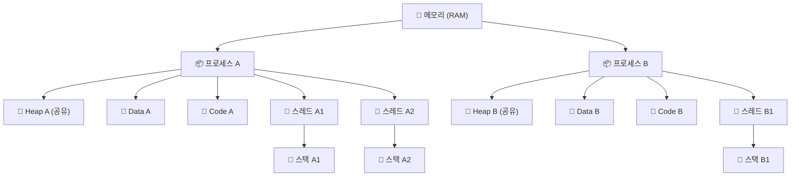

```mermaid
flowchart TB
    %% 메모리 전체
    RAM["💾 메모리 (RAM)"]

    %% 프로세스 A
    ProcessA["📦 프로세스 A"]
    HeapA["🧱 Heap A (공유)"]
    DataA["📄 Data A"]
    CodeA["📜 Code A"]
    ThreadA1["🧵 스레드 A1"]
    ThreadA2["🧵 스레드 A2"]
    StackA1["🧠 스택 A1"]
    StackA2["🧠 스택 A2"]

    %% 프로세스 B
    ProcessB["📦 프로세스 B"]
    HeapB["🧱 Heap B (공유)"]
    DataB["📄 Data B"]
    CodeB["📜 Code B"]
    ThreadB1["🧵 스레드 B1"]
    StackB1["🧠 스택 B1"]

    %% 연결: 메모리 → 프로세스
    RAM --> ProcessA
    RAM --> ProcessB

    %% 프로세스 A 구성
    ProcessA --> HeapA
    ProcessA --> DataA
    ProcessA --> CodeA
    ProcessA --> ThreadA1 --> StackA1
    ProcessA --> ThreadA2 --> StackA2

    %% 프로세스 B 구성
    ProcessB --> HeapB
    ProcessB --> DataB
    ProcessB --> CodeB
    ProcessB --> ThreadB1 --> StackB1
```
