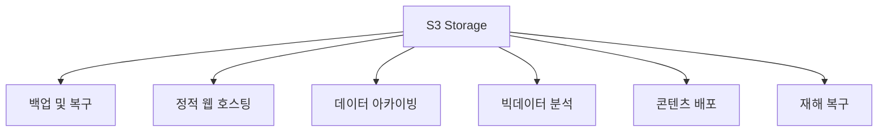

---
tags:
- aws
- s3
- terraform
- storage
- object-storage
created: 2025-01-15
updated: 2025-01-15
aliases:
- AWS S3
- Simple Storage Service
- S3 Terraform
description: AWS S3(Simple Storage Service) 개념과 Terraform을 사용한 S3 리소스 관리
status: published
category: guide
---

# AWS S3 with Terraform

> [!info] 개요
> AWS S3(Simple Storage Service)는 업계 최고 수준의 확장성, 데이터 가용성, 보안 및 성능을 제공하는 객체 스토리지 서비스입니다. Terraform을 사용하여 S3 리소스를 효과적으로 관리하는 방법을 학습합니다.

## 📑 목차

- [[#🗄️ S3 개요]]
- [[#🏗️ S3 아키텍처]]
- [[#📦 S3 버킷 생성]]
- [[#🔐 버킷 정책 관리]]
- [[#🔄 라이프사이클 관리]]
- [[#🌐 정적 웹 호스팅]]
- [[#🔒 보안 설정]]
- [[#💰 비용 최적화]]
- [[#📚 참고자료]]

---

## 🗄️ S3 개요

### S3 핵심 특징

> [!note] S3 주요 특징
> - **Object-Based Storage**: 데이터를 객체로 저장 (데이터 + 메타데이터 + 고유 식별자)
> - **Scalability**: 무제한 저장 용량 (단일 객체 최대 5TB)
> - **Data Availability**: 99.99% 가용성 설계
> - **Durability**: 99.999999999% (11 9's) 내구성
> - **Security**: 강력한 보안 기능 (버킷 정책, IAM, ACL, 암호화)
> - **Lifecycle Management**: 자동 데이터 마이그레이션 및 삭제
> - **Integration**: 다른 AWS 서비스와의 완벽한 통합

### S3 사용 사례



---

## 🏗️ S3 아키텍처

### S3 구성 요소

> [!tip] S3 계층 구조
> ```
> S3 Service
> └── Bucket (전역적으로 고유한 이름)
>     ├── Object (파일)
>     │   ├── Key (파일 경로/이름)
>     │   ├── Value (실제 데이터)
>     │   └── Metadata
>     └── Bucket Policy (접근 제어)
> ```

---

## 📦 S3 버킷 생성

### 기본 버킷 생성

> [!example] Terraform으로 S3 버킷 생성
> ```hcl
> resource "aws_s3_bucket" "learn_terraform_mybucket" {
>   bucket = "learn-terraform-mybucket"
>   
>   tags = {
>     environment = "devel"
>     Name        = "My Terraform Bucket"
>   }
> }
> ```

### 고급 버킷 설정

```hcl
# variables.tf
variable "bucket_name" {
  description = "S3 버킷 이름"
  type        = string
  default     = "my-unique-bucket-name-2024"
}

# main.tf
resource "aws_s3_bucket" "main" {
  bucket = var.bucket_name
  
  # 실수로 버킷이 삭제되는 것을 방지
  lifecycle {
    prevent_destroy = true
  }
  
  tags = {
    Name        = var.bucket_name
    Environment = "Production"
    ManagedBy   = "Terraform"
  }
}

# 버킷 버전 관리
resource "aws_s3_bucket_versioning" "main" {
  bucket = aws_s3_bucket.main.id
  
  versioning_configuration {
    status = "Enabled"
  }
}

# 서버 사이드 암호화
resource "aws_s3_bucket_server_side_encryption_configuration" "main" {
  bucket = aws_s3_bucket.main.id
  
  rule {
    apply_server_side_encryption_by_default {
      sse_algorithm = "AES256"
    }
  }
}

# 퍼블릭 액세스 차단
resource "aws_s3_bucket_public_access_block" "main" {
  bucket = aws_s3_bucket.main.id
  
  block_public_acls       = true
  block_public_policy     = true
  ignore_public_acls      = true
  restrict_public_buckets = true
}
```

---

## 🔐 버킷 정책 관리

### 버킷 정책 예제

> [!warning] 버킷 정책 작성 시 주의사항
> - 최소 권한 원칙 적용
> - Principal과 Resource 명확히 지정
> - Condition 활용하여 보안 강화

```hcl
# S3 버킷 정책
resource "aws_s3_bucket_policy" "allow_access" {
  bucket = aws_s3_bucket.main.id
  
  policy = jsonencode({
    Version = "2012-10-17"
    Statement = [
      {
        Sid    = "AllowSpecificIAMRole"
        Effect = "Allow"
        Principal = {
          AWS = "arn:aws:iam::123456789012:role/MyRole"
        }
        Action = [
          "s3:GetObject",
          "s3:ListBucket"
        ]
        Resource = [
          aws_s3_bucket.main.arn,
          "${aws_s3_bucket.main.arn}/*"
        ]
      },
      {
        Sid    = "DenyUnencryptedObjectUploads"
        Effect = "Deny"
        Principal = "*"
        Action = "s3:PutObject"
        Resource = "${aws_s3_bucket.main.arn}/*"
        Condition = {
          StringNotEquals = {
            "s3:x-amz-server-side-encryption" = "AES256"
          }
        }
      }
    ]
  })
}
```

### CORS 설정

```hcl
resource "aws_s3_bucket_cors_configuration" "main" {
  bucket = aws_s3_bucket.main.id
  
  cors_rule {
    allowed_headers = ["*"]
    allowed_methods = ["GET", "HEAD"]
    allowed_origins = ["https://example.com"]
    expose_headers  = ["ETag"]
    max_age_seconds = 3000
  }
}
```

---

## 🔄 라이프사이클 관리

### 라이프사이클 규칙 설정

> [!tip] 비용 최적화를 위한 라이프사이클
> 데이터 접근 패턴에 따라 자동으로 스토리지 클래스를 변경합니다.

```hcl
resource "aws_s3_bucket_lifecycle_configuration" "main" {
  bucket = aws_s3_bucket.main.id
  
  rule {
    id     = "archive-old-objects"
    status = "Enabled"
    
    # 30일 후 Infrequent Access로 이동
    transition {
      days          = 30
      storage_class = "STANDARD_IA"
    }
    
    # 90일 후 Glacier로 이동
    transition {
      days          = 90
      storage_class = "GLACIER"
    }
    
    # 365일 후 Deep Archive로 이동
    transition {
      days          = 365
      storage_class = "DEEP_ARCHIVE"
    }
    
    # 7년 후 삭제
    expiration {
      days = 2555
    }
  }
  
  rule {
    id     = "delete-incomplete-multipart-uploads"
    status = "Enabled"
    
    # 미완성 멀티파트 업로드 7일 후 삭제
    abort_incomplete_multipart_upload {
      days_after_initiation = 7
    }
  }
  
  rule {
    id     = "delete-old-versions"
    status = "Enabled"
    
    # 이전 버전 30일 후 삭제
    noncurrent_version_expiration {
      noncurrent_days = 30
    }
  }
}
```

---

## 🌐 정적 웹 호스팅

### S3 정적 웹사이트 설정

> [!example] 정적 웹사이트 호스팅
> ```hcl
> resource "aws_s3_bucket" "website" {
>   bucket = "my-static-website-bucket"
> }
> 
> resource "aws_s3_bucket_website_configuration" "website" {
>   bucket = aws_s3_bucket.website.id
>   
>   index_document {
>     suffix = "index.html"
>   }
>   
>   error_document {
>     key = "error.html"
>   }
>   
>   routing_rule {
>     condition {
>       key_prefix_equals = "docs/"
>     }
>     redirect {
>       replace_key_prefix_with = "documents/"
>     }
>   }
> }
> 
> # 웹사이트 파일 업로드
> resource "aws_s3_object" "index" {
>   bucket       = aws_s3_bucket.website.id
>   key          = "index.html"
>   source       = "./website/index.html"
>   content_type = "text/html"
>   etag         = filemd5("./website/index.html")
> }
> ```

### CloudFront 연동

```hcl
# CloudFront Origin Access Identity
resource "aws_cloudfront_origin_access_identity" "website" {
  comment = "OAI for static website"
}

# S3 버킷 정책 - CloudFront만 접근 허용
resource "aws_s3_bucket_policy" "website" {
  bucket = aws_s3_bucket.website.id
  
  policy = jsonencode({
    Version = "2012-10-17"
    Statement = [
      {
        Sid    = "AllowCloudFrontAccess"
        Effect = "Allow"
        Principal = {
          AWS = aws_cloudfront_origin_access_identity.website.iam_arn
        }
        Action   = "s3:GetObject"
        Resource = "${aws_s3_bucket.website.arn}/*"
      }
    ]
  })
}
```

---

## 🔒 보안 설정

### 암호화 설정

> [!warning] 보안 베스트 프랙티스
> ```hcl
> # KMS 키로 암호화
> resource "aws_kms_key" "s3" {
>   description             = "S3 버킷 암호화용 KMS 키"
>   deletion_window_in_days = 10
>   enable_key_rotation     = true
> }
> 
> resource "aws_s3_bucket_server_side_encryption_configuration" "kms" {
>   bucket = aws_s3_bucket.main.id
>   
>   rule {
>     apply_server_side_encryption_by_default {
>       kms_master_key_id = aws_kms_key.s3.arn
>       sse_algorithm     = "aws:kms"
>     }
>     bucket_key_enabled = true
>   }
> }
> ```

### 로깅 설정

```hcl
# 로그 버킷
resource "aws_s3_bucket" "logs" {
  bucket = "my-s3-logs-bucket"
}

resource "aws_s3_bucket_acl" "logs" {
  bucket = aws_s3_bucket.logs.id
  acl    = "log-delivery-write"
}

# 메인 버킷 로깅 설정
resource "aws_s3_bucket_logging" "main" {
  bucket = aws_s3_bucket.main.id
  
  target_bucket = aws_s3_bucket.logs.id
  target_prefix = "s3-access-logs/"
}
```

---

## 💰 비용 최적화

### 스토리지 클래스 비교

> [!tip] 스토리지 클래스별 사용 시나리오
> | 클래스 | 사용 사례 | 최소 저장 기간 | 접근 빈도 |
> |--------|-----------|---------------|-----------|
> | STANDARD | 자주 접근하는 데이터 | 없음 | 매일 |
> | STANDARD_IA | 가끔 접근하는 데이터 | 30일 | 월 1-2회 |
> | ONEZONE_IA | 재생성 가능한 데이터 | 30일 | 월 1-2회 |
> | GLACIER_IR | 아카이브 (즉시 접근) | 90일 | 분기 1회 |
> | GLACIER_FA | 아카이브 (유연한 접근) | 90일 | 연 1-2회 |
> | DEEP_ARCHIVE | 장기 아카이브 | 180일 | 연 1회 미만 |

### Intelligent-Tiering 설정

```hcl
resource "aws_s3_bucket_intelligent_tiering_configuration" "main" {
  bucket = aws_s3_bucket.main.id
  name   = "entire-bucket"
  
  tiering {
    access_tier = "ARCHIVE_ACCESS"
    days        = 90
  }
  
  tiering {
    access_tier = "DEEP_ARCHIVE_ACCESS"
    days        = 180
  }
}
```

---

## 📚 참고자료

### 관련 문서
- [[AWS 기초 개념]]
- [[AWS EC2 with Terraform]]
- [[Terraform 기초]]

### 외부 리소스
- [AWS S3 Documentation](https://docs.aws.amazon.com/s3/)
- [S3 Pricing](https://aws.amazon.com/s3/pricing/)
- [S3 Best Practices](https://docs.aws.amazon.com/AmazonS3/latest/userguide/security-best-practices.html)
- [Terraform AWS Provider S3](https://registry.terraform.io/providers/hashicorp/aws/latest/docs/resources/s3_bucket)

---

> [!quote]
> "S3는 단순한 스토리지가 아니라, 클라우드 애플리케이션의 기반입니다."