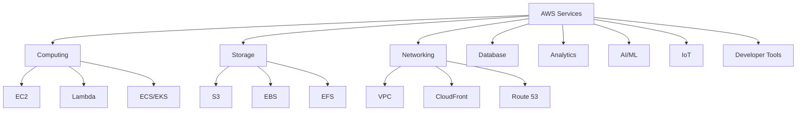
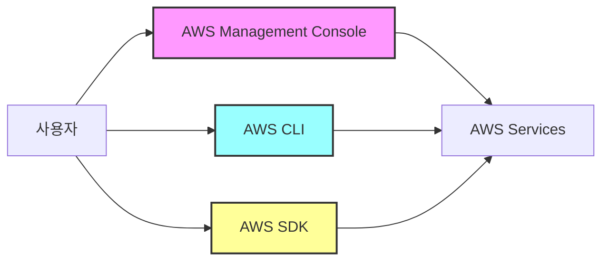

---
tags:
- aws
- cloud
- infrastructure
- iaas
- iam
- root-user
- devops
created: 2025-01-06
updated: 2025-01-06
aliases:
- AWS Fundamentals
- AWS 기초
- Amazon Web Services
- AWS 가이드
description: AWS(Amazon Web Services)의 기본 개념, 주요 특징, Root User, IAM, CLI 설정 등 종합 가이드
status: published
category: guide
---

# AWS 기초 개념

> [!info] 개요
> Amazon Web Services(AWS)는 세계 최대의 클라우드 서비스 제공업체로, 2006년 최초로 IaaS를 제공한 선구자입니다. 200개 이상의 서비스를 통해 인프라, 플랫폼, 소프트웨어를 제공하며, 전 세계적인 인프라와 강력한 생태계를 구축하고 있습니다.

## 📑 목차

- [[#☁️ AWS 소개]]
- [[#⚡ AWS 주요 특징]]
- [[#👤 Root User Account]]
- [[#🔐 IAM (Identity and Access Management)]]
- [[#💻 AWS CLI 설치 및 설정]]
- [[#🔑 AWS 접근 방법]]
- [[#🛠️ Terraform으로 IAM 리소스 관리]]
- [[#💡 보안 베스트 프랙티스]]
- [[#📚 참고자료]]

---

## ☁️ AWS 소개

### AWS란?
Amazon Web Services(AWS)는 Amazon에서 제공하는 클라우드 컴퓨팅 플랫폼으로, 기업과 개인에게 다양한 IT 인프라와 서비스를 온디맨드로 제공합니다.

### AWS 서비스 카테고리



---

## ⚡ AWS 주요 특징

### 1. 선구자적 위치 (Early Start)
> [!note] 최초의 IaaS 제공자
> AWS는 2006년 출시되어 Infrastructure as a Service(IaaS) 시장을 개척한 최초의 기업입니다.

### 2. 광범위한 서비스 제공 (Extensive Service Offerings)
> [!tip] 200개 이상의 서비스
> AWS는 다른 클라우드 제공업체보다 훨씬 많은 서비스를 제공합니다:
> 
> **주요 서비스 카테고리:**
> - **컴퓨팅**: EC2, Lambda, ECS, EKS, Fargate, Batch
> - **스토리지**: S3, EBS, EFS, Glacier, Storage Gateway
> - **네트워킹**: VPC, CloudFront, Route 53, Direct Connect
> - **데이터베이스**: RDS, DynamoDB, Aurora, Redshift, ElastiCache
> - **분석**: Athena, EMR, Kinesis, QuickSight
> - **AI/ML**: SageMaker, Rekognition, Polly, Comprehend
> - **IoT**: IoT Core, IoT Analytics, IoT Device Management
> - **모바일**: Amplify, AppSync, Device Farm
> - **개발자 도구**: CodeCommit, CodeBuild, CodeDeploy, CodePipeline
> - **관리 도구**: CloudWatch, Systems Manager, CloudFormation
> - **보안**: IAM, KMS, Secrets Manager, GuardDuty

### 3. 글로벌 인프라 (Global Presence)
> [!example] 전 세계적 배포
> - **리전(Regions)**: 전 세계 31개 지역에 분산된 데이터센터 클러스터
> - **가용 영역(Availability Zones)**: 각 리전 내 99개 이상의 독립 데이터센터
> - **엣지 로케이션**: 450개 이상의 CDN 포인트
> - **로컬 존**: 대도시 근처의 확장 인프라
> - 높은 가용성, 확장성, 안정성 보장

### 4. 확장성과 유연성 (Scalability and Flexibility)
- **자동 확장**: Auto Scaling으로 수요에 따른 자동 리소스 조정
- **탄력적 요금제**: 사용한 만큼만 지불하는 Pay-as-you-go 모델
- **다양한 인스턴스 타입**: 워크로드에 최적화된 200개 이상의 인스턴스 타입

### 5. 신뢰성과 보안 (Reliability and Security)
> [!warning] 엔터프라이즈급 보안
> - **데이터 암호화**: 전송 중 및 저장 중 암호화
> - **규정 준수**: ISO 27001, SOC, PCI DSS, HIPAA 등 인증
> - **SLA**: 99.99% 이상의 가용성 보장
> - **DDoS 보호**: AWS Shield 기본 제공
> - **보안 모니터링**: GuardDuty, Security Hub

### 6. 지속적인 혁신 (Innovation and Continuous Improvement)
- 연간 3,000개 이상의 새로운 기능과 서비스 출시
- 고객 피드백 기반 개발
- 최신 기술 트렌드 신속 반영 (AI/ML, 서버리스, 컨테이너 등)

### 7. 강력한 생태계 (Strong Ecosystem)
- **AWS Marketplace**: 10,000개 이상의 서드파티 소프트웨어
- **Partner Network (APN)**: 100,000개 이상의 파트너
- **교육 프로그램**: AWS Training and Certification
- **커뮤니티**: 활발한 사용자 커뮤니티와 포럼

---

## 👤 Root User Account

### Root User란?
> [!danger] 최고 권한 계정
> Root User는 AWS 계정을 처음 생성할 때 만들어지는 초기 계정으로, 모든 AWS 서비스와 리소스에 대한 완전한 접근 권한을 가집니다.

### Root User 특징

#### 1. 완전한 접근 권한 (Complete Access)
- 모든 AWS 서비스와 리소스에 대한 무제한 접근
- 모든 리전의 모든 리소스 제어 가능

#### 2. 계정 관리 (Account Management)
**Root User만 수행 가능한 작업:**
- AWS 계정 설정 변경
- 결제 정보 및 지불 방법 관리
- AWS Support 플랜 변경
- IAM 사용자 권한 경계 설정
- AWS 계정 종료
- Marketplace 구독 관리
- Reserved Instance Marketplace 등록

#### 3. 보안 위험 (Security Risk)
> [!danger] 절대 하지 말아야 할 것
> - Root 계정으로 일상 작업 수행
> - Root 계정의 Access Key 생성 및 사용
> - 비밀번호만으로 로그인 허용
> - Root 계정 정보 공유

### Root User 보안 설정

> [!success] 필수 보안 설정
> ```bash
> # 1. 강력한 비밀번호 설정 (최소 14자, 특수문자 포함)
> # 2. MFA(Multi-Factor Authentication) 활성화
> # 3. Root 계정 Access Key 삭제
> # 4. 개인 IAM 사용자 생성 및 사용
> # 5. 계정 보안 연락처 정보 업데이트
> # 6. 보안 질문 설정
> # 7. CloudTrail 로깅 활성화
> ```

### Multi-Factor Authentication (MFA) 설정

> [!example] MFA 옵션
> **가상 MFA 디바이스:**
> - Google Authenticator
> - Authy
> - Microsoft Authenticator
> 
> **하드웨어 MFA 디바이스:**
> - YubiKey
> - Gemalto 토큰
> 
> **SMS MFA** (일부 리전에서만 지원)


---

## 🔐 IAM (Identity and Access Management)

### IAM 개요
IAM은 AWS 리소스에 대한 접근을 안전하게 제어할 수 있는 서비스입니다.

### IAM 주요 구성 요소

#### 1. IAM Users (사용자)
> [!tip] IAM 사용자 생성 권장사항
> - 개인별 고유 사용자 생성
> - 그룹을 통한 권한 관리
> - 강력한 비밀번호 정책 적용
> - MFA 활성화

#### 2. IAM Groups (그룹)
사용자 집합으로 공통 권한을 쉽게 관리

#### 3. IAM Roles (역할)
임시 권한을 위한 AWS 자격 증명

#### 4. IAM Policies (정책)
JSON 형식으로 정의된 권한 문서

### IAM 정책 구조

```json
{
  "Version": "2012-10-17",
  "Statement": [
    {
      "Effect": "Allow",
      "Action": [
        "s3:GetObject",
        "s3:ListBucket"
      ],
      "Resource": [
        "arn:aws:s3:::my-bucket",
        "arn:aws:s3:::my-bucket/*"
      ],
      "Condition": {
        "IpAddress": {
          "aws:SourceIp": "203.0.113.0/24"
        }
      }
    }
  ]
}
```

---

## 💻 AWS CLI 설치 및 설정

### 설치 방법

#### macOS (Homebrew)
```bash
# AWS CLI 설치
brew install awscli

# zsh 자동완성 설정
echo 'source /opt/homebrew/share/zsh/site-functions/_aws' >> ~/.zshrc
source ~/.zshrc
```

#### Linux
```bash
# pip를 통한 설치
pip install awscli --upgrade --user

# 또는 번들 설치
curl "https://awscli.amazonaws.com/awscli-exe-linux-x86_64.zip" -o "awscliv2.zip"
unzip awscliv2.zip
sudo ./aws/install
```

#### Windows
```powershell
# MSI 설치 프로그램 다운로드 및 실행
# 또는 Chocolatey 사용
choco install awscli
```

### AWS CLI 초기 설정

> [!example] 기본 설정
> ```bash
> $ aws configure
> AWS Access Key ID [None]: AKIAVXXXXXXXX
> AWS Secret Access Key [None]: 3uzWzYnDXXXXXXXXXXX
> Default region name [None]: us-west-2
> Default output format [None]: json
> ```

### 설정 파일 구조

#### ~/.aws/credentials
```ini
[default]
aws_access_key_id = AKIAVXXXXXXXX
aws_secret_access_key = 3uzWzYnDXXXXXXXXXXX

[production]
aws_access_key_id = AKIAPXXXXXXXX
aws_secret_access_key = 4vzXzYnEXXXXXXXXXXX
```

#### ~/.aws/config
```ini
[default]
region = us-west-2
output = json

[profile production]
region = us-east-1
output = table
role_arn = arn:aws:iam::123456789012:role/ProductionRole
source_profile = default
```

### 프로파일 관리

> [!tip] 여러 계정/환경 관리
> ```bash
> # 프로파일 생성
> aws configure --profile development
> aws configure --profile staging
> aws configure --profile production
> 
> # 프로파일 사용
> aws s3 ls --profile production
> 
> # 환경변수로 프로파일 설정
> export AWS_PROFILE=production
> 
> # 특정 명령에만 프로파일 적용
> AWS_PROFILE=staging aws ec2 describe-instances
> ```

---

## 🔑 AWS 접근 방법

### 접근 방법 3가지



### 1. AWS Management Console
- 웹 기반 GUI 인터페이스
- 시각적 리소스 관리
- 초보자 친화적

### 2. AWS CLI
- 명령줄 인터페이스
- 스크립팅 및 자동화 지원
- 모든 AWS 서비스 접근 가능

### 3. AWS SDK
- 프로그래밍 언어별 라이브러리
- 지원 언어: Python (Boto3), Java, JavaScript, .NET, Go, Ruby, PHP, C++
- 애플리케이션 통합용

### Access Key 관리

> [!warning] Access Key 보안
> ```bash
> # Access Key는 절대 코드에 하드코딩하지 마세요!
> 
> # 잘못된 예
> aws_access_key = "AKIAVXXXXXXXX"  # 절대 금지!
> 
> # 올바른 예 - 환경변수 사용
> export AWS_ACCESS_KEY_ID="AKIAVXXXXXXXX"
> export AWS_SECRET_ACCESS_KEY="3uzWzYnDXXXXXXXXXXX"
> 
> # 또는 AWS Vault 같은 도구 사용
> aws-vault exec production -- aws s3 ls
> ```


---

## 🛠️ Terraform으로 IAM 리소스 관리

### Terraform Provider 설정

```hcl
# versions.tf
terraform {
  required_version = ">= 1.0"
  required_providers {
    aws = {
      source  = "hashicorp/aws"
      version = "~> 5.0"
    }
  }
}

# provider.tf
provider "aws" {
  region = var.aws_region
  
  # 프로파일 사용 (권장)
  profile = "terraform"
  
  # 태그 자동 적용
  default_tags {
    tags = {
      ManagedBy   = "Terraform"
      Environment = var.environment
      Project     = var.project_name
    }
  }
}
```

### IAM 리소스 생성

#### 1. IAM User
```hcl
resource "aws_iam_user" "developer" {
  name = "developer1"
  path = "/system/"
  
  tags = {
    Department = "Engineering"
    Team       = "Backend"
  }
}

# 프로그래밍 방식 액세스용 Access Key
resource "aws_iam_access_key" "developer_key" {
  user = aws_iam_user.developer.name
}
```

#### 2. IAM Group
```hcl
resource "aws_iam_group" "developers" {
  name = "developers"
  path = "/teams/"
}

resource "aws_iam_group_membership" "dev_team" {
  name = "dev-team-membership"
  
  users = [
    aws_iam_user.developer.name,
  ]
  
  group = aws_iam_group.developers.name
}
```

#### 3. IAM Policy
```hcl
resource "aws_iam_policy" "developer_policy" {
  name        = "developer-policy"
  path        = "/policies/"
  description = "Policy for developers"
  
  policy = jsonencode({
    Version = "2012-10-17"
    Statement = [
      {
        Effect = "Allow"
        Action = [
          "s3:ListBucket",
          "s3:GetObject"
        ]
        Resource = [
          "arn:aws:s3:::dev-*",
          "arn:aws:s3:::dev-*/*"
        ]
      },
      {
        Effect = "Allow"
        Action = [
          "ec2:Describe*",
          "ec2:StartInstances",
          "ec2:StopInstances"
        ]
        Resource = "*"
        Condition = {
          StringEquals = {
            "ec2:ResourceTag/Environment" = "Development"
          }
        }
      }
    ]
  })
}

# Policy를 Group에 연결
resource "aws_iam_group_policy_attachment" "developers_policy" {
  group      = aws_iam_group.developers.name
  policy_arn = aws_iam_policy.developer_policy.arn
}
```

#### 4. IAM Role
```hcl
resource "aws_iam_role" "ec2_role" {
  name = "ec2-s3-access-role"
  
  assume_role_policy = jsonencode({
    Version = "2012-10-17"
    Statement = [
      {
        Action = "sts:AssumeRole"
        Effect = "Allow"
        Principal = {
          Service = "ec2.amazonaws.com"
        }
      }
    ]
  })
}

resource "aws_iam_role_policy_attachment" "ec2_s3_policy" {
  role       = aws_iam_role.ec2_role.name
  policy_arn = "arn:aws:iam::aws:policy/AmazonS3ReadOnlyAccess"
}

resource "aws_iam_instance_profile" "ec2_profile" {
  name = "ec2-s3-profile"
  role = aws_iam_role.ec2_role.name
}
```

---

## 💡 보안 베스트 프랙티스

### 계정 보안 체크리스트

> [!success] AWS 계정 보안 설정
> - [x] Root 계정 MFA 활성화
> - [x] Root 계정 Access Key 삭제
> - [x] 개별 IAM 사용자 생성
> - [x] IAM 사용자 MFA 활성화
> - [x] 최소 권한 원칙 적용
> - [x] 정기적인 Access Key 교체 (90일마다)
> - [x] CloudTrail 로깅 활성화
> - [x] GuardDuty 활성화
> - [x] 비용 알림 설정
> - [x] 비밀번호 정책 강화
> - [x] Security Hub 활성화
> - [x] 불필요한 리전 비활성화

### IAM 베스트 프랙티스

#### 1. 최소 권한 원칙
```json
{
  "Version": "2012-10-17",
  "Statement": [
    {
      "Effect": "Allow",
      "Action": [
        "s3:GetObject"
      ],
      "Resource": [
        "arn:aws:s3:::specific-bucket/specific-path/*"
      ]
    }
  ]
}
```

#### 2. 조건부 액세스
```json
{
  "Version": "2012-10-17",
  "Statement": [
    {
      "Effect": "Allow",
      "Action": "*",
      "Resource": "*",
      "Condition": {
        "IpAddress": {
          "aws:SourceIp": ["203.0.113.0/24"]
        },
        "DateGreaterThan": {
          "aws:CurrentTime": "2024-01-01T00:00:00Z"
        },
        "DateLessThan": {
          "aws:CurrentTime": "2024-12-31T23:59:59Z"
        },
        "Bool": {
          "aws:MultiFactorAuthPresent": "true"
        }
      }
    }
  ]
}
```

### 비밀 관리

> [!danger] 절대 하지 말아야 할 것
> - 코드에 자격 증명 하드코딩
> - 공개 저장소에 자격 증명 커밋
> - 이메일이나 메신저로 자격 증명 공유
> - 루트 계정 Access Key 사용

> [!tip] 권장 사항
> ```bash
> # AWS Secrets Manager 사용
> aws secretsmanager create-secret \
>   --name prod/db/password \
>   --secret-string '{"password":"MySecurePassword"}'
> 
> # AWS Systems Manager Parameter Store 사용
> aws ssm put-parameter \
>   --name /myapp/db/password \
>   --value "MySecurePassword" \
>   --type SecureString
> 
> # 환경변수 사용
> export DB_PASSWORD=$(aws secretsmanager get-secret-value \
>   --secret-id prod/db/password \
>   --query SecretString \
>   --output text | jq -r .password)
> ```

### 모니터링 및 알림

```bash
# CloudWatch 알람 설정
aws cloudwatch put-metric-alarm \
  --alarm-name root-account-usage \
  --alarm-description "Alert when root account is used" \
  --metric-name UserName \
  --namespace AWS/CloudTrail \
  --statistic Sum \
  --period 300 \
  --threshold 1 \
  --comparison-operator GreaterThanOrEqualToThreshold
```

---

## 📚 참고자료

### AWS 공식 문서
- [AWS Documentation](https://docs.aws.amazon.com/)
- [AWS Well-Architected Framework](https://aws.amazon.com/architecture/well-architected/)
- [AWS Security Best Practices](https://aws.amazon.com/security/best-practices/)
- [IAM Best Practices](https://docs.aws.amazon.com/IAM/latest/UserGuide/best-practices.html)
- [AWS CLI Command Reference](https://docs.aws.amazon.com/cli/latest/)

### 학습 리소스
- [AWS Training and Certification](https://aws.amazon.com/training/)
- [AWS Free Tier](https://aws.amazon.com/free/)
- [AWS Skill Builder](https://skillbuilder.aws/)
- [AWS Workshop](https://workshops.aws/)

### 관련 내부 문서
- [[AWS S3 with Terraform]]
- [[AWS EC2 with Terraform]]
- [[AWS Systems Manager Parameter Store]]
- [[Terraform 기초 가이드]]
- [[Terraform 고급 기능 가이드]]

### 유용한 도구
- [AWS Vault](https://github.com/99designs/aws-vault) - 안전한 자격 증명 관리
- [Terraform](https://www.terraform.io/) - Infrastructure as Code
- [AWS SAM](https://aws.amazon.com/serverless/sam/) - 서버리스 애플리케이션
- [LocalStack](https://localstack.cloud/) - 로컬 AWS 환경

---

> [!quote]
> "The cloud is about how you do computing, not where you do computing." - Paul Maritz, VMware CEO
> 
> "클라우드는 단순히 다른 사람의 컴퓨터가 아니라, 무한한 가능성의 플랫폼입니다."