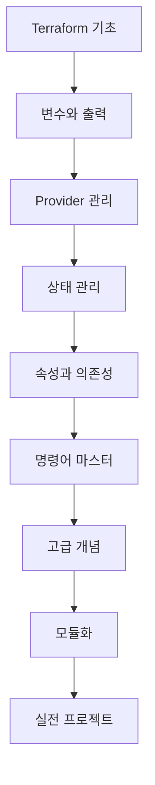

---
tags:
  - terraform
  - infrastructure
  - iac
  - devops
  - guide
created: 2025-01-20
updated: 2025-01-20
aliases:
  - Terraform Guide
  - 테라폼 가이드
  - IaC Guide
description: Terraform 학습을 위한 종합 가이드 - 초급부터 고급까지 체계적인 학습 경로
status: published
category: guide
---

# Terraform 완벽 가이드

> [!info] 개요
> HashiCorp Terraform을 사용한 Infrastructure as Code(IaC) 구현을 위한 종합 가이드입니다. 초급자부터 고급 사용자까지 단계별로 학습할 수 있도록 구성되어 있습니다.

## 📑 목차

- [[#⚡ 학습 로드맵]]
- [[#📚 초급 과정]]
- [[#🔧 중급 과정]]
- [[#🚀 고급 과정]]
- [[#💡 실전 프로젝트]]
- [[#📊 모범 사례]]
- [[#🔗 관련 자료]]

---

## ⚡ 학습 로드맵

> [!tip] 추천 학습 순서
> 아래 순서대로 학습하시면 Terraform을 체계적으로 마스터할 수 있습니다.



---

## 📚 초급 과정

### 1단계: 기초 이해하기

> [!example] 시작하기
> Terraform의 기본 개념과 첫 인프라 구성

- [[01. Terraform 기초]] - Infrastructure as Code 개념과 기본 구조
- [[Terraform init 상세]] - 초기화 과정과 Provider 설정
- [[02. Terraform 명령어#핵심 명령어]] - init, plan, apply, destroy

### 2단계: 변수와 데이터 관리

> [!note] 동적 구성 만들기
> 재사용 가능하고 유연한 구성 작성법

- [[04. Terraform 변수 (Input Variables)]] - 입력 변수 정의와 활용
- [[05. Terraform 출력 변수 (Output)]] - 결과 값 출력과 모듈 간 데이터 전달
- [[Terraform Provider 관리]] - Provider 설정과 버전 관리

---

## 🔧 중급 과정

### 3단계: 상태와 협업

> [!warning] 팀 작업 필수 지식
> 여러 명이 함께 작업할 때 필요한 개념들

- [[Terraform 상태 관리]] - State 파일의 이해와 Remote Backend
- [[Terraform 속성과 의존성]] - 리소스 간 관계 설정
- [[02. Terraform 명령어#상태 관리 명령어]] - state 명령어 활용

### 4단계: 워크플로우 최적화

> [!tip] 효율적인 작업 방법
> 생산성을 높이는 명령어와 기법들

- [[02. Terraform 명령어#검증 및 포맷팅]] - validate, fmt 활용
- [[02. Terraform 명령어#Workspace 관리]] - 환경별 인프라 관리
- [[02. Terraform 명령어#시각화 및 디버깅]] - graph, console 활용

---

## 🚀 고급 과정

### 5단계: 고급 기능 마스터

> [!abstract] 전문가 레벨
> 복잡한 인프라를 효과적으로 관리하는 고급 기법

- [[07. Terraform 고급 개념#리소스 동작 관리]] - Mutable vs Immutable Resources
- [[07. Terraform 고급 개념#Lifecycle Rules]] - 리소스 생명주기 제어
- [[07. Terraform 고급 개념#Data Sources]] - 외부 리소스 참조
- [[07. Terraform 고급 개념#Meta-Arguments]] - count, for_each, depends_on

### 6단계: 모듈화와 재사용

> [!success] 확장 가능한 인프라
> 모듈을 통한 코드 재사용과 표준화

- 모듈 설계 패턴
- 모듈 레지스트리 활용
- 모듈 버전 관리

---

## 💡 실전 프로젝트

> [!example] 실습 프로젝트
> 실제 환경에서 적용할 수 있는 예제들

### AWS 3-Tier Architecture

```hcl
# 네트워크 모듈
module "network" {
  source = "./modules/network"
  
  vpc_cidr = "10.0.0.0/16"
  az_count = 2
}

# 애플리케이션 모듈
module "application" {
  source = "./modules/application"
  
  subnet_ids = module.network.private_subnet_ids
  instance_type = "t3.micro"
}

# 데이터베이스 모듈
module "database" {
  source = "./modules/database"
  
  subnet_ids = module.network.database_subnet_ids
  engine_version = "13.7"
}
```

### Kubernetes 클러스터 구성

- EKS/GKE/AKS 클러스터 프로비저닝
- 네트워킹 및 보안 설정
- 모니터링 및 로깅 설정

---

## 📊 모범 사례

> [!success] Best Practices
> 프로덕션 환경에서 검증된 모범 사례들

### 코드 구조

```
terraform/
├── environments/
│   ├── dev/
│   ├── staging/
│   └── prod/
├── modules/
│   ├── network/
│   ├── compute/
│   └── database/
└── global/
    ├── iam/
    └── s3/
```

### 네이밍 컨벤션

| 리소스 타입 | 네이밍 패턴 | 예시 |
|------------|------------|------|
| VPC | `{env}-{region}-vpc` | `prod-us-west-2-vpc` |
| Subnet | `{env}-{az}-{type}-subnet` | `prod-us-west-2a-private-subnet` |
| Instance | `{env}-{app}-{role}-{index}` | `prod-api-server-001` |
| Security Group | `{env}-{app}-{tier}-sg` | `prod-web-frontend-sg` |

### 보안 고려사항

> [!danger] 중요 보안 사항
> - State 파일 암호화 필수
> - 민감한 변수는 환경 변수나 Vault 사용
> - IAM 권한 최소화 원칙
> - Git에 `.tfstate` 파일 커밋 금지

### CI/CD 통합

```yaml
# GitHub Actions 예시
name: Terraform Deploy

on:
  push:
    branches: [main]

jobs:
  terraform:
    runs-on: ubuntu-latest
    steps:
      - uses: actions/checkout@v2
      
      - name: Setup Terraform
        uses: hashicorp/setup-terraform@v1
        
      - name: Terraform Init
        run: terraform init
        
      - name: Terraform Plan
        run: terraform plan -out=tfplan
        
      - name: Terraform Apply
        if: github.ref == 'refs/heads/main'
        run: terraform apply tfplan
```

---

## 🔗 관련 자료

### 공식 문서
- [Terraform Documentation](https://www.terraform.io/docs)
- [Terraform Registry](https://registry.terraform.io/)
- [HashiCorp Learn](https://learn.hashicorp.com/terraform)

### 커뮤니티
- [Terraform Community Forum](https://discuss.hashicorp.com/c/terraform-core)
- [Terraform GitHub](https://github.com/hashicorp/terraform)
- [r/Terraform Reddit](https://www.reddit.com/r/Terraform/)

### 도구 및 확장
- [Terraform Cloud](https://app.terraform.io/)
- [Terragrunt](https://terragrunt.gruntwork.io/)
- [Atlantis](https://www.runatlantis.io/)
- [tflint](https://github.com/terraform-linters/tflint)
- [tfsec](https://github.com/aquasecurity/tfsec)

---

> [!quote]
> "Infrastructure as Code는 단순히 스크립트를 작성하는 것이 아니라, 인프라를 소프트웨어 개발 방법론으로 관리하는 패러다임의 전환입니다." - HashiCorp

> [!success] 다음 단계
> [[01. Terraform 기초]]부터 시작하여 단계별로 학습을 진행하세요. 각 문서는 실습 예제와 함께 구성되어 있어 직접 따라하며 학습할 수 있습니다.