---
tags:
  - terraform
  - infrastructure
  - iac
  - devops
  - tutorial
created: 2025-01-20
updated: 2025-01-20
aliases:
  - Terraform Basics
  - 테라폼 기초
  - IaC 기초
description: Terraform의 기본 개념과 구조를 이해하고 첫 인프라 구성을 작성하는 입문 가이드
status: published
category: tutorial
---

# Terraform 기초

> [!info] 개요
> HashiCorp Terraform은 선언적 설정 파일을 사용하여 인프라를 코드로 정의하고 관리하는 Infrastructure as Code(IaC) 도구입니다. 이 문서에서는 Terraform의 기본 개념과 HCL 문법을 학습합니다.

## 📑 목차

- [[#⚡ 빠른 시작]]
- [[#🎯 Infrastructure as Code란?]]
- [[#📦 설치 및 설정]]
- [[#🔧 HCL 기본 문법]]
- [[#💡 기본 워크플로우]]
- [[#🚀 첫 번째 프로젝트]]
- [[#⚠️ 주의사항]]
- [[#📚 다음 단계]]

---

## ⚡ 빠른 시작

> [!example] 최소 구성 예제
> 가장 간단한 Terraform 구성 파일입니다.

```hcl
# main.tf
resource "local_file" "hello" {
  filename = "/tmp/hello.txt"
  content  = "Hello, Terraform!"
}
```

```bash
# 실행 명령어
terraform init    # 초기화
terraform plan    # 계획 확인
terraform apply   # 적용
```

---

## 🎯 Infrastructure as Code란?

> [!abstract] IaC의 핵심 개념
> 인프라를 텍스트 파일로 정의하고 버전 관리하는 방법론

### 전통적 방식 vs IaC

| 구분 | 전통적 방식 | IaC 방식 |
|------|------------|----------|
| **관리 방법** | GUI/CLI 수동 작업 | 코드로 자동화 |
| **재현성** | 문서화 의존 | 100% 재현 가능 |
| **버전 관리** | 어려움 | Git으로 관리 |
| **협업** | 제한적 | 코드 리뷰 가능 |
| **롤백** | 복잡함 | 이전 버전으로 쉽게 복원 |

### Terraform의 특징

- **선언적 구문**: 원하는 최종 상태를 선언
- **멀티 클라우드**: AWS, Azure, GCP 등 다양한 Provider 지원
- **상태 관리**: 현재 인프라 상태를 추적
- **계획 수립**: 변경사항을 사전에 확인

---

## 📦 설치 및 설정

### macOS (Homebrew)

> [!tip] 권장 설치 방법
> Homebrew를 사용하면 버전 관리가 쉽습니다.

```bash
# Homebrew tap 추가
brew tap hashicorp/tap

# Terraform 설치
brew install hashicorp/tap/terraform

# 설치 확인
terraform --version
# 출력: Terraform v1.6.x on darwin_arm64
```

### Windows (Chocolatey)

```powershell
# Chocolatey로 설치
choco install terraform

# 설치 확인
terraform --version
```

### Linux (apt/yum)

```bash
# Ubuntu/Debian
wget -O- https://apt.releases.hashicorp.com/gpg | sudo gpg --dearmor -o /usr/share/keyrings/hashicorp-archive-keyring.gpg
echo "deb [signed-by=/usr/share/keyrings/hashicorp-archive-keyring.gpg] https://apt.releases.hashicorp.com $(lsb_release -cs) main" | sudo tee /etc/apt/sources.list.d/hashicorp.list
sudo apt update && sudo apt install terraform

# RHEL/CentOS
sudo yum install -y yum-utils
sudo yum-config-manager --add-repo https://rpm.releases.hashicorp.com/RHEL/hashicorp.repo
sudo yum -y install terraform
```

### 환경 설정

```bash
# 자동 완성 설정 (bash)
terraform -install-autocomplete

# 환경 변수 설정
export TF_LOG=INFO  # 로그 레벨 설정
export TF_VAR_region=us-west-2  # 변수 설정
```

---

## 🔧 HCL 기본 문법

> [!note] HashiCorp Configuration Language
> Terraform은 HCL이라는 독자적인 구성 언어를 사용합니다.

### 1. 블록 (Blocks)

블록은 HCL의 기본 구조 단위입니다.

```hcl
# 기본 구조
block_type "label1" "label2" {
  argument = value
  
  nested_block {
    argument = value
  }
}

# 실제 예시
resource "aws_instance" "web" {
  ami           = "ami-xxxxxxxxx"
  instance_type = "t2.micro"
  
  tags = {
    Name = "WebServer"
  }
}
```

### 2. 인자와 표현식 (Arguments & Expressions)

```hcl
# 리터럴 값
string_arg = "hello"
number_arg = 42
bool_arg   = true

# 리스트
list_arg = ["item1", "item2", "item3"]

# 맵
map_arg = {
  key1 = "value1"
  key2 = "value2"
}

# 참조
reference = aws_instance.web.id

# 보간법
interpolation = "Instance ID: ${aws_instance.web.id}"
```

### 3. 변수 (Variables)

```hcl
# 변수 정의
variable "instance_type" {
  description = "EC2 instance type"
  type        = string
  default     = "t2.micro"
  
  validation {
    condition     = contains(["t2.micro", "t2.small", "t2.medium"], var.instance_type)
    error_message = "Invalid instance type."
  }
}

# 변수 사용
resource "aws_instance" "example" {
  instance_type = var.instance_type
}
```

### 4. 출력 (Outputs)

```hcl
output "instance_public_ip" {
  description = "Public IP address of the instance"
  value       = aws_instance.web.public_ip
  sensitive   = false
}
```

### 5. 로컬 값 (Locals)

```hcl
locals {
  common_tags = {
    Environment = "Development"
    ManagedBy   = "Terraform"
  }
  
  instance_name = "${var.project}-${var.environment}-server"
}

resource "aws_instance" "example" {
  tags = merge(local.common_tags, {
    Name = local.instance_name
  })
}
```

### 6. 조건문 (Conditionals)

```hcl
resource "aws_instance" "example" {
  instance_type = var.environment == "production" ? "t2.large" : "t2.micro"
  
  # 조건부 블록
  dynamic "ebs_block_device" {
    for_each = var.environment == "production" ? [1] : []
    
    content {
      device_name = "/dev/sdf"
      volume_size = 100
    }
  }
}
```

### 7. 반복문 (Loops)

```hcl
# count 사용
resource "aws_instance" "server" {
  count = 3
  
  ami           = "ami-xxxxxxxxx"
  instance_type = "t2.micro"
  
  tags = {
    Name = "Server-${count.index}"
  }
}

# for_each 사용
variable "instances" {
  default = {
    web = "t2.micro"
    app = "t2.small"
    db  = "t2.medium"
  }
}

resource "aws_instance" "server" {
  for_each = var.instances
  
  ami           = "ami-xxxxxxxxx"
  instance_type = each.value
  
  tags = {
    Name = "Server-${each.key}"
    Type = each.key
  }
}
```

### 8. 함수 (Functions)

> [!example] 자주 사용되는 함수들
> Terraform은 다양한 내장 함수를 제공합니다.

```hcl
# 문자열 함수
locals {
  uppercase = upper("hello")                    # "HELLO"
  lowercase = lower("HELLO")                    # "hello"
  substring = substr("hello world", 0, 5)       # "hello"
  replaced  = replace("hello world", "world", "terraform")  # "hello terraform"
}

# 컬렉션 함수
locals {
  list_length = length(["a", "b", "c"])         # 3
  list_concat = concat(["a"], ["b", "c"])       # ["a", "b", "c"]
  map_keys    = keys({a = 1, b = 2})            # ["a", "b"]
  map_merge   = merge({a = 1}, {b = 2})         # {a = 1, b = 2}
}

# 파일 시스템 함수
locals {
  file_content = file("${path.module}/data.txt")
  json_data    = jsondecode(file("${path.module}/config.json"))
  yaml_data    = yamldecode(file("${path.module}/config.yaml"))
}
```

---

## 💡 기본 워크플로우

> [!tip] Terraform 작업 순서
> 이 워크플로우를 따르면 안전하게 인프라를 관리할 수 있습니다.

```mermaid
graph LR
    A[작성] --> B[초기화]
    B --> C[검증]
    C --> D[계획]
    D --> E[적용]
    E --> F[확인]
```



### 1. 작성 (Write)

```hcl
# main.tf
terraform {
  required_providers {
    aws = {
      source  = "hashicorp/aws"
      version = "~> 5.0"
    }
  }
}

provider "aws" {
  region = "us-west-2"
}

resource "aws_instance" "example" {
  ami           = "ami-xxxxxxxxx"
  instance_type = "t2.micro"
}
```

### 2. 초기화 (Initialize)

```bash
terraform init

# 출력 예시
Initializing the backend...
Initializing provider plugins...
- Installing hashicorp/aws v5.0.0...
Terraform has been successfully initialized!
```

### 3. 검증 (Validate)

```bash
terraform validate

# 출력 예시
Success! The configuration is valid.
```

### 4. 계획 (Plan)

```bash
terraform plan

# 출력 예시
Terraform will perform the following actions:
  + resource "aws_instance" "example" {
      + ami           = "ami-xxxxxxxxx"
      + instance_type = "t2.micro"
      ...
    }
Plan: 1 to add, 0 to change, 0 to destroy.
```

### 5. 적용 (Apply)

```bash
terraform apply

# 또는 자동 승인
terraform apply -auto-approve
```

### 6. 확인 (Show)

```bash
# 현재 상태 확인
terraform show

# 특정 리소스 확인
terraform state show aws_instance.example
```

---

## 🚀 첫 번째 프로젝트

> [!example] 실습: 간단한 웹 서버 구성
> AWS EC2 인스턴스와 보안 그룹을 생성하는 예제입니다.

### 프로젝트 구조

```
my-first-terraform/
├── main.tf         # 메인 구성
├── variables.tf    # 변수 정의
├── outputs.tf      # 출력 정의
└── terraform.tfvars # 변수 값
```

### main.tf

```hcl
terraform {
  required_version = ">= 1.0"
  
  required_providers {
    aws = {
      source  = "hashicorp/aws"
      version = "~> 5.0"
    }
  }
}

provider "aws" {
  region = var.aws_region
}

# 보안 그룹
resource "aws_security_group" "web" {
  name        = "${var.project_name}-web-sg"
  description = "Security group for web server"
  
  ingress {
    from_port   = 80
    to_port     = 80
    protocol    = "tcp"
    cidr_blocks = ["0.0.0.0/0"]
  }
  
  ingress {
    from_port   = 22
    to_port     = 22
    protocol    = "tcp"
    cidr_blocks = [var.ssh_allowed_ip]
  }
  
  egress {
    from_port   = 0
    to_port     = 0
    protocol    = "-1"
    cidr_blocks = ["0.0.0.0/0"]
  }
  
  tags = local.common_tags
}

# EC2 인스턴스
resource "aws_instance" "web" {
  ami           = data.aws_ami.amazon_linux.id
  instance_type = var.instance_type
  
  vpc_security_group_ids = [aws_security_group.web.id]
  
  user_data = <<-EOF
    #!/bin/bash
    yum update -y
    yum install -y httpd
    systemctl start httpd
    systemctl enable httpd
    echo "<h1>Hello from Terraform!</h1>" > /var/www/html/index.html
  EOF
  
  tags = merge(local.common_tags, {
    Name = "${var.project_name}-web-server"
  })
}

# 최신 Amazon Linux AMI 조회
data "aws_ami" "amazon_linux" {
  most_recent = true
  owners      = ["amazon"]
  
  filter {
    name   = "name"
    values = ["amzn2-ami-hvm-*-x86_64-gp2"]
  }
}

locals {
  common_tags = {
    Project     = var.project_name
    Environment = var.environment
    ManagedBy   = "Terraform"
  }
}
```

### variables.tf

```hcl
variable "aws_region" {
  description = "AWS region"
  type        = string
  default     = "us-west-2"
}

variable "project_name" {
  description = "Project name"
  type        = string
  default     = "my-first-terraform"
}

variable "environment" {
  description = "Environment name"
  type        = string
  default     = "dev"
}

variable "instance_type" {
  description = "EC2 instance type"
  type        = string
  default     = "t2.micro"
}

variable "ssh_allowed_ip" {
  description = "IP address allowed for SSH"
  type        = string
  default     = "0.0.0.0/0"  # 주의: 프로덕션에서는 특정 IP만 허용
}
```

### outputs.tf

```hcl
output "instance_id" {
  description = "ID of the EC2 instance"
  value       = aws_instance.web.id
}

output "instance_public_ip" {
  description = "Public IP address of the EC2 instance"
  value       = aws_instance.web.public_ip
}

output "instance_public_dns" {
  description = "Public DNS of the EC2 instance"
  value       = aws_instance.web.public_dns
}

output "web_url" {
  description = "URL of the web server"
  value       = "http://${aws_instance.web.public_ip}"
}
```

### 실행 방법

```bash
# 1. AWS 자격 증명 설정
export AWS_ACCESS_KEY_ID="your-access-key"
export AWS_SECRET_ACCESS_KEY="your-secret-key"

# 2. 초기화
terraform init

# 3. 계획 확인
terraform plan

# 4. 인프라 생성
terraform apply

# 5. 웹 서버 접속
curl $(terraform output -raw web_url)

# 6. 정리 (사용 후)
terraform destroy
```

---

## ⚠️ 주의사항

> [!warning] 초보자가 자주 하는 실수
> 이러한 실수를 피하면 안전하게 Terraform을 사용할 수 있습니다.

### 1. State 파일 관리

- ❌ **절대 하지 말 것**: State 파일을 Git에 커밋
- ✅ **올바른 방법**: `.gitignore`에 추가

```gitignore
# .gitignore
*.tfstate
*.tfstate.*
.terraform/
.terraform.lock.hcl
```

### 2. 민감한 정보 보호

- ❌ **절대 하지 말 것**: 비밀번호나 API 키를 하드코딩
- ✅ **올바른 방법**: 환경 변수나 시크릿 관리 도구 사용

```hcl
# 잘못된 예
variable "db_password" {
  default = "mypassword123"  # 절대 이렇게 하지 마세요!
}

# 올바른 예
variable "db_password" {
  description = "Database password"
  type        = string
  sensitive   = true  # 로그에 표시되지 않음
}
```

### 3. 리소스 삭제 주의

```bash
# 삭제 전 항상 계획 확인
terraform plan -destroy

# 특정 리소스만 삭제
terraform destroy -target=aws_instance.test
```

### 4. 버전 고정

```hcl
# 항상 Provider 버전을 고정
terraform {
  required_providers {
    aws = {
      source  = "hashicorp/aws"
      version = "~> 5.0"  # 5.x 버전만 사용
    }
  }
}
```

---

## 📚 다음 단계

> [!success] 학습 경로
> 다음 문서들을 순서대로 학습하세요.

1. [[Terraform init 상세]] - 초기화 과정 깊이 이해하기
2. [[04. Terraform 변수 (Input Variables)]] - 동적 구성 만들기
3. [[05. Terraform 출력 변수 (Output)]] - 리소스 정보 출력하기
4. [[Terraform Provider 관리]] - Provider 설정과 버전 관리
5. [[Terraform 상태 관리]] - State 파일 이해와 관리

### 추가 학습 자료

- [Terraform 공식 문서](https://www.terraform.io/docs)
- [HashiCorp Learn](https://learn.hashicorp.com/terraform)
- [Terraform Registry](https://registry.terraform.io/)
- [[00. Terraform 학습 가이드]] - 전체 학습 로드맵

---

> [!quote]
> "Infrastructure as Code is not just about automation; it's about applying software engineering practices to infrastructure management." - HashiCorp

> [!tip] 실습 팁
> 모든 예제는 직접 실행해보세요. 실습을 통해 이론을 체득하는 것이 가장 효과적입니다. AWS Free Tier를 활용하면 무료로 실습할 수 있습니다.


---

## 🔢 Terraform 타입 시스템

> [!important] 타입 시스템의 중요성
> Terraform은 강타입 언어로, 각 값은 명확한 타입을 가집니다. 타입을 이해하면 더 안전하고 예측 가능한 코드를 작성할 수 있습니다.

### 기본 타입 (Primitive Types)

```hcl
# string - 문자열
variable "name" {
  type    = string
  default = "hello"
}

# number - 숫자 (정수 및 실수)
variable "count" {
  type    = number
  default = 42
}

variable "price" {
  type    = number
  default = 19.99
}

# bool - 불리언
variable "enable_monitoring" {
  type    = bool
  default = true
}
```

### 컬렉션 타입 (Collection Types)

#### List - 순서가 있는 동일 타입 컬렉션
```hcl
variable "availability_zones" {
  type    = list(string)
  default = ["us-west-2a", "us-west-2b", "us-west-2c"]
}

# 리스트 접근 및 조작
locals {
  first_zone  = var.availability_zones[0]           # "us-west-2a"
  zone_count  = length(var.availability_zones)      # 3
  sorted_zones = sort(var.availability_zones)
  filtered_zones = [for z in var.availability_zones : z if can(regex("2a$", z))]
}
```

#### Set - 중복 없는 순서 없는 컬렉션
```hcl
variable "security_groups" {
  type    = set(string)
  default = ["sg-123", "sg-456", "sg-789", "sg-123"]  # sg-123 중복 자동 제거
}

# Set 활용
locals {
  # Set은 인덱스 접근 불가, 변환 필요
  sg_list = tolist(var.security_groups)
  sg_count = length(var.security_groups)  # 3 (중복 제거됨)
  
  # Set 연산
  set_a = toset(["a", "b", "c"])
  set_b = toset(["b", "c", "d"])
  union = setunion(local.set_a, local.set_b)      # {"a", "b", "c", "d"}
  intersection = setintersection(local.set_a, local.set_b)  # {"b", "c"}
}
```

#### Map - 키-값 쌍
```hcl
variable "instance_tags" {
  type = map(string)
  default = {
    Name        = "WebServer"
    Environment = "Production"
    Team        = "DevOps"
  }
}

# 맵 접근 및 조작
locals {
  env_tag  = var.instance_tags["Environment"]       # "Production"
  name_tag = var.instance_tags.Name                 # "WebServer"
  tag_keys = keys(var.instance_tags)                # ["Environment", "Name", "Team"]
  tag_values = values(var.instance_tags)
  
  # 맵 병합
  additional_tags = {
    Owner = "admin"
    Cost  = "project-123"
  }
  all_tags = merge(var.instance_tags, local.additional_tags)
}
```

#### Tuple - 고정 길이, 다른 타입 허용
```hcl
variable "database_config" {
  type    = tuple([string, number, bool])
  default = ["postgres", 5432, true]
}

# 튜플 접근
locals {
  db_type = var.database_config[0]  # "postgres"
  db_port = var.database_config[1]  # 5432
  db_ssl  = var.database_config[2]  # true
  
  # 튜플은 고정 길이, 각 위치의 타입이 정해짐
  # var.database_config[3] - 오류 발생
}
```

#### Object - 명명된 속성을 가진 구조체
```hcl
variable "server_config" {
  type = object({
    instance_type = string
    monitoring    = bool
    disk_size     = number
    tags         = map(string)
  })
  
  default = {
    instance_type = "t2.micro"
    monitoring    = true
    disk_size     = 30
    tags = {
      Name = "MyServer"
      Env  = "Dev"
    }
  }
}

# 객체 접근
locals {
  instance = var.server_config.instance_type
  monitor  = var.server_config.monitoring
  server_name = var.server_config.tags["Name"]
}
```

### 복합 타입 패턴

```hcl
# 리스트의 맵 - 여러 서버 설정
variable "servers" {
  type = list(map(string))
  default = [
    {
      name = "web-1"
      type = "t2.micro"
      zone = "us-west-2a"
    },
    {
      name = "web-2"
      type = "t2.small"
      zone = "us-west-2b"
    }
  ]
}

# 맵의 리스트 - 환경별 설정
variable "subnet_configs" {
  type = map(list(string))
  default = {
    public   = ["10.0.1.0/24", "10.0.2.0/24"]
    private  = ["10.0.10.0/24", "10.0.11.0/24"]
    database = ["10.0.20.0/24", "10.0.21.0/24"]
  }
}

# 맵의 객체 - 환경별 상세 설정
variable "environment_configs" {
  type = map(object({
    instance_type = string
    min_size      = number
    max_size      = number
    subnets       = list(string)
    enable_monitoring = bool
  }))
  
  default = {
    dev = {
      instance_type = "t2.micro"
      min_size      = 1
      max_size      = 2
      subnets       = ["subnet-dev-1", "subnet-dev-2"]
      enable_monitoring = false
    }
    prod = {
      instance_type = "t2.large"
      min_size      = 3
      max_size      = 10
      subnets       = ["subnet-prod-1", "subnet-prod-2", "subnet-prod-3"]
      enable_monitoring = true
    }
  }
}
```

### Any 타입과 Optional

```hcl
# any 타입 - 모든 타입 허용 (타입 추론)
variable "flexible_config" {
  type = any
  default = {
    string_val = "hello"
    number_val = 42
    list_val   = [1, 2, 3]
    nested = {
      key = "value"
    }
  }
}

# optional 속성 (Terraform 1.3+)
variable "database" {
  type = object({
    engine    = string
    version   = optional(string, "14.0")    # 기본값 지정
    port      = optional(number, 5432)
    backup    = optional(bool, true)
    replicas  = optional(number)            # 기본값 없음 (null)
  })
  
  default = {
    engine = "postgres"
    # version, port, backup은 optional 기본값 사용
  }
}

# nullable 변수
variable "optional_tag" {
  type     = string
  nullable = true  # null 값 허용
  default  = null
}
```

### 타입 변환 함수

```hcl
locals {
  # 기본 타입 변환
  string_to_number = tonumber("42")           # 42
  number_to_string = tostring(42)             # "42"
  bool_to_string   = tostring(true)           # "true"
  
  # 컬렉션 변환
  list_to_set = toset(["a", "b", "a"])       # {"a", "b"} - 중복 제거
  set_to_list = tolist(toset(["a", "b"]))    # ["a", "b"]
  
  # Tuple과 List 변환
  tuple_example = tuple(["a", "b", "c"])
  list_from_tuple = tolist(tuple_example)
  
  # Map과 Object 변환
  map_example = tomap({
    key1 = "value1"
    key2 = "value2"
  })
  
  # JSON 변환
  json_string = jsonencode({
    name = "example"
    value = 123
  })
  json_decoded = jsondecode(local.json_string)
}
```

### 타입 검증과 제약

```hcl
# 타입 제약이 있는 변수
variable "allowed_ports" {
  type = list(number)
  
  validation {
    condition = alltrue([
      for port in var.allowed_ports : port >= 1 && port <= 65535
    ])
    error_message = "Port numbers must be between 1 and 65535."
  }
}

# 복잡한 객체 검증
variable "cluster_config" {
  type = object({
    name = string
    size = number
    nodes = list(object({
      name          = string
      instance_type = string
      disk_size     = number
    }))
  })
  
  validation {
    condition = var.cluster_config.size >= 1 && var.cluster_config.size <= 100
    error_message = "Cluster size must be between 1 and 100."
  }
  
  validation {
    condition = alltrue([
      for node in var.cluster_config.nodes : 
      contains(["t2.micro", "t2.small", "t2.medium"], node.instance_type)
    ])
    error_message = "Node instance types must be t2.micro, t2.small, or t2.medium."
  }
}
```

### 실전 활용: 복잡한 인프라 구성

```hcl
# 완전한 애플리케이션 스택 구성
variable "app_stack" {
  type = object({
    name = string
    environment = string
    
    network = object({
      vpc_cidr = string
      availability_zones = list(string)
      public_subnets  = list(string)
      private_subnets = list(string)
    })
    
    compute = object({
      web_servers = list(object({
        name          = string
        instance_type = string
        count         = number
      }))
      app_servers = optional(list(object({
        name          = string
        instance_type = string
        count         = number
      })), [])
    })
    
    database = optional(object({
      engine         = string
      instance_class = string
      allocated_storage = number
      multi_az      = bool
    }))
    
    tags = map(string)
  })
  
  default = {
    name = "myapp"
    environment = "production"
    
    network = {
      vpc_cidr = "10.0.0.0/16"
      availability_zones = ["us-west-2a", "us-west-2b"]
      public_subnets  = ["10.0.1.0/24", "10.0.2.0/24"]
      private_subnets = ["10.0.10.0/24", "10.0.11.0/24"]
    }
    
    compute = {
      web_servers = [
        {
          name          = "web"
          instance_type = "t2.small"
          count         = 2
        }
      ]
    }
    
    database = {
      engine         = "postgres"
      instance_class = "db.t3.micro"
      allocated_storage = 20
      multi_az      = true
    }
    
    tags = {
      Project     = "MyApp"
      Environment = "Production"
      ManagedBy   = "Terraform"
    }
  }
}

# 타입 활용한 리소스 생성
resource "aws_instance" "web" {
  for_each = {
    for idx, server in var.app_stack.compute.web_servers : 
    "${server.name}-${idx}" => server
  }
  
  instance_type = each.value.instance_type
  count        = each.value.count
  
  tags = merge(
    var.app_stack.tags,
    {
      Name = each.key
      Type = "WebServer"
    }
  )
}
```