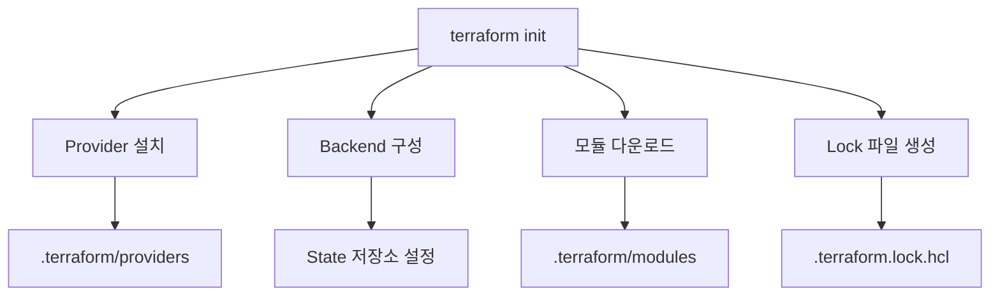

---
tags:
  - terraform
  - infrastructure
  - initialization
  - provider
  - tutorial
created: 2025-01-20
updated: 2025-01-20
aliases:
  - Terraform Init
  - 테라폼 초기화
  - Provider 설치
description: Terraform init 명령어의 상세한 동작 과정과 Provider 설치 메커니즘을 이해하는 가이드
status: published
category: tutorial
---

# 02. Terraform init 상세

> [!info] 개요
> `terraform init`는 Terraform 작업 디렉토리를 초기화하는 첫 번째 명령어입니다. Provider 플러그인 다운로드, 백엔드 설정, 모듈 설치 등 필수적인 초기 설정을 수행합니다.

## 📑 목차

- [[#⚡ 빠른 시작]]
- [[#🔧 init 명령어의 역할]]
- [[#📦 Provider 설치 과정]]
- [[#🔐 Lock 파일 관리]]
- [[#💾 Backend 초기화]]
- [[#📚 모듈 설치]]
- [[#⚠️ 문제 해결]]
- [[#📊 고급 옵션]]

---

## ⚡ 빠른 시작

> [!example] 기본 사용법
> 가장 일반적인 초기화 시나리오입니다.

```bash
# 기본 초기화
terraform init

# Provider 업그레이드와 함께 초기화
terraform init -upgrade

# Backend 재구성
terraform init -reconfigure

# 마이그레이션과 함께 초기화
terraform init -migrate-state
```

---

## 🔧 init 명령어의 역할

### 주요 기능



### 초기화 과정 상세

> [!note] 실행 순서
> init 명령어는 다음 순서로 작업을 수행합니다.

1. **작업 디렉토리 검증**
2. **Backend 초기화**
3. **모듈 설치**
4. **Provider 요구사항 확인**
5. **Provider 플러그인 다운로드**
6. **Lock 파일 생성/업데이트**

---

## 📦 Provider 설치 과정

### Provider 구성 예시

```hcl
# versions.tf
terraform {
  required_version = ">= 1.0"
  
  required_providers {
    aws = {
      source  = "hashicorp/aws"
      version = "~> 5.0"
    }
    
    random = {
      source  = "hashicorp/random"
      version = "3.5.1"
    }
    
    local = {
      source  = "hashicorp/local"
      version = ">= 2.4"
    }
  }
}
```

### Provider 저장 구조

```
.terraform/
└── providers/
    └── registry.terraform.io/
        ├── hashicorp/
        │   ├── aws/
        │   │   └── 5.31.0/
        │   │       └── darwin_arm64/
        │   │           └── terraform-provider-aws_v5.31.0_x5
        │   ├── random/
        │   │   └── 3.5.1/
        │   │       └── darwin_arm64/
        │   │           └── terraform-provider-random_v3.5.1_x5
        │   └── local/
        │       └── 2.4.0/
        │           └── darwin_arm64/
        │               └── terraform-provider-local_v2.4.0_x5
```

### Provider 소스 형식

> [!tip] Provider 소스 지정
> Provider 소스는 세 부분으로 구성됩니다.

```hcl
# 형식: [<HOSTNAME>/]<NAMESPACE>/<TYPE>

# 기본 레지스트리 (registry.terraform.io)
source = "hashicorp/aws"

# 전체 경로 지정
source = "registry.terraform.io/hashicorp/aws"

# 사설 레지스트리
source = "my-company.com/internal/custom-provider"
```

### 버전 제약 조건

| 연산자 | 설명 | 예시 |
|--------|------|------|
| `=` | 정확한 버전 | `version = "1.0.0"` |
| `!=` | 특정 버전 제외 | `version = "!= 1.0.0"` |
| `>`, `>=` | 이상 | `version = ">= 1.0.0"` |
| `<`, `<=` | 이하 | `version = "< 2.0.0"` |
| `~>` | 호환 버전 | `version = "~> 1.2"` |

```hcl
# 버전 제약 예시
terraform {
  required_providers {
    aws = {
      source  = "hashicorp/aws"
      version = "~> 5.0"      # >= 5.0.0, < 6.0.0
    }
    
    kubernetes = {
      source  = "hashicorp/kubernetes"
      version = ">= 2.0, < 3.0"  # 2.x 버전만
    }
  }
}
```

---

## 🔐 Lock 파일 관리

### .terraform.lock.hcl 구조

> [!warning] Lock 파일의 중요성
> Lock 파일은 팀원 간 일관된 Provider 버전을 보장합니다. 반드시 버전 관리에 포함시켜야 합니다.

```hcl
# .terraform.lock.hcl
provider "registry.terraform.io/hashicorp/aws" {
  version     = "5.31.0"
  constraints = "~> 5.0"
  hashes = [
    "h1:WwgMbMOhZblxZTdjHeJf9XB2/hcSHHmpuywLxuTWYw0=",
    "zh:0cdb9c2083bf0902442384f7309367791e4640581652dda456f2d6d7abf0de8d",
    # ... 추가 해시값들
  ]
}
```

### Lock 파일 업데이트

```bash
# 특정 Provider만 업데이트
terraform init -upgrade=true -upgrade-provider=hashicorp/aws

# 모든 Provider 업데이트
terraform init -upgrade

# Lock 파일 재생성
rm .terraform.lock.hcl
terraform init
```

### 플랫폼별 Lock 파일

```bash
# 여러 플랫폼용 Lock 파일 생성
terraform providers lock \
  -platform=linux_amd64 \
  -platform=darwin_amd64 \
  -platform=darwin_arm64 \
  -platform=windows_amd64
```

---

## 💾 Backend 초기화

### Local Backend (기본)

```hcl
# 별도 설정 없이 로컬 파일 시스템 사용
# terraform.tfstate 파일이 현재 디렉토리에 생성됨
```

### Remote Backend 설정

> [!example] S3 Backend 예시
> AWS S3를 Backend로 사용하는 설정입니다.

```hcl
# backend.tf
terraform {
  backend "s3" {
    bucket         = "my-terraform-state"
    key            = "prod/terraform.tfstate"
    region         = "us-west-2"
    encrypt        = true
    dynamodb_table = "terraform-state-lock"
  }
}
```

### Backend 마이그레이션

```bash
# 1. Backend 설정 변경 후
terraform init -migrate-state

# 또는 기존 설정 무시하고 재구성
terraform init -reconfigure

# Backend 설정 제거 시
terraform init -force-copy
```

---

## 📚 모듈 설치

### 모듈 사용 예시

```hcl
# 로컬 모듈
module "vpc" {
  source = "./modules/vpc"
}

# Git 모듈
module "vpc" {
  source = "git::https://github.com/example/vpc.git?ref=v1.2.0"
}

# Terraform Registry 모듈
module "vpc" {
  source  = "terraform-aws-modules/vpc/aws"
  version = "5.0.0"
}
```

### 모듈 저장 구조

```
.terraform/
└── modules/
    ├── modules.json
    └── vpc/
        ├── main.tf
        ├── variables.tf
        └── outputs.tf
```

---

## ⚠️ 문제 해결

### 일반적인 오류와 해결 방법

> [!failure] Provider 설치 실패
> ```
> Error: Failed to install provider
> ```
> **해결 방법:**
> - 네트워크 연결 확인
> - Provider 버전 확인
> - 프록시 설정 확인

> [!failure] Lock 파일 충돌
> ```
> Error: Provider version conflicts with lock file
> ```
> **해결 방법:**
> ```bash
> terraform init -upgrade
> ```

> [!failure] Backend 초기화 실패
> ```
> Error: Backend initialization required
> ```
> **해결 방법:**
> ```bash
> terraform init -reconfigure
> ```

### 디버깅 옵션

```bash
# 상세 로그 출력
TF_LOG=DEBUG terraform init

# 특정 로그 레벨
TF_LOG=INFO terraform init

# 로그 파일로 저장
TF_LOG=DEBUG TF_LOG_PATH=./terraform-init.log terraform init
```

---

## 📊 고급 옵션

### init 명령어 옵션

| 옵션 | 설명 | 사용 예시 |
|------|------|----------|
| `-upgrade` | Provider를 최신 버전으로 업그레이드 | `terraform init -upgrade` |
| `-reconfigure` | Backend 재구성 | `terraform init -reconfigure` |
| `-migrate-state` | State 마이그레이션 | `terraform init -migrate-state` |
| `-backend=false` | Backend 초기화 건너뛰기 | `terraform init -backend=false` |
| `-get=false` | 모듈 다운로드 건너뛰기 | `terraform init -get=false` |
| `-plugin-dir` | Provider 플러그인 디렉토리 지정 | `terraform init -plugin-dir=/path/to/plugins` |

### 에어갭 환경 설정

> [!tip] 오프라인 환경
> 인터넷 연결이 없는 환경에서 Terraform을 사용하는 방법입니다.

```bash
# 1. Provider 미러 생성
terraform providers mirror /path/to/mirror

# 2. 미러에서 Provider 설치
terraform init -plugin-dir=/path/to/mirror

# 3. CLI 설정 파일 사용
cat ~/.terraformrc
provider_installation {
  filesystem_mirror {
    path = "/path/to/mirror"
  }
}
```

### CI/CD 최적화

```yaml
# GitHub Actions 예시
- name: Cache Terraform
  uses: actions/cache@v3
  with:
    path: |
      .terraform
      .terraform.lock.hcl
    key: ${{ runner.os }}-terraform-${{ hashFiles('**/.terraform.lock.hcl') }}
    restore-keys: |
      ${{ runner.os }}-terraform-

- name: Terraform Init
  run: terraform init -input=false
```

---

## 📚 다음 단계

> [!success] 학습 경로
> init를 마스터했다면 다음 단계로 진행하세요.

- [[03. Terraform 변수 (Input Variables)]] - 동적 구성 만들기
- [[04. Terraform 출력 변수 (Output)]] - 리소스 정보 출력
- [[05. Terraform Provider 관리]] - Provider 심화 학습
- [[01. Terraform 기초]] - 기초로 돌아가기

---

> [!quote]
> "A good initialization is half the battle won in infrastructure automation." - DevOps Proverb

> [!tip] Pro Tip
> `terraform init`는 멱등성(idempotent)을 가집니다. 여러 번 실행해도 안전하므로, 확실하지 않을 때는 다시 실행하세요.