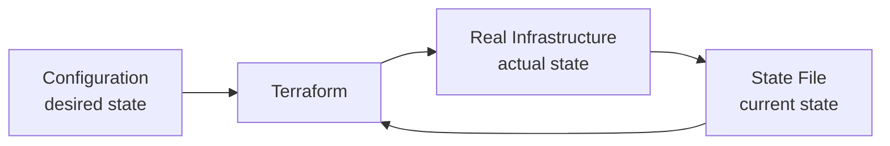

---
tags:
  - terraform
  - state
  - backend
  - collaboration
  - intermediate
created: 2025-01-20
updated: 2025-01-20
aliases:
  - Terraform State
  - 테라폼 상태
  - tfstate
description: Terraform State 파일의 역할과 관리 방법, Remote Backend 설정으로 팀 협업 환경 구축하기
status: published
category: guide
---

# 06. Terraform 상태 관리

> [!info] 개요
> Terraform State는 인프라의 현재 상태를 추적하는 JSON 파일입니다. 실제 인프라와 구성 파일 간의 매핑을 관리하며, Terraform이 변경사항을 파악하는 핵심 메커니즘입니다.

## 📑 목차

- [[#⚡ 빠른 시작]]
- [[#🎯 State 파일의 역할]]
- [[#📂 State 파일 구조]]
- [[#🔒 로컬 vs 원격 State]]
- [[#☁️ Remote Backend 설정]]
- [[#🤝 협업 전략]]
- [[#🛠️ State 관리 명령어]]
- [[#⚠️ 주의사항과 Best Practices]]

---

## ⚡ 빠른 시작

> [!example] State 관리 핵심 명령어
> 가장 자주 사용하는 State 관련 명령어들입니다.

```bash
# State 조회
terraform state list                    # 리소스 목록
terraform state show aws_instance.web   # 특정 리소스 상세

# State 조작
terraform state mv old_name new_name    # 리소스 이름 변경
terraform state rm aws_instance.temp    # State에서 제거

# State 가져오기
terraform import aws_instance.web i-1234567890abcdef0
```

---

## 🎯 State 파일의 역할

### State가 하는 일

> [!note] 핵심 기능
> State 파일은 Terraform의 **진실의 원천(Source of Truth)** 역할을 합니다.



### 주요 목적

#### 1. 리소스 추적 (State Tracking)
- 관리 중인 리소스 기록
- 리소스 간 관계 저장
- 속성 및 메타데이터 보관

#### 2. 동시성 관리 (Concurrency Management)
- State Locking으로 동시 수정 방지
- 팀 협업 시 충돌 방지
- 일관성 있는 상태 유지

#### 3. 의존성 관리 (Resource Dependency)
- 리소스 생성/삭제 순서 결정
- 의존성 그래프 구성
- 순환 의존성 방지

#### 4. 상태 보존 (State Preservation)
- 실행 간 상태 유지
- 점진적 변경 가능
- 변경 이력 추적

---

## 📂 State 파일 구조

### terraform.tfstate 예시

> [!warning] 민감 정보 포함
> State 파일에는 패스워드, API 키 등 민감한 정보가 포함될 수 있습니다.

```json
{
  "version": 4,
  "terraform_version": "1.5.0",
  "serial": 42,
  "lineage": "8b5c6d6f-9f3e-4f3e-8f3e-9f3e4f3e8f3e",
  "outputs": {
    "instance_ip": {
      "value": "192.168.1.100",
      "type": "string"
    }
  },
  "resources": [
    {
      "mode": "managed",
      "type": "aws_instance",
      "name": "web",
      "provider": "provider[\"registry.terraform.io/hashicorp/aws\"]",
      "instances": [
        {
          "schema_version": 1,
          "attributes": {
            "ami": "ami-0c55b159cbfafe1f0",
            "instance_type": "t2.micro",
            "public_ip": "52.14.100.200",
            "tags": {
              "Name": "WebServer"
            }
          },
          "dependencies": [
            "aws_security_group.web"
          ]
        }
      ]
    }
  ]
}
```

### State 파일 메타데이터

| 필드 | 설명 | 용도 |
|------|------|------|
| `version` | State 파일 형식 버전 | 호환성 확인 |
| `terraform_version` | 사용된 Terraform 버전 | 버전 추적 |
| `serial` | State 변경 일련번호 | 동시성 제어 |
| `lineage` | State 파일 고유 ID | 파일 식별 |
| `outputs` | 출력 값 | 모듈 간 데이터 전달 |
| `resources` | 리소스 상태 | 실제 인프라 매핑 |

---

## 🔒 로컬 vs 원격 State

### 로컬 State의 문제점

> [!failure] 협업 시 문제
> ```
> 개발자 A ← X → terraform.tfstate ← X → 개발자 B
>                       ↓ ↑
>                    개발자 C
> ```
> - 동기화 문제
> - 충돌 가능성
> - 버전 관리 어려움

### Remote State의 장점

> [!success] 중앙 집중식 관리
> ```
> 개발자 A ← → Remote Backend ← → 개발자 B
>                    ↓ ↑
>                 개발자 C
> ```
> - 자동 동기화
> - State Locking
> - 버전 이력 관리

### 비교표

| 특성 | Local State | Remote State |
|------|-------------|--------------|
| **저장 위치** | 로컬 파일 시스템 | 원격 저장소 |
| **협업** | 어려움 | 쉬움 |
| **잠금** | 없음 | 자동 잠금 |
| **백업** | 수동 | 자동 |
| **보안** | 낮음 | 높음 (암호화) |
| **설정** | 간단 | 추가 설정 필요 |

---

## ☁️ Remote Backend 설정

### AWS S3 Backend

> [!example] S3 + DynamoDB 설정
> 가장 널리 사용되는 Remote Backend 구성입니다.

```hcl
# backend.tf
terraform {
  backend "s3" {
    bucket         = "my-terraform-state"
    key            = "prod/terraform.tfstate"
    region         = "us-west-2"
    
    # State Locking
    dynamodb_table = "terraform-state-lock"
    
    # 암호화
    encrypt        = true
    
    # 버전 관리
    versioning     = true
  }
}
```

#### DynamoDB 테이블 생성

```hcl
resource "aws_dynamodb_table" "terraform_locks" {
  name         = "terraform-state-lock"
  billing_mode = "PAY_PER_REQUEST"
  hash_key     = "LockID"
  
  attribute {
    name = "LockID"
    type = "S"
  }
  
  tags = {
    Name        = "Terraform State Lock"
    Environment = "Production"
  }
}
```

#### S3 버킷 생성

```hcl
resource "aws_s3_bucket" "terraform_state" {
  bucket = "my-terraform-state"
  
  lifecycle {
    prevent_destroy = true
  }
  
  tags = {
    Name        = "Terraform State"
    Environment = "Production"
  }
}

resource "aws_s3_bucket_versioning" "terraform_state" {
  bucket = aws_s3_bucket.terraform_state.id
  
  versioning_configuration {
    status = "Enabled"
  }
}

resource "aws_s3_bucket_server_side_encryption_configuration" "terraform_state" {
  bucket = aws_s3_bucket.terraform_state.id
  
  rule {
    apply_server_side_encryption_by_default {
      sse_algorithm = "AES256"
    }
  }
}

resource "aws_s3_bucket_public_access_block" "terraform_state" {
  bucket = aws_s3_bucket.terraform_state.id
  
  block_public_acls       = true
  block_public_policy     = true
  ignore_public_acls      = true
  restrict_public_buckets = true
}
```

### 다른 Backend 옵션

#### Azure Storage Backend

```hcl
terraform {
  backend "azurerm" {
    resource_group_name  = "terraform-state-rg"
    storage_account_name = "tfstate12345"
    container_name      = "tfstate"
    key                 = "prod.terraform.tfstate"
  }
}
```

#### Google Cloud Storage Backend

```hcl
terraform {
  backend "gcs" {
    bucket = "my-terraform-state"
    prefix = "terraform/state"
  }
}
```

#### Terraform Cloud Backend

```hcl
terraform {
  cloud {
    organization = "my-org"
    
    workspaces {
      name = "my-workspace"
    }
  }
}
```

---

## 🤝 협업 전략

### State Locking

> [!tip] 자동 잠금 메커니즘
> Remote Backend는 작업 시작 시 자동으로 State를 잠그고, 완료 후 해제합니다.

```bash
# 잠금 상태 확인
terraform plan

# 출력 예시
Acquiring state lock. This may take a few moments...

# 잠금 충돌 시
Error: Error acquiring the state lock
Another process is holding the lock.

# 강제 잠금 해제 (주의!)
terraform force-unlock LOCK_ID
```

### Workspace 활용

```bash
# Workspace 생성
terraform workspace new dev
terraform workspace new staging
terraform workspace new prod

# Workspace 전환
terraform workspace select prod

# Workspace 목록
terraform workspace list
  default
  dev
  staging
* prod

# Workspace별 State 파일
# s3://bucket/env:/dev/terraform.tfstate
# s3://bucket/env:/staging/terraform.tfstate
# s3://bucket/env:/prod/terraform.tfstate
```

### 환경별 Backend 설정

```hcl
# backend-dev.hcl
bucket = "my-terraform-state-dev"
key    = "terraform.tfstate"
region = "us-west-2"

# backend-prod.hcl
bucket = "my-terraform-state-prod"
key    = "terraform.tfstate"
region = "us-west-2"
```

```bash
# 환경별 초기화
terraform init -backend-config=backend-dev.hcl
terraform init -backend-config=backend-prod.hcl
```

---

## 🛠️ State 관리 명령어

### 조회 명령어

```bash
# 전체 State 보기
terraform show

# JSON 형식으로 출력
terraform show -json

# 리소스 목록
terraform state list

# 특정 리소스 상세
terraform state show aws_instance.web

# 모듈 내 리소스
terraform state list module.vpc
```

### 수정 명령어

> [!warning] 위험한 작업
> State 직접 수정은 신중하게 수행해야 합니다. 백업을 먼저 만드세요.

```bash
# State 백업
terraform state pull > backup.tfstate

# 리소스 이름 변경
terraform state mv aws_instance.old aws_instance.new

# 모듈로 이동
terraform state mv aws_instance.web module.compute.aws_instance.web

# State에서 제거 (실제 리소스는 유지)
terraform state rm aws_instance.obsolete

# 기존 리소스 가져오기
terraform import aws_instance.existing i-1234567890abcdef0
```

### Remote State 데이터 소스

```hcl
# 다른 State 참조
data "terraform_remote_state" "network" {
  backend = "s3"
  
  config = {
    bucket = "terraform-state"
    key    = "network/terraform.tfstate"
    region = "us-west-2"
  }
}

# 참조 사용
resource "aws_instance" "app" {
  subnet_id = data.terraform_remote_state.network.outputs.private_subnet_ids[0]
}
```

---

## ⚠️ 주의사항과 Best Practices

### 보안 고려사항

> [!danger] 절대 하지 말 것
> - ❌ State 파일을 Git에 커밋
> - ❌ 암호화 없이 State 저장
> - ❌ Public 접근 허용
> - ❌ 백업 없이 State 수정

### .gitignore 설정

```gitignore
# Terraform State
*.tfstate
*.tfstate.*
*.tfstate.backup

# Terraform directories
.terraform/
.terraform.lock.hcl

# Override files
override.tf
override.tf.json
*_override.tf
*_override.tf.json

# CLI config
.terraformrc
terraform.rc
```

### State 마이그레이션

> [!tip] Backend 변경 절차
> Backend를 변경할 때는 State 마이그레이션이 필요합니다.

```bash
# 1. 현재 State 백업
terraform state pull > terraform.tfstate.backup

# 2. Backend 설정 변경
# backend.tf 수정

# 3. 마이그레이션 실행
terraform init -migrate-state

# 4. 확인
terraform state list
```

### 재해 복구

```bash
# State 복구
terraform state push backup.tfstate

# 특정 시점으로 복구 (S3 버전 관리 사용 시)
aws s3api get-object \
  --bucket my-terraform-state \
  --key prod/terraform.tfstate \
  --version-id "IYV3p45BT0YWISlmdylYnLabfGbDae.e" \
  terraform.tfstate

# State 재구성
terraform refresh
```

### Best Practices 체크리스트

> [!success] 권장 사항
> - ✅ Remote Backend 사용
> - ✅ State Locking 활성화
> - ✅ 암호화 설정
> - ✅ 버전 관리 활성화
> - ✅ 정기적 백업
> - ✅ 접근 권한 최소화
> - ✅ 환경별 State 분리
> - ✅ Workspace 활용

---

## 📚 다음 단계

> [!success] 학습 경로
> State 관리를 마스터했다면 다음 단계로 진행하세요.

- [[07. Terraform 속성과 의존성]] - 리소스 관계 이해
- [[08. Terraform 명령어]] - CLI 명령어 마스터
- [[09. Terraform 고급 개념]] - 고급 기능 학습
- [[00. Terraform 학습 가이드]] - 전체 학습 로드맵

---

> [!quote]
> "State is the heart of Terraform. Protect it, version it, and never lose it." - HashiCorp Best Practices

> [!tip] Pro Tip
> State 파일은 Terraform의 가장 중요한 자산입니다. Production 환경에서는 반드시 Remote Backend를 사용하고, 암호화와 버전 관리를 활성화하세요.