---
tags:
- infrastructure
- hashicorp
- packer
- image-builder
- devops
- iac
created: 2025-09-01
updated: 2025-09-01
aliases:
- HashiCorp Packer
- Machine Image Builder
description: HashiCorp Packer를 사용한 자동화된 머신 이미지 빌드 가이드
status: published
category: guide
---

# HashiCorp Packer 완벽 가이드

> [!info] 개요
> Packer는 HashiCorp에서 개발한 강력한 오픈소스 도구로, 단일 소스 구성에서 여러 플랫폼을 위한 동일한 머신 이미지를 빌드하는 데 사용됩니다. 이 가이드에서는 Packer의 핵심 개념과 실제 사용법을 다룹니다.

## 📑 목차

- [[#🎯 Packer란?]]
- [[#⚡ 빠른 시작]]
- [[#🔑 핵심 기능]]
- [[#🛠️ 설치 및 설정]]
- [[#💡 실전 예제]]
- [[#🔗 다른 HashiCorp 도구와 통합]]
- [[#⚠️ 주의사항]]
- [[#📚 참고자료]]

---

## 🎯 Packer란?

### 정의 및 목적

Packer는 **단일 소스 구성에서 여러 플랫폼을 위한 동일한 머신 이미지를 빌드**하는 도구입니다. 이를 통해 개발, 스테이징, 프로덕션 환경 전반에 걸쳐 **소프트웨어 환경의 일관성을 보장**할 수 있습니다.

### 지원 플랫폼

> [!example] 주요 지원 플랫폼
> - **클라우드**: Amazon EC2, Azure, Google Cloud
> - **가상화**: VMware, VirtualBox, Hyper-V
> - **컨테이너**: Docker
> - **베어메탈**: 다양한 하드웨어 플랫폼

### 작동 원리

```mermaid
graph LR
    A[원본 이미지] --> B[Packer]
    B --> C[HCL/JSON 설정]
    C --> D[새 이미지]
    style B fill:#1670f0,stroke:#333,stroke-width:2px
    style C fill:#f9f,stroke:#333,stroke-width:2px
```



---

## ⚡ 빠른 시작

### 기본 워크플로우

> [!tip] 3단계로 시작하기
> 1. **설정 파일 작성** (HCL 또는 JSON)
> 2. **빌드 실행** (`packer build`)
> 3. **이미지 배포** (각 플랫폼별 방식)

### 간단한 예제

```hcl
# example.pkr.hcl
source "amazon-ebs" "ubuntu" {
  ami_name      = "packer-example-{{timestamp}}"
  instance_type = "t2.micro"
  region        = "us-west-2"
  
  source_ami_filter {
    filters = {
      name                = "ubuntu/images/*ubuntu-focal-20.04-amd64-server-*"
      root-device-type    = "ebs"
      virtualization-type = "hvm"
    }
    most_recent = true
    owners      = ["099720109477"]
  }
  
  ssh_username = "ubuntu"
}

build {
  sources = ["source.amazon-ebs.ubuntu"]
  
  provisioner "shell" {
    inline = [
      "echo 'Hello, Packer!' > /tmp/hello.txt",
      "sudo apt-get update",
      "sudo apt-get install -y nginx"
    ]
  }
}
```

---

## 🔑 핵심 기능

### 1. 자동화 (Automation)

> [!note] 자동화의 이점
> Packer는 이미지 생성 프로세스를 완전히 자동화하여:
> - 배포 속도를 크게 향상시킵니다
> - 수동 작업으로 인한 오류를 제거합니다
> - 이미지 간 일관성을 보장합니다

### 2. 병렬 빌드 (Parallel Builds)

여러 플랫폼을 위한 이미지를 **동시에 생성**할 수 있어 시간과 리소스를 절약합니다.

```hcl
# 여러 플랫폼 동시 빌드 예제
build {
  sources = [
    "source.amazon-ebs.ubuntu",
    "source.azure-arm.ubuntu",
    "source.googlecompute.ubuntu"
  ]
}
```

### 3. Infrastructure as Code (IaC)

> [!info] IaC 지원
> - **JSON** 형식: 기존 방식
> - **HCL2** 형식: HashiCorp Configuration Language (권장)
> - Git을 통한 버전 관리 가능
> - CI/CD 파이프라인 통합 용이

### 4. 확장성 (Extensibility)

플러그인 아키텍처를 통해 새로운 플랫폼과 기술을 쉽게 추가할 수 있습니다.

- **Builder 플러그인**: 새로운 플랫폼 지원
- **Provisioner 플러그인**: 구성 관리 도구 통합
- **Post-processor 플러그인**: 빌드 후 처리 작업

### 5. HashiCorp 생태계 통합

> [!success] 완벽한 통합
> - **Terraform**: 인프라 관리
> - **Vault**: 시크릿 관리
> - **Consul**: 서비스 디스커버리
> - **Nomad**: 워크로드 오케스트레이션

### 6. 커스터마이징 (Customization)

다양한 프로비저너를 통한 상세한 커스터마이징:

- Shell 스크립트
- Ansible 플레이북
- Chef 레시피
- Puppet 모듈
- PowerShell (Windows)

---

## 🛠️ 설치 및 설정

### macOS (Homebrew)

```bash
# HashiCorp 저장소 등록
brew tap hashicorp/tap

# Packer 설치
brew install hashicorp/tap/packer

# 버전 확인
packer version
```

### Linux

```bash
# 바이너리 다운로드
wget https://releases.hashicorp.com/packer/1.9.4/packer_1.9.4_linux_amd64.zip

# 압축 해제
unzip packer_1.9.4_linux_amd64.zip

# 실행 파일 이동
sudo mv packer /usr/local/bin/

# 권한 설정
sudo chmod +x /usr/local/bin/packer
```

### 플러그인 설치

```bash
# Amazon 플러그인 설치 예제
packer plugins install github.com/hashicorp/amazon
```

> [!tip] 플러그인 관리
> Packer 1.7+ 버전부터는 플러그인을 자동으로 관리합니다.
> `required_plugins` 블록을 사용하여 필요한 플러그인을 명시하세요.

---

## 💡 실전 예제

### AWS AMI 빌드

> [!example] 프로덕션 준비 AMI 생성

```hcl
# aws-ubuntu.pkr.hcl
variable "aws_region" {
  type    = string
  default = "us-west-2"
}

variable "instance_type" {
  type    = string
  default = "t3.micro"
}

packer {
  required_plugins {
    amazon = {
      version = ">= 1.2.8"
      source  = "github.com/hashicorp/amazon"
    }
  }
}

source "amazon-ebs" "ubuntu" {
  ami_name      = "my-app-{{timestamp}}"
  instance_type = var.instance_type
  region        = var.aws_region
  
  source_ami_filter {
    filters = {
      name                = "ubuntu/images/*ubuntu-jammy-22.04-amd64-server-*"
      root-device-type    = "ebs"
      virtualization-type = "hvm"
    }
    most_recent = true
    owners      = ["099720109477"] # Canonical
  }
  
  ssh_username = "ubuntu"
  
  tags = {
    Name        = "My App AMI"
    Environment = "Production"
    BuiltBy     = "Packer"
    BuiltAt     = "{{timestamp}}"
  }
}

build {
  name = "production-build"
  
  sources = ["source.amazon-ebs.ubuntu"]
  
  # 시스템 업데이트
  provisioner "shell" {
    inline = [
      "sudo apt-get update",
      "sudo apt-get upgrade -y",
      "sudo apt-get install -y curl wget git"
    ]
  }
  
  # 애플리케이션 설치
  provisioner "file" {
    source      = "./app"
    destination = "/tmp/"
  }
  
  provisioner "shell" {
    script = "./scripts/install-app.sh"
  }
  
  # Ansible을 통한 구성
  provisioner "ansible" {
    playbook_file = "./ansible/playbook.yml"
  }
  
  # 정리 작업
  provisioner "shell" {
    inline = [
      "sudo apt-get autoremove -y",
      "sudo apt-get clean",
      "sudo rm -rf /tmp/*"
    ]
  }
  
  # AMI 정보 출력
  post-processor "manifest" {
    output = "manifest.json"
  }
}
```

### Docker 이미지 빌드

```hcl
# docker.pkr.hcl
source "docker" "ubuntu" {
  image  = "ubuntu:22.04"
  commit = true
}

build {
  sources = ["source.docker.ubuntu"]
  
  provisioner "shell" {
    inline = [
      "apt-get update",
      "apt-get install -y nginx",
      "echo 'Hello from Packer Docker' > /var/www/html/index.html"
    ]
  }
  
  post-processor "docker-tag" {
    repository = "myapp"
    tags       = ["latest", "1.0.0"]
  }
}
```

---

## 🔗 다른 HashiCorp 도구와 통합

### Terraform과 함께 사용

> [!tip] 완벽한 IaC 워크플로우
> 1. **Packer**로 머신 이미지 생성
> 2. **Terraform**으로 인프라 프로비저닝
> 3. 생성된 AMI ID를 Terraform 변수로 전달

```hcl
# terraform/main.tf
data "aws_ami" "packer_image" {
  most_recent = true
  owners      = ["self"]
  
  filter {
    name   = "name"
    values = ["my-app-*"]
  }
}

resource "aws_instance" "app" {
  ami           = data.aws_ami.packer_image.id
  instance_type = "t3.micro"
  
  tags = {
    Name = "My App Instance"
  }
}
```

### Vault와 시크릿 관리

```hcl
# Vault에서 시크릿 가져오기
source "amazon-ebs" "secure" {
  # Vault에서 AWS 자격 증명 가져오기
  vault_aws_engine {
    name = "aws"
    role = "packer-build"
  }
  
  # 다른 설정...
}
```

---

## ⚠️ 주의사항

> [!warning] 일반적인 실수
> - **AMI 이름 중복**: 타임스탬프를 사용하여 고유한 이름 생성
> - **리전 설정 누락**: 명시적으로 리전 지정 필요
> - **SSH 타임아웃**: 충분한 대기 시간 설정
> - **임시 리소스 정리**: 빌드 후 임시 파일 삭제

> [!danger] 보안 주의사항
> - 자격 증명을 코드에 하드코딩하지 마세요
> - 환경 변수나 Vault를 사용하여 민감한 정보 관리
> - 빌드된 이미지에 시크릿이 포함되지 않도록 주의

### 디버깅 팁

```bash
# 디버그 모드 실행
PACKER_LOG=1 packer build template.pkr.hcl

# 검증만 수행
packer validate template.pkr.hcl

# 변수 파일과 함께 실행
packer build -var-file="variables.pkrvars.hcl" template.pkr.hcl
```

---

## 📚 참고자료

### 공식 문서
- [Packer 공식 문서](https://developer.hashicorp.com/packer)
- [Packer 튜토리얼](https://developer.hashicorp.com/packer/tutorials)
- [HashiCorp Learn](https://learn.hashicorp.com/packer)

### 관련 문서
- [[Terraform 기초]] - 인프라 프로비저닝
- [[HashiCorp Vault]] - 시크릿 관리
- [[AWS AMI 관리]] - AMI 베스트 프랙티스
- [[Docker 이미지 최적화]] - 컨테이너 이미지 관리

### 유용한 리소스
- [Packer GitHub Repository](https://github.com/hashicorp/packer)
- [Packer 플러그인 레지스트리](https://developer.hashicorp.com/packer/plugins)
- [Packer 예제 템플릿](https://github.com/hashicorp/packer-plugin-amazon/tree/main/example)

---

> [!quote]
> "Packer는 'Infrastructure as Code'의 핵심 구성 요소로, 불변 인프라(Immutable Infrastructure)를 구현하는 데 필수적인 도구입니다." - HashiCorp

> [!success] 다음 단계
> - Packer 템플릿 작성 연습
> - CI/CD 파이프라인에 Packer 통합
> - 멀티 클라우드 이미지 빌드 구현
> - Golden Image 관리 전략 수립