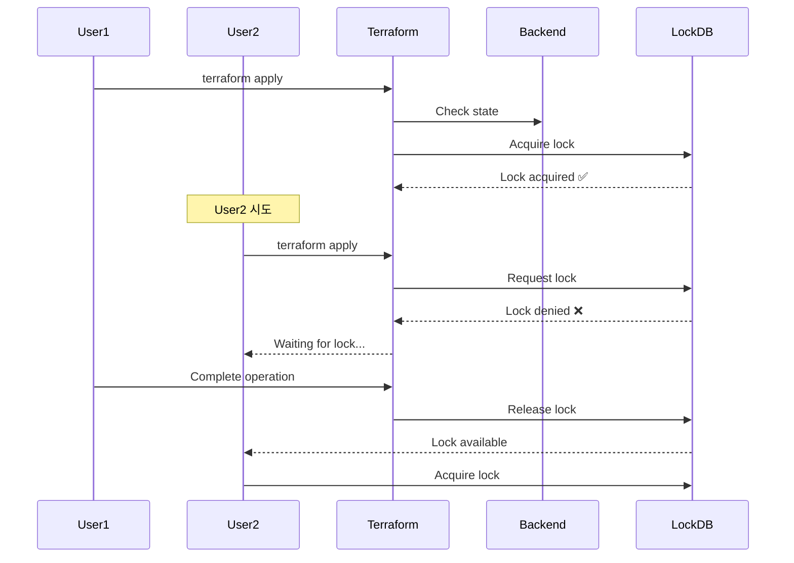

---
tags:
- terraform
- backend
- state-management
- remote-backend
- collaboration
created: 2025-01-06  
updated: 2025-01-06
aliases:
- Terraform Remote Backend
- Terraform Backend Configuration
description: Terraform Remote Backend 설정과 State 관리 전략
status: published
category: guide
---

# Terraform Remote Backend 상세 가이드

> [!info] 개요
> Remote Backend는 Terraform State를 원격 저장소에 저장하고 관리하는 기능으로, 팀 협업과 State 보안에 필수적입니다. 이 문서는 Remote Backend의 상세 설정과 운영 방법을 다룹니다.

## 📑 목차

- [[#🌐 Remote Backend 개요]]
- [[#🔒 State Locking 메커니즘]]
- [[#☁️ 클라우드별 Backend 설정]]
- [[#🛠️ Backend 마이그레이션]]
- [[#📊 Backend 모니터링]]
- [[#🚨 트러블슈팅]]
- [[#📚 참고자료]]

---

## 🌐 Remote Backend 개요

### Remote Backend의 핵심 이점

> [!success] 5가지 핵심 장점
> 1. **Collaboration (협업)**: 여러 개발자가 동시에 상태 파일에 접근하고 수정 가능
> 2. **Concurrency and Locking (동시성 제어)**: 충돌 방지를 위한 내장 메커니즘
> 3. **State Persistence (상태 지속성)**: 로컬 환경 손실 시에도 상태 보존
> 4. **Security (보안)**: 추가적인 보안 계층 제공
> 5. **Additional Features (추가 기능)**: 버전 관리, 이력 추적, 감사 로그, CI/CD 통합

### Backend 종류

| Backend Type | Lock 지원 | 암호화 | 버전관리 | 비용 |
|-------------|----------|--------|----------|------|
| **S3 + DynamoDB** | ✅ | ✅ | ✅ | 저렴 |
| **Azure Storage** | ✅ | ✅ | ❌ | 저렴 |
| **GCS** | ✅ | ✅ | ✅ | 저렴 |
| **Terraform Cloud** | ✅ | ✅ | ✅ | 무료/유료 |
| **Consul** | ✅ | ✅ | ❌ | 자체 호스팅 |
| **PostgreSQL** | ✅ | ❌ | ❌ | 자체 호스팅 |

---

## 🔒 State Locking 메커니즘

### Locking 작동 원리



### DynamoDB Lock 정보 구조

```json
{
  "LockID": {
    "S": "my-terraform-state-bucket/env:/prod/terraform.tfstate"
  },
  "Info": {
    "S": "{
      \"ID\": \"f765eb21-c866-4dd6-6dbb-9c91234c4526\",
      \"Operation\": \"OperationTypeApply\",
      \"Who\": \"user@hostname\",
      \"Version\": \"1.5.0\",
      \"Created\": \"2024-01-15T10:30:00Z\",
      \"Path\": \"prod/terraform.tfstate\"
    }"
  }
}
```

---

## ☁️ 클라우드별 Backend 설정

### AWS S3 + DynamoDB (권장)

#### 1. 인프라 구성

```hcl
# backend-infrastructure.tf
# S3 버킷 생성
resource "aws_s3_bucket" "terraform_state" {
  bucket = "my-terraform-state-${data.aws_caller_identity.current.account_id}"
  
  lifecycle {
    prevent_destroy = true
  }
  
  tags = {
    Name        = "Terraform State"
    Environment = "Production"
    ManagedBy   = "Terraform"
  }
}

# 버전 관리 활성화
resource "aws_s3_bucket_versioning" "terraform_state" {
  bucket = aws_s3_bucket.terraform_state.id
  
  versioning_configuration {
    status = "Enabled"
  }
}

# 서버 사이드 암호화
resource "aws_s3_bucket_server_side_encryption_configuration" "terraform_state" {
  bucket = aws_s3_bucket.terraform_state.id
  
  rule {
    apply_server_side_encryption_by_default {
      sse_algorithm     = "aws:kms"
      kms_master_key_id = aws_kms_key.terraform.arn
    }
  }
}

# Public 접근 차단
resource "aws_s3_bucket_public_access_block" "terraform_state" {
  bucket = aws_s3_bucket.terraform_state.id
  
  block_public_acls       = true
  block_public_policy     = true
  ignore_public_acls      = true
  restrict_public_buckets = true
}

# 수명 주기 정책
resource "aws_s3_bucket_lifecycle_configuration" "terraform_state" {
  bucket = aws_s3_bucket.terraform_state.id
  
  rule {
    id     = "delete-old-versions"
    status = "Enabled"
    
    noncurrent_version_expiration {
      noncurrent_days = 90
    }
  }
}

# KMS 키
resource "aws_kms_key" "terraform" {
  description             = "KMS key for Terraform state encryption"
  deletion_window_in_days = 10
  enable_key_rotation     = true
}

resource "aws_kms_alias" "terraform" {
  name          = "alias/terraform-state"
  target_key_id = aws_kms_key.terraform.key_id
}

# DynamoDB 테이블 for State Locking
resource "aws_dynamodb_table" "terraform_locks" {
  name         = "terraform-state-locks"
  billing_mode = "PAY_PER_REQUEST"
  hash_key     = "LockID"
  
  attribute {
    name = "LockID"
    type = "S"
  }
  
  point_in_time_recovery {
    enabled = true
  }
  
  server_side_encryption {
    enabled = true
  }
  
  tags = {
    Name        = "Terraform State Locks"
    Environment = "Production"
  }
}
```

#### 2. Backend 설정

```hcl
# backend.tf
terraform {
  backend "s3" {
    bucket         = "my-terraform-state-123456789012"
    key            = "env/prod/terraform.tfstate"
    region         = "us-west-2"
    encrypt        = true
    kms_key_id     = "alias/terraform-state"
    dynamodb_table = "terraform-state-locks"
    
    # 추가 보안 옵션
    skip_credentials_validation = false
    skip_metadata_api_check     = false
    force_path_style            = false
  }
}
```

### Azure Storage Backend

```hcl
# backend-azure.tf
terraform {
  backend "azurerm" {
    resource_group_name  = "terraform-state-rg"
    storage_account_name = "tfstate${random_string.storage.result}"
    container_name       = "tfstate"
    key                  = "prod.terraform.tfstate"
    
    # 선택 사항
    subscription_id      = "00000000-0000-0000-0000-000000000000"
    tenant_id           = "00000000-0000-0000-0000-000000000000"
    use_msi             = true
    use_azuread_auth    = true
  }
}
```

### Google Cloud Storage Backend

```hcl
# backend-gcs.tf
terraform {
  backend "gcs" {
    bucket  = "my-terraform-state"
    prefix  = "terraform/state"
    
    # 선택 사항
    credentials = "path/to/credentials.json"
    encryption_key = "base64-encoded-encryption-key"
  }
}
```

### Terraform Cloud Backend

```hcl
# backend-tfc.tf
terraform {
  cloud {
    organization = "my-organization"
    
    workspaces {
      name = "production"
      # 또는 태그 사용
      # tags = ["production", "aws"]
    }
  }
}
```

---

## 🛠️ Backend 마이그레이션

### Local에서 Remote로 마이그레이션

```bash
# 1. 현재 State 백업
terraform state pull > terraform.tfstate.backup

# 2. backend 설정 추가
cat > backend.tf <<EOF
terraform {
  backend "s3" {
    bucket = "my-terraform-state"
    key    = "terraform.tfstate"
    region = "us-west-2"
  }
}
EOF

# 3. 마이그레이션 실행
terraform init -migrate-state

# 4. 확인
terraform state list
```

### Remote 간 마이그레이션

```bash
# 1. 현재 State 다운로드
terraform state pull > current.tfstate

# 2. Backend 설정 제거
mv backend.tf backend.tf.old

# 3. Local로 초기화
terraform init -migrate-state

# 4. 새 Backend 설정
cat > backend.tf <<EOF
terraform {
  backend "azurerm" {
    # 새 설정
  }
}
EOF

# 5. 새 Remote로 마이그레이션
terraform init -migrate-state
```

---

## 📊 Backend 모니터링

### CloudWatch 알람 설정 (AWS)

```hcl
# S3 버킷 모니터링
resource "aws_cloudwatch_metric_alarm" "state_file_size" {
  alarm_name          = "terraform-state-file-size"
  comparison_operator = "GreaterThanThreshold"
  evaluation_periods  = "2"
  metric_name         = "BucketSizeBytes"
  namespace           = "AWS/S3"
  period              = "86400"
  statistic           = "Average"
  threshold           = "1073741824"  # 1GB
  alarm_description   = "State file is getting too large"
  
  dimensions = {
    BucketName = aws_s3_bucket.terraform_state.id
    StorageType = "StandardStorage"
  }
}

# DynamoDB Lock 모니터링
resource "aws_cloudwatch_metric_alarm" "lock_duration" {
  alarm_name          = "terraform-lock-duration"
  comparison_operator = "GreaterThanThreshold"
  evaluation_periods  = "1"
  metric_name         = "UserErrors"
  namespace           = "AWS/DynamoDB"
  period              = "300"
  statistic           = "Sum"
  threshold           = "5"
  alarm_description   = "Too many lock conflicts"
  
  dimensions = {
    TableName = aws_dynamodb_table.terraform_locks.name
  }
}
```

### 감사 로깅

```hcl
# CloudTrail for S3 State Access
resource "aws_cloudtrail" "terraform_state" {
  name                          = "terraform-state-trail"
  s3_bucket_name               = aws_s3_bucket.cloudtrail.id
  include_global_service_events = true
  is_multi_region_trail        = true
  enable_logging               = true
  
  event_selector {
    read_write_type           = "All"
    include_management_events = true
    
    data_resource {
      type   = "AWS::S3::Object"
      values = ["${aws_s3_bucket.terraform_state.arn}/*"]
    }
  }
}
```

---

## 🚨 트러블슈팅

### Lock 관련 문제

#### 문제: Lock이 해제되지 않음
```bash
Error: Error acquiring the state lock
Lock Info:
  ID:        f765eb21-c866-4dd6-6dbb-9c91234c4526
  Path:      prod/terraform.tfstate
  Operation: OperationTypeApply
  Who:       user@hostname
  Version:   1.5.0
  Created:   2024-01-15 10:30:00
```

#### 해결 방법:
```bash
# 1. Lock ID 확인
terraform force-unlock f765eb21-c866-4dd6-6dbb-9c91234c4526

# 2. DynamoDB에서 직접 삭제 (AWS)
aws dynamodb delete-item \
  --table-name terraform-state-locks \
  --key '{"LockID": {"S": "my-bucket/terraform.tfstate"}}'

# 3. 타임아웃 설정
export TF_INPUT=0
timeout 300 terraform apply
```

### State 복구

#### S3 버전에서 복구
```bash
# 버전 목록 확인
aws s3api list-object-versions \
  --bucket my-terraform-state \
  --prefix terraform.tfstate

# 특정 버전 복구
aws s3api get-object \
  --bucket my-terraform-state \
  --key terraform.tfstate \
  --version-id "IYV3p45BT0YWISlmdylYnLabfGbDae.e" \
  restored.tfstate

# State 복원
terraform state push restored.tfstate
```

### 성능 최적화

```hcl
# S3 Transfer Acceleration
resource "aws_s3_bucket_accelerate_configuration" "terraform_state" {
  bucket = aws_s3_bucket.terraform_state.id
  status = "Enabled"
}

# DynamoDB 성능 설정
resource "aws_dynamodb_table" "terraform_locks" {
  # On-Demand 대신 Provisioned 사용
  billing_mode   = "PROVISIONED"
  read_capacity  = 5
  write_capacity = 5
  
  # Auto Scaling
  lifecycle {
    ignore_changes = [read_capacity, write_capacity]
  }
}
```

---

## 📚 참고자료

### 관련 내부 문서
- [[06. Terraform 상태 관리]]
- [[Terraform Taint와 디버깅]]
- [[15. Terraform 베스트 프랙티스]]

### 공식 문서
- [Terraform Backend Configuration](https://www.terraform.io/docs/language/settings/backends/index.html)
- [S3 Backend](https://www.terraform.io/docs/language/settings/backends/s3.html)
- [State Locking](https://www.terraform.io/docs/language/state/locking.html)

---

> [!quote]
> "Remote Backend는 단순한 State 저장소가 아니라, 팀 협업의 기반이 되는 핵심 인프라입니다."