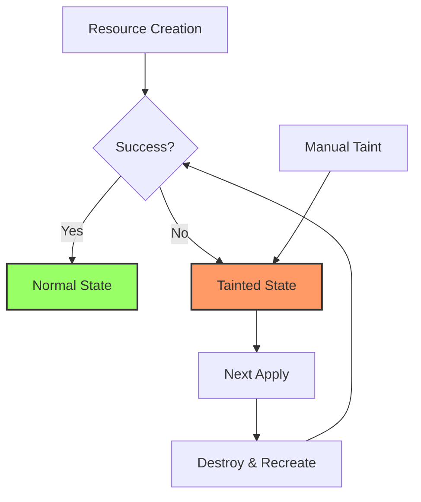

---
tags:
- terraform
- taint
- debugging
- troubleshooting
- state-management
created: 2025-01-06
updated: 2025-01-06
aliases:
- Terraform Taint
- Terraform Debugging
- Terraform 트러블슈팅
description: Terraform의 Taint 기능과 디버깅 방법에 대한 상세 가이드
status: published
category: guide
---

# Terraform Taint와 디버깅

> [!info] 개요
> Terraform의 Taint 기능은 리소스를 재생성이 필요한 상태로 표시하는 중요한 기능입니다. 또한 효과적인 디버깅은 복잡한 인프라 코드 문제를 해결하는 데 필수적입니다. 이 문서에서는 Taint 메커니즘과 다양한 디버깅 기법을 다룹니다.

## 📑 목차

- [[#🔴 Taint란?]]
- [[#⚙️ Taint 작동 방식]]
- [[#🔧 Taint 명령어]]
- [[#🐛 Terraform 디버깅]]
- [[#📊 로그 레벨]]
- [[#💡 디버깅 전략]]
- [[#🚨 일반적인 오류와 해결법]]
- [[#📚 참고자료]]

---

## 🔴 Taint란?

### Taint의 정의
> [!note] Taint란?
> 리소스가 성공적으로 생성되지 않았거나 손상된 것으로 간주될 때, Terraform은 해당 리소스를 "tainted" 상태로 표시합니다. Taint된 리소스는 **신뢰할 수 없는 상태**로 간주되며, **다음 apply 작업에서 재생성**됩니다.

### Taint가 발생하는 상황

1. **Provisioner 실패**: 리소스는 생성되었지만 provisioner가 실패한 경우
2. **수동 Taint**: 관리자가 의도적으로 리소스를 재생성하고자 할 때
3. **부분적 생성 실패**: 리소스가 부분적으로만 생성된 경우

### Taint 상태 예제

```bash
$ terraform apply

aws_instance.web: Provisioning with 'local-exec'...
aws_instance.web (local-exec): Executing: ["/bin/sh" "-c" "echo 35.161.77.233 >> /temp/public_ip.txt"]
aws_instance.web (local-exec): /bin/sh: /temp/public_ip.txt: No such file or directory

│ Error: local-exec provisioner error
│ 
│   with aws_instance.web,
│   on main.tf line 74, in resource "aws_instance" "web":
│   74:   provisioner "local-exec" {
│ 
│ Error running command 'echo 35.161.77.233 >> /temp/public_ip.txt': exit status 1. Output:
│ /bin/sh: /temp/public_ip.txt: No such file or directory
```

---

## ⚙️ Taint 작동 방식

### Taint 플로우



### Taint 표시 확인

> [!warning] Tainted 리소스 식별
> ```bash
> $ terraform apply
> ...
> Terraform will perform the following actions:
> 
>   # aws_instance.web is tainted, so must be replaced
> -/+ resource "aws_instance" "web" {
>       ~ arn                        = "arn:aws:ec2:us-west-2:365399126646:..."
>       ~ associate_public_ip_address = true -> (known after apply)
>       ~ availability_zone          = "us-west-2a" -> (known after apply)
>       # ... 
>   }
> ```

---

## 🔧 Taint 명령어

### terraform taint
리소스를 수동으로 tainted 상태로 표시

```bash
# 기본 사용법
$ terraform taint aws_instance.web
Resource instance aws_instance.web has been marked as tainted.

# 모듈 내 리소스 taint
$ terraform taint module.vpc.aws_subnet.private[0]
Resource instance module.vpc.aws_subnet.private[0] has been marked as tainted.
```

### terraform untaint
Tainted 상태를 제거

```bash
# Taint 제거
$ terraform untaint aws_instance.web
Resource instance aws_instance.web has been successfully untainted.
```

### Taint 대체 방법 (Terraform 0.15.2+)

> [!tip] Replace 옵션 사용
> Terraform 0.15.2 이후 버전에서는 `taint` 명령어 대신 `-replace` 옵션을 권장합니다.
> 
> ```bash
> # 새로운 방법 (권장)
> $ terraform apply -replace="aws_instance.web"
> 
> # 여러 리소스 교체
> $ terraform apply \
>   -replace="aws_instance.web" \
>   -replace="aws_instance.db"
> 
> # 계획 단계에서 확인
> $ terraform plan -replace="aws_instance.web"
> ```

---

## 🐛 Terraform 디버깅

### 디버깅 환경 변수

> [!important] 주요 디버깅 환경 변수
> ```bash
> # 로그 레벨 설정
> export TF_LOG=TRACE
> 
> # 로그 파일 경로 지정
> export TF_LOG_PATH=/tmp/terraform.log
> 
> # 특정 Provider 디버깅
> export TF_LOG_PROVIDER=DEBUG
> 
> # Core 디버깅
> export TF_LOG_CORE=DEBUG
> ```

### 디버깅 모드 활성화

```bash
# 상세 로깅 활성화
export TF_LOG=DEBUG
terraform plan

# 특정 파일로 로그 저장
export TF_LOG_PATH=./terraform-debug.log
terraform apply

# 로깅 비활성화
unset TF_LOG
unset TF_LOG_PATH
```

---

## 📊 로그 레벨

### 로그 레벨 계층

| 레벨 | 설명 | 사용 시기 |
|------|------|-----------|
| **TRACE** | 가장 상세한 로그, 모든 내부 작업 포함 | 심각한 버그 추적 |
| **DEBUG** | 디버깅 정보, API 호출 상세 | 일반적인 문제 해결 |
| **INFO** | 일반 정보 메시지 | 정상 작동 확인 |
| **WARN** | 경고 메시지 | 잠재적 문제 확인 |
| **ERROR** | 오류 메시지만 | 오류만 확인 필요 시 |

### 로그 레벨별 출력 예제

```bash
# TRACE 레벨 - 매우 상세
export TF_LOG=TRACE
# API 요청/응답, 내부 함수 호출, 모든 변수 값 등

# DEBUG 레벨 - 디버깅용
export TF_LOG=DEBUG
# Provider 초기화, 리소스 상태 변경, 설정 값 등

# INFO 레벨 - 일반 정보
export TF_LOG=INFO
# 주요 작업 시작/완료, 리소스 생성/삭제 등
```

---

## 💡 디버깅 전략

### 1. 단계별 디버깅

> [!tip] 체계적인 접근
> ```bash
> # 1. 문법 검증
> terraform validate
> 
> # 2. 포맷 확인
> terraform fmt -check
> 
> # 3. 계획 단계 디버깅
> TF_LOG=DEBUG terraform plan
> 
> # 4. 특정 리소스만 적용
> terraform apply -target=aws_instance.web
> 
> # 5. 상태 파일 검사
> terraform state list
> terraform state show aws_instance.web
> ```

### 2. Provider 디버깅

```hcl
# Provider 디버깅 활성화
terraform {
  required_providers {
    aws = {
      source  = "hashicorp/aws"
      version = "~> 5.0"
    }
  }
}

# Provider 로그 레벨
provider "aws" {
  region = "us-west-2"
  
  # Provider 레벨 디버깅 (개발 환경만)
  # AWS SDK 로깅 활성화
  default_tags {
    tags = {
      TF_LOG = "DEBUG"
    }
  }
}
```

### 3. 변수 디버깅

```hcl
# 변수 값 확인을 위한 출력
output "debug_variables" {
  value = {
    environment = var.environment
    instance_type = var.instance_type
    subnet_ids = var.subnet_ids
  }
  
  # 민감한 정보가 아닌 경우만
  sensitive = false
}

# Local 값으로 디버깅
locals {
  debug_info = {
    timestamp = timestamp()
    caller_arn = data.aws_caller_identity.current.arn
    region = data.aws_region.current.name
  }
}

output "debug_info" {
  value = local.debug_info
}
```

### 4. 조건부 디버깅

```hcl
# 디버그 모드 변수
variable "debug_mode" {
  description = "Enable debug mode"
  type        = bool
  default     = false
}

# 조건부 로깅 리소스
resource "null_resource" "debug_log" {
  count = var.debug_mode ? 1 : 0
  
  provisioner "local-exec" {
    command = <<-EOT
      echo "=== DEBUG INFO ===" >> debug.log
      echo "Timestamp: $(date)" >> debug.log
      echo "Instance ID: ${aws_instance.web.id}" >> debug.log
      echo "Public IP: ${aws_instance.web.public_ip}" >> debug.log
    EOT
  }
}
```

---

## 🚨 일반적인 오류와 해결법

### 1. Provisioner 실패

> [!danger] 문제 상황
> ```bash
> Error: local-exec provisioner error
> ```

> [!success] 해결 방법
> ```hcl
> resource "aws_instance" "web" {
>   # ... 
>   
>   provisioner "local-exec" {
>     # 실패 시 계속 진행
>     on_failure = continue
>     
>     # 작업 디렉토리 지정
>     working_dir = "/tmp"
>     
>     # 환경 변수 설정
>     environment = {
>       INSTANCE_IP = self.public_ip
>     }
>     
>     # 오류 처리 포함
>     command = <<-EOT
>       mkdir -p /tmp/logs
>       echo ${self.public_ip} >> /tmp/logs/public_ip.txt || true
>     EOT
>   }
> }
> ```

### 2. State Lock 오류

> [!danger] 문제 상황
> ```bash
> Error: Error acquiring the state lock
> ```

> [!success] 해결 방법
> ```bash
> # Lock 정보 확인
> terraform force-unlock <LOCK_ID>
> 
> # 또는 DynamoDB에서 직접 삭제 (AWS)
> aws dynamodb delete-item \
>   --table-name terraform-state-lock \
>   --key '{"LockID": {"S": "<LOCK_ID>"}}'
> ```

### 3. 순환 의존성

> [!danger] 문제 상황
> ```bash
> Error: Cycle: aws_security_group.web, aws_security_group.app
> ```

> [!success] 해결 방법
> ```hcl
> # 잘못된 예 - 순환 참조
> resource "aws_security_group" "web" {
>   ingress {
>     security_groups = [aws_security_group.app.id]
>   }
> }
> 
> resource "aws_security_group" "app" {
>   ingress {
>     security_groups = [aws_security_group.web.id]
>   }
> }
> 
> # 올바른 예 - 규칙 분리
> resource "aws_security_group" "web" {
>   # 기본 설정만
> }
> 
> resource "aws_security_group" "app" {
>   # 기본 설정만
> }
> 
> resource "aws_security_group_rule" "web_to_app" {
>   type                     = "ingress"
>   from_port                = 8080
>   to_port                  = 8080
>   protocol                 = "tcp"
>   source_security_group_id = aws_security_group.web.id
>   security_group_id        = aws_security_group.app.id
> }
> ```

### 4. Provider 버전 충돌

> [!danger] 문제 상황
> ```bash
> Error: Unsupported Terraform Core version
> ```

> [!success] 해결 방법
> ```hcl
> # versions.tf
> terraform {
>   # 버전 범위 지정
>   required_version = ">= 1.0, < 2.0"
>   
>   required_providers {
>     aws = {
>       source  = "hashicorp/aws"
>       version = "~> 5.0"  # 5.x 버전만 허용
>     }
>   }
> }
> 
> # 버전 업그레이드
> # terraform init -upgrade
> ```

---

## 🛠️ 고급 디버깅 기법

### 1. 커스텀 Validation

```hcl
variable "instance_type" {
  type = string
  
  validation {
    condition = can(regex("^t[2-3]\\.", var.instance_type))
    error_message = "Instance type must be t2.* or t3.*"
  }
}

# 디버깅용 검증 출력
output "validation_check" {
  value = {
    is_valid_type = can(regex("^t[2-3]\\.", var.instance_type))
    actual_value = var.instance_type
  }
}
```

### 2. 타임스탬프 디버깅

```hcl
# 실행 시간 추적
locals {
  start_time = timestamp()
}

resource "null_resource" "timer" {
  triggers = {
    start = local.start_time
  }
  
  provisioner "local-exec" {
    command = "echo 'Started at: ${local.start_time}'"
  }
}

output "execution_time" {
  value = {
    started_at = local.start_time
    completed_at = timestamp()
  }
}
```

### 3. 상태 파일 분석

```bash
# 상태 파일을 JSON으로 출력
terraform show -json > state.json

# jq를 사용한 분석
cat state.json | jq '.values.root_module.resources[] | select(.type == "aws_instance")'

# 특정 리소스 속성 확인
terraform state show -json aws_instance.web | jq '.values'
```

---

## 📚 참고자료

### 관련 내부 문서
- [[Terraform 고급 기능 가이드]]
- [[06. Terraform 상태 관리]]
- [[14. Terraform 트러블슈팅]]
- [[15. Terraform 베스트 프랙티스]]

### 공식 문서
- [Terraform Debugging](https://www.terraform.io/docs/internals/debugging.html)
- [Terraform Taint](https://www.terraform.io/docs/cli/commands/taint.html)
- [Terraform Replace](https://www.terraform.io/docs/cli/commands/plan.html#replace-address)

### 유용한 도구
- [tfenv](https://github.com/tfutils/tfenv) - Terraform 버전 관리
- [tflint](https://github.com/terraform-linters/tflint) - Terraform 린터
- [terraform-docs](https://github.com/terraform-docs/terraform-docs) - 문서 자동 생성

---

> [!quote]
> "Debugging is twice as hard as writing the code in the first place. Therefore, if you write the code as cleverly as possible, you are, by definition, not smart enough to debug it." - Brian Kernighan